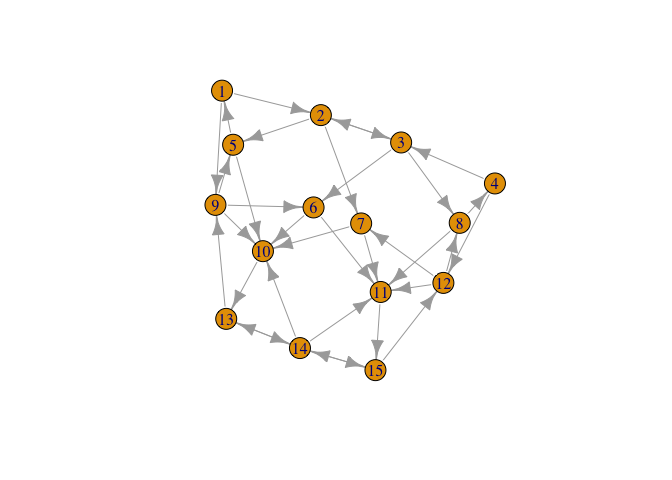

Activity - Eigenvalues II
================

------------------------------------------------------------------------

When you begin work during class, work with your assigned partner.
Please have only one electronic device open and work on it jointly. When
writing up this assignment, please remember that showing all of your
work and giving your reasoning are critical parts of achieving mastery.
If the course staff cannot tell how you solved a problem or finds leaps
in explanation or logic, the problem is not mastered. Finally, as a
matter of academic integrity, please make sure that you are positioned
to honestly answer yes to these questions:

- Have I disclosed everyone with whom I collaborated on this work? (Even
  if it is only my assigned partner.)

- Have I made a substantive intellectual contribution to the solution of
  every problem?

- Am I making sure not to pass off as my own work any work that belongs
  to someone else?

Whether intentional or unintentional, any potential violations of
academic integrity will be referred to the Honor Committee.

------------------------------------------------------------------------

Load necessary packages:

``` r
library(expm)
library(pracma)
library(igraph)
```

### Problem 1

Every position in the United States House of Representatives is up for
election every two years. A linear algebra student built the following
(admittedly oversimplified, but still fun) model for predicting the
political party of the winning candidate in a local congressional
district:

- If our current representative is a Democrat, there is a 75% chance
  that a Democrat will win the next election, and a 25% chance that a
  Republican will win the next election.

- If our current representative is a Republican, there is a 50% chance
  that a Democrat will win the next election, and a 50% chance that a
  Republican will win the next election.

Note the simplification: this model assumes that the winner will always
be a Democrat or Republican.

a\. Let’s model the political party of the representative as a Markov
chain with two states. We can represent the Markov chain as the
dynamical system $\mathbf{x}_{k+1}=\mathbf{A}\mathbf{x}_k$, where
$\mathbf{x}_k \in \mathbb{R}^2$ is a vector whose first component
represents the probability that a Democrat wins the $k^{th}$ election,
and the second component represents the probability that a Republican
wins the $k^{th}$ election. What is the transition matrix $\mathbf{A}$?

b\. Let $k=0$ be the 2022 election. Suppose a Democrat won the election
in question, so we’ll take $\mathbf{x}_0=(1,0)^T$. According to the
model, what is the probability that a Democrat will win the election in
2028? Hint: to raise a matrix $\mathbf{A}$ to, for example, the power 2,
make sure the `expm` package is installed, and type `A%^%2`.

c\. A matrix $\mathbf{A}$ is **primitive** if there exists a positive
integer $k$ such that $\mathbf{A}^k$ has all positive entries.
$\mathbf{A}$ is **(right) stochastic** if its columns sum to one. There
is a theorem called the **Perron-Frobenius Theorem** that says: if
$\mathbf{A}$ is a nonnegative square primitive matrix, then there is a
dominant eigenvalue $\lambda$ with eigenvector $\mathbf{v}$ that has all
positive entries. If $\mathbf{A}$ is stochastic, then additionally,
$\lambda = 1$, so that $\mathbf{A}\mathbf{v} = \mathbf{v}$. In the
context of Markov chains, you can imagine $\mathbf{v}$ as being the
(possibly scaled) stationary distribution of probabilities, that is, the
probabilities of being in each state after many, many iterations of the
Markov chain. Now apply this concept. In the limit of very long time,
what is the probability that a Democrat will win the election? Would
your answer be different if a Republican had won the last election?

### Problem 1 Solution

a\. Your solution goes here.

b\. Your solution goes here.

c\. Your solution goes here.

### Problem 2

In this problem, you’ll work with the famous Google PageRank algorithm.
The version of PageRank we use here is slightly more sophisticated than
the basic version. We start with the adjacency matrix $\mathbf{G}$ of
the directed graph that represents websites and their links. A link from
site $i$ to site $j$ indicated by a 1 entry in $G_{ij}$. At each step of
the Markov process, an internet surfer jumps to a random website with
probability $q$, and follows one of the links on the current page with
probability $1-q$. Here, $q$ is a parameter in the problem. If jumping
to a random site (including back to the current page), the probability
of each site is $\frac{1}{N}$, where $N$ is the total number of
websites. If following one of the links, the surfer chooses randomly
from the $n_i$ links on the current page $i$ with equal probabilities.
The PageRank is the steady-state distribution of this Markov chain.

Consider the following network of 15 websites, encoded in the adjacency
matrix $\mathbf{G}$.

``` r
G <- matrix(c(0, 0, 0, 0, 1, 0, 0, 0, 0, 0, 0, 0, 0, 0, 0, 1, 0, 
1, 0, 0, 0, 0, 0, 0, 0, 0, 0, 0, 0, 0, 0, 1, 0, 1, 0, 0, 0, 0, 
0, 0, 0, 0, 0, 0, 0, 0, 0, 0, 0, 0, 0, 0, 1, 0, 0, 0, 0, 0, 0, 
0, 0, 1, 0, 0, 0, 0, 0, 0, 1, 0, 0, 0, 0, 0, 0, 0, 0, 1, 0, 0, 
0, 0, 0, 1, 0, 0, 0, 0, 0, 0, 0, 1, 0, 0, 0, 0, 0, 0, 0, 0, 0, 
1, 0, 0, 0, 0, 0, 1, 0, 0, 0, 0, 0, 0, 0, 0, 1, 0, 0, 0, 1, 0, 
0, 0, 0, 0, 0, 0, 0, 0, 0, 0, 1, 0, 0, 0, 0, 0, 0, 1, 1, 1, 0, 
1, 0, 0, 0, 0, 1, 0, 0, 0, 0, 0, 0, 1, 1, 1, 0, 0, 0, 1, 0, 1, 
0, 0, 0, 0, 1, 0, 0, 0, 0, 0, 0, 0, 0, 0, 0, 1, 0, 0, 0, 0, 0, 
0, 0, 0, 0, 1, 0, 0, 0, 1, 0, 0, 0, 0, 0, 0, 0, 0, 0, 0, 0, 0, 
0, 1, 0, 1, 0, 0, 0, 0, 0, 0, 0, 0, 0, 0, 1, 0, 0, 1, 0), nrow = 15)
plot(graph_from_adjacency_matrix(G), margin = -0.07)
```

<!-- -->

Let $q = 0.15$, and use power iteration to find the PageRank values for
each website. Stop your iteration when the 2-norm of successive
approximations is less that $5 \times 10^{-6}$. Remember to normalize
the dominant eigenvector so that it sums to 1. Then round your PageRanks
to six decimal places. Which sites have the most inward-pointing links?
Which sites have the highest PageRank? Are they the same?

### Problem 2 Solution

Your solution goes here.
