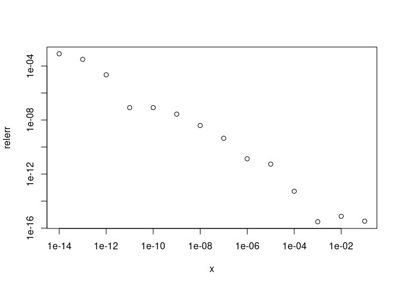

Activity - How Computers Store Numbers
================
Solutions

### Objectives

-   Practice with binary and machine representation of numbers
-   Recognize situations when the limitations of floating point
    arithmetic are realized
-   Reformulate those situations to get improved numerical accuracy

### Procedure

-   Please collaborate on this activity with one person as scribe
    (typist). There should only be one laptop open. We’re aiming for
    actual collaboration here, not two or three people working in
    parallel.

-   It doesn’t matter if you finish the whole activity during class.

-   It **does** mater if you focus on helping each other learn. Helping
    each other learn is the point of this activity. Completing the
    problems is merely a mechanism to guide you towards learning.

-   It **does** mater if everyone participates. The expectation is that
    every group member participates, where the definition of
    “participation” can include asking questions, answering questions,
    brainstorming, or any other form of meaningful engagement.

-   In the last three minutes of class, before you leave, please knit
    your .Rmd file to html, print the html to .pdf, and have the scribe
    submit it as a group assignment through GLOW.

-   Don’t forget that the solutions are available on GLOW.

### Problem 0

Recalling that academic integrity policies apply even in an ungraded
course, please disclose any irregular circumstances related to
participation in your group (for instance, a group member was missing
and did not contribute to this document).

### Problem 0 Solution

Your solution goes here.

### Problem 1

Convert the binary number 110111.001 to base 10.

### Problem 1 Solution


### Problem 2

Convert the base 10 number 1/3 to binary.

### Problem 2 Solution


which in binary is
.

### Problem 3

By hand, calculate the IEEE double precision representation fl(1/3) and
find the relative error in the computer storage of this number.

### Problem 3 Solution

The sign is
,
the exponent is

and the mantissa is

where the

pattern after the decimal point is repeated 26 times. This mantissa is

^2 + \ldots + (1/4)^26 = \frac{6004799503160661}{4503599627370496}")

So, our final machine number is this numnber times
,
which is

 = \frac{6004799503160661}{18014398509481984}")

The relative error is

}{1/3}= \frac{1}{54043195528445952} \approx 1.85\times10^{-17}")

### Problem 4

Consider the function

=\frac{1-(1-x)^3}{x}")

for x =
.
Then use an alternative form of the expression that doesn’t suffer from
subtracting nearly equal numbers. Consider the results from the second
calculation to be exact, and make a log-log plot of the relative error
in the first calculation as a function of x. What is the general trend?

### Problem 4 Solution

``` r
f1 <- function(x) {(1-(1-x)^3)/x}
f2 <- function(x) {x^2 - 3*x + 3}
x <- 10^seq(-1,-14)
y1 <- f1(x)
y2 <- f2(x)
relerr <- (abs(y2-y1)/y2)
plot(x,relerr,log="xy")
```

<!-- -->

The relative error increases drastically as x decreases.

### Problem 5

Consider a right triangle whose legs are of length 3344556600 and
1.2222222. How much longer is the hypotenuse than the longer leg?

### Problem 5 Solution

We are tempted to compute this, which does not end well:

``` r
a <- 3344556600
b <- 1.2222222
sqrt(a^2+b^2)-a
```

    ## [1] 0

The problem is due to the subtraction of nearly equal numbers. To avoid
this, we can rationalize the expression,

 \times \frac{\sqrt{a^2+b^2}+a}{\sqrt{a^2+b^2}+a}")

which simplifies to


We compute as

``` r
b^2/(sqrt(a^2+b^2)+a)
```

    ## [1] 2.233221e-10
