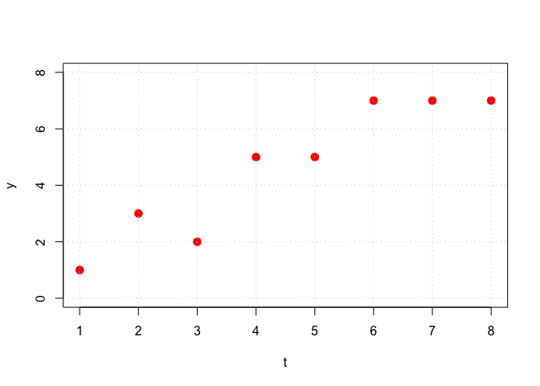

Remember to show your work / give your reasoning, as applicable.

    library(pracma)

### Problem 1

Let

$$
\mathbf{a}\_1 = \begin{pmatrix} 0 \\\\ 3 \\\\ 4 \end{pmatrix}, \quad \mathbf{a}\_2 = \begin{pmatrix} 2 \\\\ 2 \\\\ 1 \end{pmatrix}
$$

be the columns of the 3x2 matrix **A**. Let
${\cal W}=\hbox{col}(\mathbf{A})=\hbox{span}\\{\mathbf{a}\_1,\mathbf{a}\_2\\}$,
and let

$$
\mathbf{b} = \begin{pmatrix} 2 \\\\ -1 \\\\ 1 \end{pmatrix}.
$$

In this problem, any time you need a norm, use the Euclidean norm.

a\. Find the projection of **b** onto $\hbox{span}\\{\mathbf{a}\_1\\}$.
Call that $\widehat{\mathbf{b}}\_1$.

b\. Find the projection of **b** onto $\hbox{span}\\{\mathbf{a}\_2\\}$.
Call that $\widehat{\mathbf{b}}\_2$.

c\. Compute the pseudoinverse of **A**.

d\. Compute the projection operator $\mathbf{P}\_{{\cal W}}$ such that
the closest point to a given vector **v** ∈ ℝ3 in the space
${\cal W}$ is $\mathbf{P}\_{{\cal W}}\mathbf{v}$.

e\. Find the vector $\widehat{\mathbf{b}} \in {\cal W}$ that is closest
to *b*.

f\. TRUE or FALSE:
$\widehat{\mathbf{b}}=\widehat{\mathbf{b}}\_1 + \widehat{\mathbf{b}}\_2$.
When is this true in general? When is it false?

g\. Let ${\cal W}^{\perp}$ be the orthogonal complement of *W*; i.e.,
every vector in ${\cal W}^{\perp}$ is orthogonal to every vector in *W*.
What is the dimension of ${\cal W}^{\perp}$ for this problem?

h\. Draw an abstract picture (don’t worry about getting the placement of
the vectors correct) and label **a**1, **a**2,
${\cal W}$, ${\cal W}^{\perp}$, **b**, $\widehat{\mathbf{b}}\_1$,
$\widehat{\mathbf{b}}\_2$, $\widehat{\mathbf{b}}$, and
$\mathbf{r}=\mathbf{b}-\widehat{\mathbf{b}}$.

i\. Find vectors **v**1 and **v**2 in
ℝ3 such that these three conditions are all met:

-   **b** = **v**1 + **v**2
-   $\mathbf{v}\_1 \in {\cal W}$
-   $\mathbf{v}\_2 \in {\cal W}^{\perp}$

j\. What is the distance from **b** to ${\cal W}$?

### Problem 1 Solution

a\. Your solution goes here.

b\. Your solution goes here.

c\. Your solution goes here.

d\. Your solution goes here.

e\. Your solution goes here.

f\. Your solution goes here.

g\. Your solution goes here.

h\. Your solution goes here.

i\. Your solution goes here.

j\. Your solution goes here.

### Problem 2

Consider the points:

    t <- 1:8
    y <- c(1,3,2,5,5,7,7,7)
    plot(t, y, col = "red", pch = 20, cex = 2, xlim = c(1,8), ylim = c(0,8))
    grid()

a\. Setup the normal equations and solve them with R’s `solve` function
in order to find the least squares linear fit for this data. Plot your
regression line on the same plot with the points.

b\. Setup and solve the normal equations in order to find the least
squares parabola fit (i.e., polynomial of degree 2) for this data. Plot
your best fit curve on the same plot with the points.

c\. Do you expect ||**A****x** − **b**||22 (which
we call “the sum of squared residuals”) to be lower for part (a) or part
(b)? Why? Explain in plain English and using linear algebra vocabulary.
Does your answer depend on the set of data given to you? Compute the sum
of squared residuals for part (a) and part (b) to see if it matches your
intuition.

### Problem 2 Solution

a\. Your solution goes here.

b\. Your solution goes here.

c\. Your solution goes here.

### Problem 3

In this exercise, we go through the details of using optimization to
show that a vector **x** that satisfies the normal equations represents
the coefficients of the least squares solution.

a\. The least squares error term

$$
\frac{1}{2} ||\mathbf{A}\mathbf{x}-\mathbf{b}||\_2^2
$$

can be written as a quadratic function

$$
f(\mathbf{x})=\frac{1}{2}\mathbf{x}^{\top}\mathbf{P}\mathbf{x} + \mathbf{q}^{\top}\mathbf{x}+\mathbf{c}.
$$

Put the error term in this form, that is, find the matrix **P**, vector
**q** and constant vector **c** in terms of **A** and **b**. Hint:
remember that for any vector **v**,
||**v**||22 = **v**⊤**v**.

b\. Show that the **P** matrix from part (a) is symmetric and positive
semidefinite. Feel free to look up what positive semidefinite means!

c\. Here’s a fact: if the **P** matrix in the quadratic function form
above is symmetric positive semidefinite, then
∇*f*(**x**) = **P****x** + **q**, and the critical point **x**
satisfying ∇*f*(**x**) = **0** is a global minimum. Conclude that the
value of **x** that satisfies the normal equations gives the optimal
least squares coefficients.

### Problem 3 Solution

a\. Your solution goes here.

b\. Your solution goes here.

c\. Your solution goes here.
