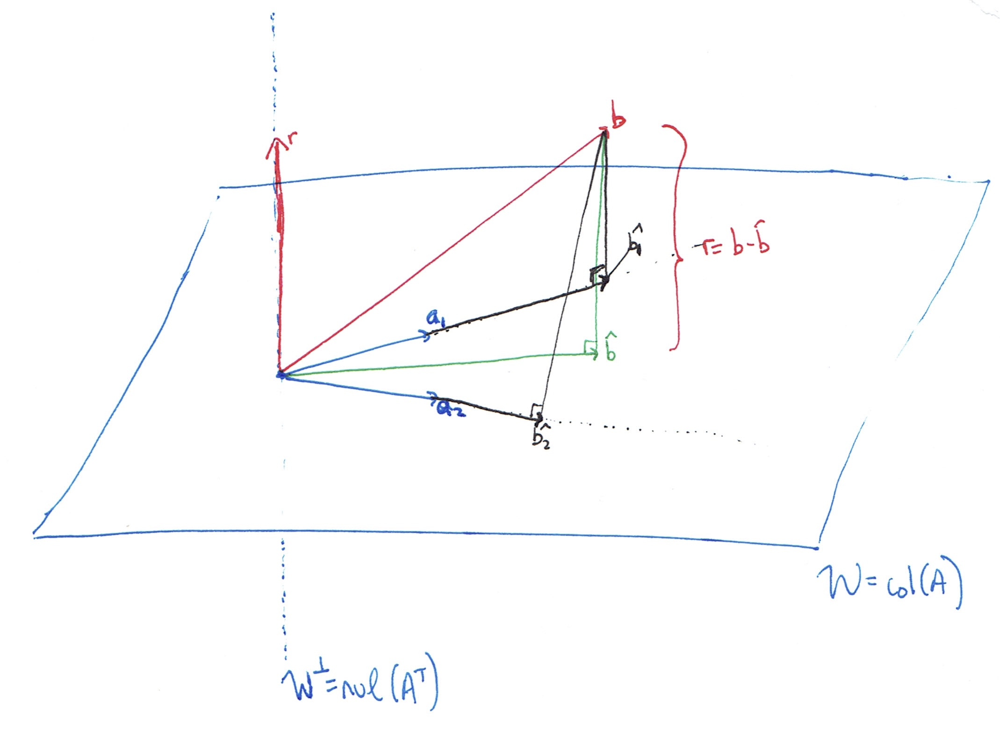

\renewcommand{\vec}[1]{\mathbf{#1}}
\renewcommand{\mat}[1]{\mathbf{#1}}

```{r message=FALSE}
library(pracma)
```

### Objectives

* Solidify conceptual understanding of least squares
* Implement least squares

### Procedure

* Please collaborate on this activity with one person as scribe (typist). There should only be one laptop open. We're aiming for actual collaboration here, not two or three people working in parallel.

* It doesn't matter if you finish the whole activity during class.

* It **does** mater if you focus on helping each other learn. Helping each other learn is the point of this activity. Completing the problems is merely a mechanism to guide you towards learning.

* It **does** mater if everyone participates. The expectation is that every group member participates, where the definition of "participation" can include asking questions, answering questions, brainstorming, or any other form of meaningful engagement.

* In the last three minutes of class, before you leave, please knit your .Rmd file to html, print the html to .pdf, and have the scribe submit it as a group assignment through GLOW.

* Don't forget that the solutions are available on GLOW.

### Problem 0

Recalling that academic integrity policies apply even in an ungraded course, please disclose any irregular circumstances related to participation in your group (for instance, a group member was missing and did not contribute to this document).

### Problem 0 Solution

Your solution goes here.

### Problem 1

Let $\vec{a}_1 = \begin{pmatrix} 0 \\ 3 \\ 4 \end{pmatrix}$ and $\vec{a}_2 = \begin{pmatrix} 2 \\ 2 \\ 1 \end{pmatrix}$ be the columns of the 3x2 matrix $\mat{A}$. Let ${\cal W}=\hbox{col}(\mat{A})=\hbox{span}\{\vec{a}_1,\vec{a}_2\}$, and let $\vec{b} = \begin{pmatrix} 2 \\ -1 \\ 1 \end{pmatrix}$. In this problem, any time you need a norm, use the Euclidean norm.

a. Find the projection of $\vec{b}$ onto $\hbox{span}\{\vec{a}_1\}$. Call that $\widehat{\vec{b}}_1$.

b. Find the projection of $\vec{b}$ onto $\hbox{span}\{\vec{a}_2\}$. Call that $\widehat{\vec{b}}_2$.

c. Compute the pseudoinverse of $\mat{A}$.

d. Compute the projection operator $\mat{P}_{{\cal W}}$ such that the closest point to a given vector $\vec{v} \in \mathbb{R}^3$ in the space ${\cal W}$ is $\vec{P}_{{\cal W}}\vec{v}$.

e. Find the vector $\widehat{\vec{b}} \in {\cal W}$ that is closest to $b$.

f. TRUE or FALSE: $\widehat{\vec{b}}=\widehat{\vec{b}}_1 + \widehat{\vec{b}}_2$. When is this true in general? When is it false?

g. Let ${\cal W}^{\perp}$ be the orthogonal complement of $W$; i.e., every vector in ${\cal W}^{\perp}$ is orthogonal to every vector in $W$. What is the dimension of ${\cal W}^{\perp}$ for this problem?

h. Draw an abstract picture (don't worry about getting the placement of the vectors correct) and label $\vec{a}_1$, $\vec{a}_2$, ${\cal W}$, ${\cal W}^{\perp}$, $\vec{b}$, $\widehat{\vec{b}}_1$, $\widehat{\vec{b}}_2$, $\widehat{\vec{b}}$, and $\vec{r}=\vec{b}-\widehat{\vec{b}}$.

i. Find vectors $\vec{v}_1$ and $\vec{v}_2$ in $\mathbb{R}^3$ such that these three conditions are all met:

    - $\vec{b}=\vec{v}_1+\vec{v}_2$
    - $\vec{v}_1 \in {\cal W}$
    - $\vec{v}_2 \in {\cal W}^{\perp}$

j. What is the distance from $\vec{b}$ to ${\cal W}$?

### Problem 1 Solution

a. through e.

```{r cache = TRUE}
A <- cbind(c(0,3,4),c(2,2,1))
b  <-  c(2,-1,1)
a1 <- A[,1]
a2 <- A[,2]
P1 <- a1 %*% solve(t(a1) %*% a1) %*% t(a1)
P2 <- a2 %*% solve(t(a2) %*% a2) %*% t(a2)
print(b1.hat <- P1 %*% b)                  # Part a
print(b2.hat <- P2 %*% b)                  # Part b
print(A.pseudo <- solve(t(A)%*%A)%*%t(A))  # Part c
print(PW <- A%*%A.pseudo)                  # Part d
print(b.hat <- PW%*%b)                     # Part e
print(b1.hat + b2.hat)                     # Part f
```

f. We can see that $\widehat{\vec{b}_1}+\widehat{\vec{b}_2} \neq \widehat{\vec{b}}$, so this is FALSE. The projection of a vector onto a subspace is the same as the sum of projections onto each of the basis vectors for that space if and only if the basis is orthogonal. Note that $\vec{a}_1$ and $\vec{a}_2$ are not orthogonal.

g. The orthogonal complement to the column space of $\mat{A}$, which is a plane in $\mathbb{R}^3$ is a line in $\mathbb{R}^3$, which has dimension 1.

h. 




i. Here $\vec{v}_1$ should be $\widehat{\vec{b}}$ and $\vec{v}_2$ should be the residual $\vec{b}-\widehat{\vec{b}}$:
```{r cache = TRUE}
v1 <- b.hat
v2 <- b - b.hat
v1 + v2
t(v1) %*% v2
```

j. The distance from $\vec{b}$ to ${\cal W}$ is the length of the residual, $\vec{v}_2$:
```{r cache = TRUE}
Norm(v2)
```


### Problem 2

Consider the points:

```{r cache = TRUE}
t <- 1:8
y <- c(1,3,2,5,5,7,7,7)
plot(t, y, col = "red", pch = 20, cex = 2, xlim = c(1,8), ylim = c(0,8))
grid()
```

a. Setup the normal equations and solve them with R's `solve` function in order to find the least squares linear fit for this data. Plot your regression line on the same plot with the points.

b. Setup and solve the normal equations in order to find the least squares parabola fit (i.e., polynomial of degree 2) for this data. Plot your best fit curve on the same plot with the points.

c. Do you expect $||\mat{A}\vec{x}-\vec{b}||_2^2$ (which we call "the sum of squared residuals") to be lower for part (a) or part (b)? Why? Explain in plain English and using linear algebra vocabulary. Does your answer depend on the set of data given to you? Compute the sum of squared residuals for part (a) and part (b) to see if it matches your intuition.

### Problem 2 Solution

a.
```{r cache = TRUE}
# Set up vandermonde function for convenience
vandermonde <- function(x) {
  A <- outer(x, (length(x)):1 - 1, "^")
  return(A)
}

# Our least squares problem is defined by last two columns of Vandermonde matrix
A2 <- vandermonde(t)[,(length(t)-1):(length(t))]

# Solve the normal equations
coeffs2 <- solve(t(A2)%*%A2, t(A2)%*%y)
print(t(coeffs2))

# Plot
f <- function(coeffs, z) horner(coeffs,z)
plot(t, y, col = "red", pch = 20, cex = 2, xlim = c(1,8), ylim = c(0,8))
tt <- seq(0, 9, length = 100)
lines(tt, f(coeffs2, tt)$y, col = "blue")
grid()
```

b.

```{r cache = TRUE}
A3 <- vandermonde(t)[,(length(t)-2):(length(t))]
coeffs3 <- solve(t(A3)%*%A3, t(A3)%*%y)
print(t(coeffs3))

# Plot
f <- function(coeffs, z) horner(coeffs,z)
plot(t, y, col = "red", pch = 20, cex = 2, xlim = c(1,8), ylim = c(0,8))
tt <- seq(0, 9, length = 100)
lines(tt, f(coeffs3, tt)$y, col = "blue")
grid()
```

c.

We expect the sum of the squared residuals to be lower for part (b). In plain English, this is because the class of fitted models considered in (b) contains all of the models considered in a) (you can always set the $t^2$ coefficient to 0), so we can always do at least as well in (b). In linear algebra terms, we are projecting the vector $\vec{y}$ onto the space spanned by the columns of $\mat{A}$. In (a), the columns of $\mat{A}$ span a two-dimensional plane in $\mathbb{R}^8$. In (b), the columns of $\mat{A}$ span a three-dimensional hyperplane in $\mathbb{R}^8$ that contains the plane from (a). So the projection of $\vec{y}$ onto this three-dimensional hyperplane will be at least as close to $\vec{y}$ as the projection of $\vec{y}$ onto the two-dimensional plane from (a). 

This answer does not depend at all on the data. It will always be true.

Now let's compute the sum of squared residuals to confirm our intuition:
```{r cache = TRUE}
b <- y
# sum of squared residuals for part a)
print(ssr.a <- (Norm(A2%*%coeffs2-y))^2)
print(ssr.b <- (Norm(A3%*%coeffs3-y))^2)
```

### Problem 3

In this exercise, we go through the details of using optimization to show that a vector $\vec{x}$ that satisfies the normal equations represents the coefficients of the least squares solution. 

a. Show that the least squares criterion $\frac{1}{2} ||\mat{A}\vec{x}-\vec{b}||_2^2$ can be written as a quadratic function 
$$ f(\vec{x})=\frac{1}{2}\vec{x}^{\top}\mat{P}\vec{x} + \vec{q}^{\top}\vec{x}+\vec{c}.$$
That is, find the matrix $\mat{P}$, vector $\vec{q}$ and constant vector $\vec{c}$ in terms of $\mat{A}$ and $\vec{b}$. Hint: remember that for any vector $\vec{v}$, $||\vec{v}||_2^2=\vec{v}^{\top}\vec{v}$.

b. Show that the $\mat{P}$ matrix from part (a) is symmetric and positive semidefinite. Feel free to look up what positive semidefinite means!

c. Here's a fact: if the $\mat{P}$ matrix in the quadratic function form above is symmetric positive semidefinite, then $\nabla f(\vec{x})=\mat{P}\vec{x}+\vec{q}$, and the critical point $\vec{x}$ satisfying $\nabla f (\vec{x})=\vec{0}$ is a global minimum. Conclude that the value of $\vec{x}$ that satisfies the normal equations gives the optimal least squares coefficients.

### Problem 3 Solution

a.

$$
\begin{align}
\frac{1}{2} ||\mat{A}\vec{x}-\vec{\vec{b}}||_2^2 &= \frac{1}{2}(\mat{A}\vec{x}-\vec{b})^{\top}(\mat{A}\vec{x}-\vec{b})\\
&=\frac{1}{2}[x^{\top}\mat{A}^{\top}\mat{A}\vec{x}-\vec{b}^{\top}(\mat{A}\vec{x})-(\mat{A}\vec{x})^{\top}\vec{b}+\vec{b}^{\top}\vec{b}]\\
&=\frac{1}{2}x^{\top}\mat{A}^{\top}\mat{A}\vec{x}-\vec{b}^{\top}\mat{A}\vec{x}+\frac{1}{2}\vec{b}^{\top}\vec{b}
\end{align}
$$
so $\mat{P}=\mat{A}^{\top}\mat{A}$, $\vec{q}=-\mat{A}^{\top}\vec{b}$, and $\vec{c}=\frac{1}{2}\vec{b}^{\top}\vec{b}$.

b. $(\mat{A}^{\top}\mat{A})^{\top}=\mat{A}^{\top}\mat{A}^{{\top}^\top}=\mat{A}^{\top}\mat{A}$, so $P$ is symmetric. We also have 
$$\vec{x}^{\top}\mat{A}^{\top}\mat{A}\vec{x}=(\mat{A}\vec{x})^{\top}(\mat{A}\vec{x})=||\mat{A}\vec{x}||_2^2 \geq 0, \hbox{ for all }x.$$

c. $\mat{P}\vec{x}+\vec{q} =0 \Leftrightarrow \mat{A}^{\top}\mat{A}\vec{x}=\mat{A}^{\top}\vec{b}$, the normal equations!!