-   <a href="#r-bootcamp" id="toc-r-bootcamp">R Bootcamp</a>
-   <a href="#how-computers-store-numbers"
    id="toc-how-computers-store-numbers">How computers store numbers</a>
-   <a href="#fundamentals-of-linear-systems"
    id="toc-fundamentals-of-linear-systems">Fundamentals of Linear
    Systems</a>
-   <a href="#lu-decomposition" id="toc-lu-decomposition">LU
    decomposition</a>
-   <a href="#iterative-methods-for-linear-systems"
    id="toc-iterative-methods-for-linear-systems">Iterative methods for
    linear systems</a>
-   <a href="#polynomial-interpolation"
    id="toc-polynomial-interpolation">Polynomial interpolation</a>
-   <a href="#interpolation-error-and-chebyshev-interpolation"
    id="toc-interpolation-error-and-chebyshev-interpolation">Interpolation
    error and Chebyshev interpolation</a>
-   <a href="#splines" id="toc-splines">Splines</a>
-   <a href="#least-squares" id="toc-least-squares">Least squares</a>
-   <a href="#qr-factorization" id="toc-qr-factorization">QR
    Factorization</a>
-   <a href="#eigenvalues" id="toc-eigenvalues">Eigenvalues</a>

# R Bootcamp

## Big picture

It’s time to review some math and start getting experience with R
programming.

## Goals

-   Implement Horner’s method
-   Explain advantage of Horner’s method
-   Define different ways to multiply vectors
-   Compute Taylor polynomials and bound the error

## Horner’s method

Evaluating a polynomial might seem boring, and admittedly, it sort of
is. But even a simple task like evaluating a polynomial can involve
complexities. Suppose that evaluating a polynomial on your comptuer
takes 0.005 seconds. That seems fast, but what if you are solving a
heavy-duty industrial problem that requires millions of evaluations?

Consider some methods for evaluating the polynomial
2*x*4 + 3*x*3 − 3*x*2 + 5*x* − 1:

1.  Naively, 2 ⋅ *x* ⋅ *x* ⋅ *x* ⋅ *x* + 3 ⋅ *x* ⋅ *x* ⋅ *x*….

-   10 multiplications, 4 additions (includes subtractions)

1.  Store (1/2)(1/2), bootstrap to (1/2)(1/2)(1/2), and so forth.

-   7 multiplications, 4 additions

1.  Horner’s method, factoring out successive powers of *x*, as in
     − 1 + *x*(5+*x*(−3+*x*(3+2*x*))).

-   4 multiplications, 4 additions

We can test:

    xvec <- runif(10^6)
    t1 <- system.time(
      for (x in xvec){
        2*x^4+3*x^3-3*x^2+5*x-1
      }
    )[3]
    t2 <- system.time(
      for (x in xvec){
        -1+x*(5+x*(-3+x*(3+2*x)))
      }
    )[3]
    t1/t2

    ##  elapsed 
    ## 2.195652

## Inner and outer products

There are several different ways to “multiply” vectors *x⃗* and *y⃗*:

1.  Element-wise. Just multiply each element of *x⃗* with the element in
    the corresponding poisiotn in *y⃗*. Note that *x⃗* and *y⃗* must have
    the same number of elements, and the result is a vector with the
    same number of elements.

2.  Dot product, also known as the inner product. To compute, calculate
    *x* ⋅ *y* ≡ *x⃗**T**y⃗* where the superscript *T* indicates
    transpose. Dot product is related to the angle *θ* between the two
    vectors as *x⃗* ⋅ *y⃗* = |*x⃗*||*y⃗*|cos *θ*. Rearranging this as
    *x⃗* ⋅ *y⃗*/|*y⃗*| = |*x⃗*|cos *θ* suggests the intuition of the dot
    product. It calculates a *projection* of one vector onto the other,
    or restated, it tells us how much of one vector is pointing in the
    direction of the other vector. Note that *x⃗* and *y⃗* must have the
    same number of elements, and the result is a scalar.

3.  Outer product. To compute, calculate
    *x* ⊗ *y* ≡ *x⃗**y⃗**T*. Note that *x⃗* and *y⃗* do not need
    to have the same number of elements, and the result is a matrix. If
    *x⃗* is *m* × 1 and *y⃗* is *n* × 1 then *x* ⊗ *y* is *m* × *n*.

4.  Cross product. We are not going to worry about this one for now.

Let’s calculate some examples.

    x <- c(1,2,3)
    y <- c(4,5,6)
    z <- c(7,8,9,10)
    x*y # element-wise

    ## [1]  4 10 18

    t(x)%*%y # dot product

    ##      [,1]
    ## [1,]   32

    sum(x*y) # dot product

    ## [1] 32

    x%*%t(z) # outer product

    ##      [,1] [,2] [,3] [,4]
    ## [1,]    7    8    9   10
    ## [2,]   14   16   18   20
    ## [3,]   21   24   27   30

    x%o%z # outer product

    ##      [,1] [,2] [,3] [,4]
    ## [1,]    7    8    9   10
    ## [2,]   14   16   18   20
    ## [3,]   21   24   27   30

## Taylor’s theorem

This theorem will be especially useful for error analysis of some
algorithms we use. The basic idea of Taylor’s theorem is that for many
functions, we can approximate the function around a point
*x*0 as a polynomial of finite degree, called the Taylor
polynomial, plus an error term that accounts for all the higher degree
terms we ignored.

More formally, suppose *f* is *n* + 1 times continuously differentiably
on the interval between *x*0 and *x*. Then
$$ f(x) = \left( \displaystyle \sum\_{k=0}^n \frac{f^{(k)}(x\_0)}{k!}(x-x\_0)^k \right) + \frac{f^{(n+1)}(c)}{(n+1)!}(x-x\_0)^{n+1}$$
where *c* is an (unknown) number between *x*0 and *x*.

For example, suppose *f*(*x*) = sin (*x*) and *x*0 = 0. We
can pre-compute some derivatives, *f*(0) = sin (0) = 0,
*f*(1)(0) = cos (0) = 1,
*f*(2)(0) =  − sin (0) = 0,
*f*(3)(0) =  − cos (0) =  − 1,
*f*(4)(0) = sin (0) = 0, and so on. Then the Taylor
polynomial to 4th order and the error term are are
$$ 0 + x + 0x^2 - \frac{x^3}{6} + 0\*x^4 + \frac{x^5}{120}\cos c.$$
Here is a plot of the function and the subsequent Taylor approximations.

    P1 <- function(x) {x}
    P3 <- function(x) {x-x^3/6}
    x = seq(from=-pi/2,to=pi/2,length=200)
    plot(x,sin(x),col="black",type="l")
    lines(x,P1(x),col="green")
    lines(x,P3(x),col="red")

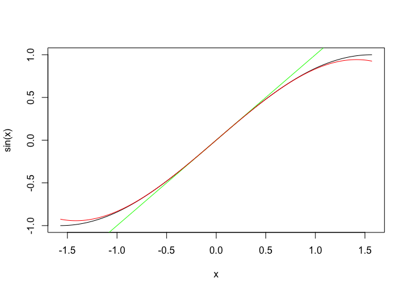

We can also calculaute a bound on the error if we use the fourth degree
polynomial to approxiamte sin (0.1). Note sin  is at most one in
magnitude, so the error term is at most
(0.1)5/120 ≈ 8.333 × 10−8. The actual error
achieved is

    abs(sin(0.1)-P3(0.1))

    ## [1] 8.331349e-08

# How computers store numbers

## Big picture

Many mathematics and applied mathematics problems can only be solved
numerically, on computers. There is, potentially, error in the way that
computers store numbers and perform arithmetic, and it is crucial to
understand this important source of error.

## Goals

-   Convert between decimal and binary
-   Explain the form of double precision floating point numbers
-   Convert between real numbers and floating point numbers
-   Implement nearest neighbor rounding
-   Recognize loss of numerical significance
-   Implement strategies to reduce loss of significance
-   Calculate/estimate the error arising in numerical computations

## Binary numbers

We usually work in the base 10 system, where each place in the number
represents a power of 10 with a coefficient of 0 through 9, *e.g.*,
13.25 = 1 × 101 + 3 × 100 + 2 × 10−1 + 5 × 10−2.
In the binary system, we instead use powers of 2 with coefficients of 0
through 1, *e.g.*,
1101.01 = 1 × 23 + 1 × 22 + 0 × 21 + 1 × 20 + 0 × 2−1 + 1 × 2−2.

## Machine numbers

Arithmetic performed on a machine can be different from what we do in
our heads. One fundamental difference is that computers can’t perfectly
store most numbers.

Most computers use a standard representation of real numbers called a
*floating point* number. Sometimes we just say *float* for short. We
represent the floating point version of a number *x* as *f**l*(*x*), and
to reiterate the point above, it is not necessarily true that
*f**l*(*x*) = *x*.

We focus on double precision floats. A double precision float consists
of 64 bits (1’s and 0’s) and, expressed in base 10, is equal to
(−1)*s*2*c* − 1023(1+*f*)
The parts of this number are:

<table>
<colgroup>
<col style="width: 17%" />
<col style="width: 11%" />
<col style="width: 20%" />
<col style="width: 52%" />
</colgroup>
<thead>
<tr class="header">
<th>Part of number</th>
<th>Name</th>
<th>Bits</th>
<th>Notes</th>
</tr>
</thead>
<tbody>
<tr class="odd">
<td>s</td>
<td>sign</td>
<td>1</td>
<td>Determines positive or negative</td>
</tr>
<tr class="even">
<td>c</td>
<td>exponent</td>
<td>2 - 12 (11 bits)</td>
<td>Subtract 1023 to correct exponential bias</td>
</tr>
<tr class="odd">
<td>f</td>
<td>mantissa</td>
<td>13 - 64 (52 bits)</td>
<td>Interpreted as a binary fraction (after radix pt)</td>
</tr>
</tbody>
</table>

For example, suppose our 64 bits are
1|10000000111|1101000000000000000000000000000000000000000000000000
Then expressed in base 10, *s* = 1, *c* = 1024 + 4 + 2 + 1 = 1031, and
*f* = 1/2 + 1/4 + 1/16 = 0.8125. So the floating point number is
(−1)1 ⋅ 21031 − 1023 ⋅ 1.8125 =  − 208.

Now let’s go the other way, namely converting from a decimal number to a
floating point number. In doing so, we’ll see that there can be error in
the computer storage of numbers. Let’s take the number 59 1/3.

1.  Convert to binary. The number is 111011.01010101….
2.  Write in normalized form, similar to scientific notation for
    base 10. In normalized form, there is a 1 before the radix point
    (nothing more, nothing less). This yelds
    $1.11011\overline{01}\times 2^5$.
3.  Work backwords to figure out *s*, *c*, and *f*. Since the number is
    positive, the sign is *s* = 0. Since we have 25, the
    exponent must equal 5 + 1023 = 1028 in base 10, which is
    10000000100. The mantissa *f* is $11011\overline{01}$.

The problem is that *f* is repeating, but on a computer only holds 52
bits. The computer truncates to 52 bits by nearest neigbor rounding,
which works like this:

-   If the 53rd bit is a 0, drop the 53rd bit and everything after it.
-   If the 53rd bit is a 1 and there is any nonzero bit after it, add 1
    to the 52nd bit (and carry as necessary).
-   If the 53rd bit is a 1 and there are only zeros after it,
-   If the 52nd bit is 1, add 1 to it and carry as necessary
-   If the 52nd bit is a 0, do nothing (truncate after 52nd bit)

For our example above, in the mantissa *f* we have 11011 followed by 23
copies of the pattern 01 followed by a 0. This means the 53rd bit is a
1, and there are nonzero bits after it, so we have to add 1 to the 52nd.
In base 10, we have
*f* = 2−1 + 2−2 + 2−4 + 2−5 + 2−7 + 2−9 +  + … + 2−51 + 2−52 = 0.85416666666666674068.
Therefore, on the machine, our number is stored as
25(1.85416666666666674068) = 59.333333333333335702 ≠ 59 1/3.

The relative error in the storage of this number is
$$\frac{|59\\ 1/3 -  59.333333333333335702|}{59\\ 1/3} \approx -4 \times 10^{-17}.$$
An important number is *machine epsilon*, denoted
*ϵ**m**a**c**h*, which is the distance from the number 1 to
the next smallest number that can be represented exactly in floating
point form. This distance is
*ϵ**m**a**c**h* = 2−52 ≈ 2.2 × 10−16.

## Machine addition

Machine addition is defined as
*f**l*(*x*+*y*) = *f**l*(*f**l*(*x*)+*f**l*(*y*)).
That is, take *x* and *y*, convert each to a machine number, add them
(exactly, since more registers are available for this operation), and
convert the result to a machine number. Subtraction is just addition
with a negative sign.

For example, let’s add 1 and 2−53. Well, *f**l*(1) = 1 and
*f**l*(2−53) = 2−53. The (exact) sum is
1 + 2−53 but due to the rounding rules on machines,
*f**l*(1+2−53) = 1. Therefore, on a machine, the sum is 1.
Let’s try:

    1+2^(-53)

    ## [1] 1

## Loss of significance

We’ve seen that computer storage of numbers can have error, and
therefore arithmetic can have error. This error is sometimes called
*loss of significance* and the most dangerous operation is subtraction
of nearly equal numbers. Consider the expression
(1−cos*x*)/sin2*x*, which can also be written as
1/(1+cos*x*). We compute this both ways for *x* decreasing from 1.

    options(digits=12)
    x <- 10^(-(0:12))
    E1 <- (1-cos(x))/sin(x)^2
    E2 <- 1/(1+cos(x))
    kable(cbind(x,E1,E2))

<table>
<thead>
<tr>
<th style="text-align:right;">
x
</th>
<th style="text-align:right;">
E1
</th>
<th style="text-align:right;">
E2
</th>
</tr>
</thead>
<tbody>
<tr>
<td style="text-align:right;">
1e+00
</td>
<td style="text-align:right;">
0.649223205205
</td>
<td style="text-align:right;">
0.649223205205
</td>
</tr>
<tr>
<td style="text-align:right;">
1e-01
</td>
<td style="text-align:right;">
0.501252086289
</td>
<td style="text-align:right;">
0.501252086289
</td>
</tr>
<tr>
<td style="text-align:right;">
1e-02
</td>
<td style="text-align:right;">
0.500012500208
</td>
<td style="text-align:right;">
0.500012500208
</td>
</tr>
<tr>
<td style="text-align:right;">
1e-03
</td>
<td style="text-align:right;">
0.500000124992
</td>
<td style="text-align:right;">
0.500000125000
</td>
</tr>
<tr>
<td style="text-align:right;">
1e-04
</td>
<td style="text-align:right;">
0.499999998628
</td>
<td style="text-align:right;">
0.500000001250
</td>
</tr>
<tr>
<td style="text-align:right;">
1e-05
</td>
<td style="text-align:right;">
0.500000041387
</td>
<td style="text-align:right;">
0.500000000012
</td>
</tr>
<tr>
<td style="text-align:right;">
1e-06
</td>
<td style="text-align:right;">
0.500044450291
</td>
<td style="text-align:right;">
0.500000000000
</td>
</tr>
<tr>
<td style="text-align:right;">
1e-07
</td>
<td style="text-align:right;">
0.499600361081
</td>
<td style="text-align:right;">
0.500000000000
</td>
</tr>
<tr>
<td style="text-align:right;">
1e-08
</td>
<td style="text-align:right;">
0.000000000000
</td>
<td style="text-align:right;">
0.500000000000
</td>
</tr>
<tr>
<td style="text-align:right;">
1e-09
</td>
<td style="text-align:right;">
0.000000000000
</td>
<td style="text-align:right;">
0.500000000000
</td>
</tr>
<tr>
<td style="text-align:right;">
1e-10
</td>
<td style="text-align:right;">
0.000000000000
</td>
<td style="text-align:right;">
0.500000000000
</td>
</tr>
<tr>
<td style="text-align:right;">
1e-11
</td>
<td style="text-align:right;">
0.000000000000
</td>
<td style="text-align:right;">
0.500000000000
</td>
</tr>
<tr>
<td style="text-align:right;">
1e-12
</td>
<td style="text-align:right;">
0.000000000000
</td>
<td style="text-align:right;">
0.500000000000
</td>
</tr>
</tbody>
</table>

The result becomes drastically wrong for small *x* because of
subtraction of nearly equal numbers. In such problems, be aware and seek
alternative ways to represent the necessary computation, as we did with
the second option above.

# Fundamentals of Linear Systems

## Big picture

We begin considering the solution of systems of linear equations,
$\mat{A}\vec{x}=\vec{b}$. Linear systems arise in analysis of different
equations (modeling macromolecules, electromagnetics, heat flow, wave
motion, structural engineering, a million other examples), in curve
fitting, in optimization, and many other applications. To understand
solution of linear systems, it’s helpful to recall some fundamental
ideas of linear algebra. Additionally, as we consider the solution of
problems on a computer, we have to think about the effect of small
errors on the solution of the problem. This is called conditioning. In
the linear algebra setting, conditioning is intimately related to matrix
and vector norms.

## Goals

-   Interpret linear systems geometrically
-   Define linear algebra terms including inverse, determinant,
    eigenvalues, nullspace, linear independence, span, and image
-   Give intuitive explanations for the “big theorem” of linear algebra
-   Perform the steps of Gaussian elimination
-   Establish the computational complexity of Gaussian elimination
-   Define forward and backward error
-   Define vector norms
-   Define matrix norms
-   Define condition number for solution of $\mat{A}\vec{x}=\vec{b}$

## Linear systems

For concreteness let’s work in three dimensions and let’s consider the
system
$$
\begin{pmatrix}
2 & 4 & -2\\\\
1 & 4 & -3\\\\
-2 & -6 & 7
\end{pmatrix}
\begin{pmatrix}
x\_1 \\\\ x\_2 \\\\ x\_3
\end{pmatrix}
=
\begin{pmatrix}
8 \\\\ 8 \\\\ -3
\end{pmatrix}.
$$
Let’s interpret this system two ways.

**Intersecting hyperplanes.** Carrying out the matrix multiplication, we
write the equations
$$
\begin{eqnarray}
2x\_1 + 4x\_2 -2x\_3 & = & 8\\\\
x\_1 + 4x\_2 -3x\_3 & = & 8\\\\
-2x\_1 -6x\_2 + 7x\_3 & = & -3
\end{eqnarray}
$$
This form suggests thinking of the set of points that are at the
intersection of these three planes, which could be the empty set, or a
point, or a line, or a plane.

**Vector spans.** Write the equation in terms of its columns, as

$$
x\_1 \begin{pmatrix} 2 \\\\ 1 \\\\ -2 \end{pmatrix}
+ x\_2 \begin{pmatrix} 4 \\\\ 4 \\\\ -6 \end{pmatrix}
+ x\_3 \begin{pmatrix} -2 \\\\ -3 \\\\ 7 \end{pmatrix}
= \begin{pmatrix} 8 \\\\ 8 \\\\ -3 \end{pmatrix}
$$

This form suggests thinking of the linear combination of three basis
vectors necessary to reach a particular target vector. There could be 0,
1, or inifinity depending on the arrangement of those vectors.

## Linear algebra review and the Big Theorem

Let’s consider an *n* × *n* matrix $\mat{A}$.

1.  **Invertible** means that the inverse $\mat{A}^{-1}$ exists. This
    matrix satisfies $\mat{A}\mat{A}^{-1} = \mat{I}$, where $\mat{I}$ is
    the *n* × *n* identity matrix.

2.  The notation det  means **determinant**. Think of it as a scaling
    factor for the transformation defined by a matrix. That is,
    multiplication by $\mat{A}$ can cause a region to contract
    ($|\det \mat{A}| &lt; 1$) or expand ($|\det \mat{A}| &gt; 1$) and/or
    reflect ($\det \mat{A} &lt; 0$). As an example, let
    $$\mat{A}=\begin{pmatrix}a & b\\\c & d\end{pmatrix}.$$
    For this example,
    $$\mat{A}^{-1} = \frac{1}{ad-bc}\begin{pmatrix}d & -b\\\\-c & a\end{pmatrix}.$$
    So $\mat{A}$ invertible $\iff \det \mat{A} \neq 0$.

3.  The **eigenvalues** *λ**i* of $\mat{A}$ satisfy
    $$\mat{A}\mathbf{v\_i}=\lambda\_i \mathbf{v\_i},$$
    where **v****i** are the **eigenvectors**. You can prove
    that
    $$\prod\_i \lambda\_i = \det \mat{A},$$
    so no $\lambda\_i = 0 \iff \det \mat{A} \neq 0$.

4.  $\mat{A} \mathbf{z} \neq 0$ for all **z** ∈ ℝ*n* except
    $\mathbf{z}=0 \iff \mat{A}$ is invertible. Why? If
    $\mat{A} \mathbf{z} = 0$ for **z** ≠ 0, then
    $\mat{A} \mathbf{z} = 0 \mathbf{z}$, so 0 is an eigenvalue. But for
    $\mat{A}$ to be invertible, we know 0 can’t be an eigenvalue. (If
    you are proof oriented you might notice that the implication needs
    to be shown both ways, but I am trying purposely not to prove here –
    just to give you some intuition.)

5.  **Nullspace** just means the parts of ℝ*n* that gets
    mapped to **0** by $\mat{A}$. Another name for nullspace is
    **kernel**. Mathematically, the nullspace is all the vectors **v**
    for which $\mat{A} \mathbf{v}=0$. So for an invertible matrix
    $\mat{A}$, the nullspace is **0**. This is basically assigning a
    definition to the previous point (above).

6.  If vectors are **linearly independent**, it means that none of the
    vectors can be written as a linear combination of the others. If
    $\mat{A}$ is invertible, then its columns are linearly independent.
    Why? If the columns were linearly dependent, you could take a linear
    combination of them to reach **0** nontrivially, for instance,
    $$\begin{pmatrix}1 & -2\\\2 & -4\end{pmatrix}\begin{pmatrix}x\_1 \\\\ x\_2 \end{pmatrix}=\begin{pmatrix}0 \\\\ 0\end{pmatrix}.$$
    This violates our previous condition (above) about the nullspace
    only being **0**.

7.  **Span** means the set of points reachable by taking linear
    combinations of a set of vectors. If you have *n* linearly
    independent vectors in ℝ*n*, they span ℝ*n*.
    The **rank** of 𝔸 is just the dimension of the space spanned by the
    column vectors.

8.  The **image** of $\mat{A}$ means all the points that $\mat{A}$ can
    map to. This is synonymous with the point above: it’s the span of
    the columns of $\mat{A}$. If the rank of $\mat{A}$ is *n*, then the
    column vectors are linearly independent so they span
    ℝ*n*, so the image of $\mat{A}$ is ℝ*n*.

9.  $\mat{A}\mathbf{x}=\mathbf{b}$ has a unique solution for all **b**⇔
    $\mat{A}$ is invertible, since you can left multiply by
    $\mat{A}^{-1}$.

## Gaussian elimination

First, we define **row echelon form**. A matrix is in row echelon for if

-   all nonzero rows (rows with at least one nonzero element) are above
    any rows of all zeroes
-   the leading coefficient (the first nonzero number from the left,
    also called the **pivot**) of a nonzero row is always strictly to
    the right of the leading coefficient of the row above it

Gaussian elimination refers to transforming a matrix to row echelon form
by applying the following operations, which do not change the solution
set:

-   swap two rows
-   multiply a row by a nonzero scalar
-   Add one row to a scalar multiple of another

To solve a linear system $\mat{A}\mathbf{x}=\mathbf{b}$, write it as an
augmented matrix, reduce it to row echelon form, and then use back
substitution to solve.

For example, take

$$
\mat{A} = 
\begin{pmatrix}
1 & 3 & 1\\\\
1 & 1 & -1 \\\\
3 & 11 & 5
\end{pmatrix}, \quad
\mathbf{b} = \begin{pmatrix}
9 \\\\ 1 \\\\ 35
\end{pmatrix}.
$$
Write augmented matrix
$$
\mathbf{A\_a} = \begin{pmatrix}
1 & 3 & 1 & 9 \\\\
1 & 1 & -1 & 1\\\\
3 & 11 & 5 & 35
\end{pmatrix}.
$$
Apply *I**I* ← *I**I* − *I* and *I**I**I* ← *I**I**I* − 3*I*.

$$
\mathbf{A\_a} = \begin{pmatrix}
1 & 3 & 1 & 9 \\\\
0 & -2 & -2 & -8\\\\
0 & 2 & 2 & 8
\end{pmatrix}.
$$
Apply *I**I**I* ← *I**I**I* + *I**I*.
$$
\mathbf{A\_a} = \begin{pmatrix}
1 & 3 & 1 & 9 \\\\
0 & -2 & -2 & -8\\\\
0 & 0 & 0 & 0
\end{pmatrix}.
$$

The bottom row tells us nothing. The second row tells us there is a free
variable, which we take to be *x*3. So we solve this equation
for *x*2, finding *x*2 = 4 − *x*3. This
is called back substitution. Then we do back substitution on the top
row, from which we find
*x*1 = 9 − *x*3 − 3*x*2 = 9 − *x*3 − 3(4−*x*3) =  − 3 + 2*x*3.
Therefore, the solution is
$$
\mathbf{x} = \begin{pmatrix}  -3 + 2x\_3 \\\\ 4 - x\_3 \\\\ x\_3 \end{pmatrix} = \begin{pmatrix}  -3 \\\\ 4\\\\ 0 \end{pmatrix} + x\_3 \begin{pmatrix}  2 \\\\ -1 \\\\ 1 \end{pmatrix}.
$$

By the way, we can go ahead and use a routine I’ve written to perform
the elimination.

    A <- matrix(c(1,3,1,9,1,1,-1,1,3,11,5,35),nrow=3,byrow = TRUE)
    eliminate(A)

    ##      [,1] [,2] [,3] [,4]
    ## [1,]    1    3    1    9
    ## [2,]    0   -2   -2   -8
    ## [3,]    0    0    0    0

## Operation counts and complexity

Because we are solving problems on computers, we should care about how
long solution takes, which in turn depends on the number of
computational operations carried out. This is called the *complexity* of
the method. For solving $\mat{A}\mathbf{x}=b$, with $\mat{A}$ an
*n* × *n* matrix, we write the complexity in terms of *n*. Then, we are
usually concerned with the behavior of the operation count for *n*
large, so we might retain just the leading term in *n* as an
approximation, or even ignore the coefficient in front that leading
term.

For Gaussian elimination, we have to compute the complexity of the two
stages.

1.  Reduce to echelon form. This takes
    $$\frac{2}{3}n^3 + \frac{1}{2}n^2-\frac{7}{6}n = \mathcal{O}(n^3)$$
    operations.

2.  Back substitute. This takes *n*2 = 𝒪(*n*2)
    operations.

Back substitution is comptuationally cheap compared to row reduction.
For large enough *n*, the back substitution step is negligible since
*n*3 ≫ *n*2.

We can use these operation counts to make estimates of how long
calculations should take.

For example, suppose row reduction on a 500 × 500 matrix takes 1 second.
How long does back substitution take? Well, we just use leading terms in
the complexity. Since *n* = 500, we have (2/3) \* 5003*t* = 1
where *t* is time per operation. Solving, *t* = 1.2 × 10−8.
Back substitution takes *n*2 = 5002 operations, so
the total time is
*n*2*t* = 5002 × 1.2 × 10−8 = 0.003
seconds.

Let’s test scaling of the reduction step on Chad’s machine for a random
matrix.

    set.seed(123)
    n1 <- 200
    A1 <- matrix(runif(n1^2), ncol=n1)
    t1 <- system.time(eliminate(A1))[3]
    n2 <- 2*n1
    A2 <- matrix(runif(n2^2), ncol=n2)
    t2 <- system.time(eliminate(A2))[3]
    t2/t1

    ##       elapsed 
    ## 5.25694444444

## Forward and backward error

In the solution of a computational problem, **forward error** is the
difference between the exact and computed solution, and **backwards
error** is the difference between the original problem and the so-called
modified problem that the approximate solution satisfies. This probably
sounds abstract, so let’s make it concrete in the cases of a
root-finding problem and a linear algebra problem.

Suppose we want to solve $\mat{A}\mathbf{x}=b$. The true solution is
**x** but our computational method finds an approximate solution
**x***a*. The forward error is the distance between the two
solutions, that is, ||**x** − **x****a**||. The backward
error is the distance between what the matrix outputs when applied to
those solutions, that is,
$||\mat{A}\mathbf{x}-\mat{A}\mathbf{x}\_a||=||\mathbf{b}-\mat{A}\mathbf{x}\_a||$.
Distance here is the length of the difference between two quantities.

Notice that we haven’t specified what distance means! This is why we
need to define vector and matrix norms.

## Vector norms

A vector norm is a rule that assigns a real number to every vector.
Intuitively, it measures length. There are a bunch of requirements that
this rule must satisfy in order to be a norm, but rather than stating
those requirements, I’m going to just tell you some practicalities.

The vector norm we’ll work with is called the *p*-norm. The *p*-norm for
1 ≤ *p* ≤ ∞ is defined as

||**x**||*p* = (|*x*1|*p*+|*x*2|*p*+⋯+|*x**n*|*p*)1/*p*.

The three most common *p*-norms are *p* = 1, 2, ∞ since they are the
easiest to compute with and in some sense are the most natural:

-   *p* = 1 (the Manhattan or taxicab norm)
    ||**x**||1 = |*x*1| + |*x*2| + ⋯ + |*x**n*|
-   *p* = 2 (the Euclidean norm)
    $$
    || \mathbf{x} ||\_2 = \sqrt{x\_1^2 + x\_2^2 + \cdots + x\_n^2\\ } = \sqrt{\mathbf{x} \cdot \mathbf{x}}
    $$
-   *p* = ∞
    ||**x**||∞ = max (|*x*1|,|*x*2|,…,|*x**n*|)

For *p* = ∞ it takes a little analysis to show why the computational
definition is what it is, but a numerical study is usually convincing.
We can use the `Norm` command

    v <- c(3,-2,2,3,1,4,1,2,3)
    pvals <- c(1,1.5,2,3,4,5,6,7,20)
    res <- NULL
    for (p in pvals){
      res <- c(res,Norm(v,p))
    }
    res <- c(res,Norm(v,Inf))
    kable(cbind(c(pvals,"Infinity"),res),col.names=c("p","norm"))

<table>
<thead>
<tr>
<th style="text-align:left;">
p
</th>
<th style="text-align:left;">
norm
</th>
</tr>
</thead>
<tbody>
<tr>
<td style="text-align:left;">
1
</td>
<td style="text-align:left;">
21
</td>
</tr>
<tr>
<td style="text-align:left;">
1.5
</td>
<td style="text-align:left;">
10.5102535215316
</td>
</tr>
<tr>
<td style="text-align:left;">
2
</td>
<td style="text-align:left;">
7.54983443527075
</td>
</tr>
<tr>
<td style="text-align:left;">
3
</td>
<td style="text-align:left;">
5.55049910291155
</td>
</tr>
<tr>
<td style="text-align:left;">
4
</td>
<td style="text-align:left;">
4.84053189512475
</td>
</tr>
<tr>
<td style="text-align:left;">
5
</td>
<td style="text-align:left;">
4.50278575773901
</td>
</tr>
<tr>
<td style="text-align:left;">
6
</td>
<td style="text-align:left;">
4.31746656321528
</td>
</tr>
<tr>
<td style="text-align:left;">
7
</td>
<td style="text-align:left;">
4.20717405025799
</td>
</tr>
<tr>
<td style="text-align:left;">
20
</td>
<td style="text-align:left;">
4.00189474866413
</td>
</tr>
<tr>
<td style="text-align:left;">
Infinity
</td>
<td style="text-align:left;">
4
</td>
</tr>
</tbody>
</table>

To further build intuition, we can plot the unit sphere in ℝ2
for various values of *p*, that is, the set of points that are unit
distance from the origin. 

## Matrix norms

The matrix *p*-norm is closely related to the vector *p*-norm, and is
given by

$$
||\mat{A}||\_p = \max\_{\mathbf{x} \not = \mathbf{ 0}} \frac{ || \mat{A} \mathbf{x}||\_p} { ||\mathbf{x}||\_p} = \max\_{||\mathbf{x}||\_p  = 1}  || \mat{A} \mathbf{x}||\_p
$$

The matrix *p*-norm says: apply *A* to the unit sphere, and
$||\mat{A}||\_p$ is the length of the vector that is farthest from the
origin. This is not trivial to calculate! You have an infinite number of
vectors to consider.

Fortunately, just like for the vector case, the matrix *p*-norm has a
few special values of *p* for which it is easy to compute. We have:

-   *p* = 1
    $$
    ||\mat{A} ||\_1 = \displaystyle{\max\_{1 \le j \le n} \sum\_{i=1}^n |a\_{ij}|} = \text{maximum absolute column sum}
    $$

-   *p* = 2
    $$
    || \mat{A} ||\_2 = \sqrt{\max\\{ \text{eigenvalue}(A^TA) \\} }
    $$

-   *p* = ∞
    $$
    || \mat{A} ||\_\infty = \displaystyle{\max\_{1 \le i \le n} \sum\_{j=1}^n |a\_{ij}|} = \text{maximum absolute row sum}
    $$

To see why these definitions are true requires some analysis. If you are
interested, I am happy to point you to proofs.

You can calculate the 1, 2, and ∞ matrix norms using the R command
`norm`.

    A <- matrix(c(2,-1,1,1,0,1,3,-1,4),byrow = TRUE, nrow = 3)
    norm(A,"1")

    ## [1] 6

    norm(A,"2")

    ## [1] 5.72292695333

    norm(A,"I")

    ## [1] 8

There is one really useful identity you should know about matrix norms:

$$||\mat{A}\mathbf{x}||\_p \leq ||\mat{A}||\_p ||\mathbf{x}||\_p.$$

To see this, we start with the right hand side and note

$$||\mat{A}||\_p ||\mathbf{x}||\_p = \left( \max\_{\mathbf{y} \not = \mathbf{ 0}} \frac{ || \mat{A} \mathbf{y}||\_p} { ||\mathbf{y}||\_p} \right) ||\mathbf{x}||\_p \geq \frac{ || \mat{A} \mathbf{x}||\_p} { ||\mathbf{x}||\_p} ||\mathbf{x}||\_p = || \mat{A} \mathbf{x}||\_p.$$

## Condition number for **Ax**=**b**

Let us consider solving $\mat{A}\mathbf{x}=\mathbf{b}$. Suppose we find
approximate solution **x***a*. The **relative forward error**
is
$$\frac{||\mathbf{x}-\mathbf{x}\_a||}{||\mathbf{x}||}$$
and the **relative backward error** is
$$\frac{||\mat{A}\mathbf{x}-\mat{A}\mathbf{x}\_a||}{||\mat{A}\mathbf{x}||}=\frac{||\mathbf{b}-\mat{A}\mathbf{x}\_a||}{||\mathbf{b}||}.$$
We define **error magnification** as the ratio
$$\frac{\text{relative forward error}}{\text{relative backward error}}=\frac{\frac{||\mathbf{x}-\mathbf{x}\_a||}{||\mathbf{x}||}}{\frac{||\mathbf{b}-\mat{A}\mathbf{x}\_a||}{||\mathbf{b}||}}.$$

The **condition number** $\kappa(\mat{A})$ is the largest possible error
magnification (over all possible **x**). Or restated, it’s the worst
possible ratio of relative forward error to relative backward error.

Why do we care about this? It tells us whether we expect a small
residual to imply a small error in the solution or not. Let’s make this
concrete with an example.

Consider:

-   Let
    $\mat{A} = \begin{pmatrix}0.913 & 0.659 \\\\ 0.457 & 0.330 \end{pmatrix}$
-   Then *κ*2(*A*) = 1.25 × 104
-   Let $\mathbf{b} = \begin{pmatrix} 0.254 \\\\ 0.127 \end{pmatrix}$
-   Then **x** = (1,−1).
-   Consider two approximate solutions **x**1, 2

$$
\begin{array}{lcl}
\mathbf{x}\_1 = (-0.0827,0.5) && \mathbf{x}\_2 = (0.999,-1.001) \\\\
\triangle \mathbf{x}\_1 = (1.0827, -1.5) && \triangle \mathbf{x}\_2 = (0.001,0.001) \\\\
||\triangle \mathbf{x}\_1 || = 1.85&& ||\triangle \mathbf{x}\_2|| = .0014\\\\
||\triangle \mathbf{x}\_1 ||/||\mathbf{x}|| = 1.308&& ||\triangle \mathbf{x}\_2||/||\mathbf{x}|| = .001\\\\
\mathbf{b}\_1 = (0.2539949, 0.1272061) &&  \mathbf{b}\_2 = (0.252428, 0.126213) \\\\
\triangle\mathbf{b}\_1 = (0.0000051,- 0.0002061) &&  \triangle\mathbf{b}\_2 = (0.001572, 0.000787) \\\\
||\triangle \mathbf{b}\_1 || = 0.000206&& ||\triangle \mathbf{b}\_2|| = .00176\\\\
||\triangle \mathbf{b}\_1 ||/||\mathbf{b}|| = 0.000726&& ||\triangle \mathbf{b}\_2||/||\mathbf{b}|| = .0062\\\\
mag = 1.8 \times 10^3 && mag = 1.6 \times 10^1
\end{array}
$$

We can go ahead and calculate the actual condition number of the matrix.
R has a command called `kappa` that computes the condition number
approximately by default, or exactly if specified.

    A <- matrix(c(0.913,0.659,0.457,0.330),nrow=2,byrow=TRUE)
    kappa(A)

    ## [1] 14132.0316376

    kappa(A,exact=TRUE)

    ## [1] 12485.031416

## Calculating the condition number

Remember that the condition number isn’t merely an error magnification –
it’s the maximum possible error magnificaton. Computing *κ* exactly
using this definition is impossible because there are an infinite number
vectors one must consider $\mat{A}$ acting on.

Fortunately, there’s another way to calculate condition number:

$$
\kappa\_p(\mat{A})=||\mat{A}||\_p||\mat{A}^{-1}||\_p
$$

The derivation of this identity is about 10 to 20 lines of linear
algebra that I am happy to show you if you are interested. We can check
it numerically for now.

    set.seed(123)
    N <- 10
    A <- matrix(runif(N^2),nrow=N)
    ans1 <- norm(A,"2")*norm(solve(A),"2")
    ans2 <- kappa(A,norm="2",exact=TRUE)

# LU decomposition

## Big picture

When solving systems of linear equations, depending on the context,
solution by Gaussian elimination can be computationally costly.
Sometimes it is better to decompose (factor) the matrix. There are a
number of useful ways to do this but the one we will focus on is called
LU decomposision.

## Goals

-   Define and implement LU decomposition and state the potential
    advantages

## LU decomposition

Recall that when solving an *n* × *n* system
$\mat{A}\mathbf{x} = \mathbf{b}$ with Gaussian elimination, the
elimination step is 𝒪(*n*3) and back substitution is
𝒪(*n*2). In some applications, it is necessary to solve
$$
\mat{A}\mathbf{x} = \mathbf{b}\_1, \quad \mat{A}\mathbf{x} = \mathbf{b}\_2, \quad \mat{A}\mathbf{x} = \mathbf{b}\_3, \quad \ldots, \quad \mat{A}\mathbf{x} = \mathbf{b}\_M
$$
where $\mat{A}$ is the same each time and *M* is large. $\mat{A}$ itself
needs the same row reductions each time. Only the augmented part **b**
changes. It would be a waste of computation to run Gaussian elimination
*M* times.

LU decomposition is a way of storing the Gaussian elimination steps in
matrix form so that they can be applied to many **b**. We take $\mat{A}$
and decompose (or factorize) it as the product

$$
A  = 
\underbrace{\begin{array}{|cccccc|}
\hline
1 &&&&&\\\\
\ast & 1 &&&&\\\\
\ast & \ast  & 1 &&&\\\\
\ast & \ast & \ast & 1 &&\\\\
\ast & \ast & \ast & \ast & 1  &\\\\
\ast & \ast & \ast & \ast & \ast & 1 \\\\ \hline
\end{array}}\_{\mathbf{L}=\text{Lower unit triangular}} \\
\underbrace{\begin{array}{|cccccc|}
\hline
\ast & \ast & \ast & \ast & \ast & \ast \\\\ 
&\ast & \ast & \ast & \ast & \ast  \\\\
&&\ast & \ast & \ast & \ast \\\\
&&&\ast & \ast  & \ast \\\\
&&&&\ast & \ast \\\\
&&&&&\ast \\\\
\hline
\end{array}}\_{\mathbf{U}=\text{Upper triangular}}
$$

The **L** matrix encodes the multipliers used to eliminate elements
during Gaussian elimination and the **U** matrix is the result of the
elimination process. Therefore, putting $\mat{A}$ into its LU
factorization takes one application of Gaussian elimination, or
approximately $\frac{2}{3} n^3$ operations. Solving
**L****U****x** = **b** requires 2 back substitutions, namely one to
solve **L****y** = **b** for **y** and one to solve **U****x** = **y**
for **x**. This takes 2*n*2 operations. So, to solve
$\mat{A}\mathbf{x} = \mathbf{b}\_1, \ldots, \mat{A}\mathbf{x} = \mathbf{b}\_M$
takes approximately $\frac{2}{3}n^3 + 2 M n^2$ operations, in contrast
to $\frac{2}{3}Mn^3 + Mn^2$ for Gaussian elimination.

The LU decomposition exists if and only if the upper-left sub-blocks
$\mat{A}\_{1:k,1:k}$ are non-singular for all 1 ≤ *k* ≤ *n* (not proven
here). If the decomposition exists, it is unique.

Let’s do an example of how LU decomposition works. Take

$$
\mat{A} = 
\begin{pmatrix}
1 & 3 & 1\\\\
1 & 1 & -1 \\\\
3 & 11 & 5
\end{pmatrix}.
$$

Start by defining $\mathbf{U} = \mat{A}$ (it’s not upper triangluar yet,
but I am still calling it **U**) and

$$
\mathbf{L} = \mathbf{I}\_3 = 
\begin{pmatrix}
1 & 0 & 0\\\\
0 & 1 & 0 \\\\
0 & 0 & 1
\end{pmatrix}.
$$

Apply *I**I* ← *I**I* − 1 ⋅ *I* and *I**I**I* ← *I**I**I* − 3 ⋅ *I* to
**U**, so

$$
\mathbf{U} = \begin{pmatrix}
1 & 3 & 1  \\\\
0 & -2 & -2\\\\
0 & 2 & 2
\end{pmatrix}.
$$

Also, store the multupliers 1 and 3 in their corresponding rows in the
first column of **L**, so that

$$
\mathbf{L} =
\begin{pmatrix}
1 & 0 & 0\\\\
1 & 1 & 0 \\\\
3 & 0 & 1
\end{pmatrix}.
$$

Now apply *I**I**I* ← *I**I**I* + *I**I*, which yields

$$
\mathbf{U} = \begin{pmatrix}
1 & 3 & 1  \\\\
0 & -2 & -2\\\\
0 & 0 & 0
\end{pmatrix}
$$

and

$$
\mathbf{L} =
\begin{pmatrix}
1 & 0 & 0\\\\
1 & 1 & 0 \\\\
3 & -1 & 1
\end{pmatrix}.
$$

Since **U** is in echelon form, we are done! We can check that our
decomposition worked.

    A <- matrix(c(1,3,1,1,1,-1,3,11,5),nrow=3,byrow=TRUE)
    L <- matrix(c(1,0,0,1,1,0,3,-1,1),nrow=3,byrow=TRUE)
    U <- matrix(c(1,3,1,0,-2,-2,0,0,0),nrow=3,byrow=TRUE)
    A - L%*%U

    ##      [,1] [,2] [,3]
    ## [1,]    0    0    0
    ## [2,]    0    0    0
    ## [3,]    0    0    0

We can also use the `lu` command.

    sol <-  lu(A, scheme = "ijk")
    L <- sol$L
    U <- sol$U
    A - L%*%U

    ##      [,1] [,2] [,3]
    ## [1,]    0    0    0
    ## [2,]    0    0    0
    ## [3,]    0    0    0

Let’s use Gaussian elimination with the `echelon` command and LU
decomposition with the to compare the time for solving a 100 × 100
system for 100 different right hand sides.

    n <- 10
    A <- matrix(runif(n^2),nrow=n)
    set.seed(123)
    t1 <- system.time(
      for (i in 1:n){
        b <- runif(n)
        x <- echelon(A,b)
      }
    )[3]
    t2 <- system.time(
      LU <- lu(A, scheme = "ijk")
    )[3]
    L <- LU$L
    U <- LU$U
    set.seed(123)
    t3 <- system.time(
      for (i in 1:n){
        b <- runif(n)
        y <- forwardsolve(L,b)
        x <- backsolve(U,y)
      }
    )[3]
    as.numeric(t1/(t2 + t3))

    ## [1] 6.66666666667

# Iterative methods for linear systems

## Big picture

So far, all of the methods you have seen for solving linear systems
provide exact solutions (excluding numerical error). They are called
direct methods. However, they all involve at least one step that is
𝒪(*n*3). If this computational cost is prohibitive, consider
a potentially faster iterative method at the expense of giving up having
an exact solution.

## Goals

-   Explain how fixed point iteration relates to solution of an equation
-   Derive and implement Jacobi’s method, and explain advantages and
    limitations
-   Use convergence criteria for Jacobi’s method
-   State other iterative solution methods

## Fixed point iteration

Sometimes you can solve a problem by a method called **fixed point
iteration** whereby you just keep plugging into an expression until the
output equals the input. For example, suppose you want to solve
(*x*−3)(*x*+1) = *x*2 − 2*x* − 3 = 0. Pretend you don’t know
where the roots are but you think there is one near x = -2, so you start
out with that guess. You also notice you can write
*x*2 − 2*x* − 3 = 0 as *x* = 3/(*x*−2). So you define an
iteration *x**i* + 1 = 3/(*x**i*−2).

    x <- -2
    for (i in 1:10){
      x <-  3/(x-2)
    }

The iteration seems to be converging to a root. What if we try a guess
near the other root?

    x <- 3.00001
    for (i in 1:20){
      x <-  3/(x-2)
    }

The iteration does not have to converge to the solution we want, and in
fact, it doesn’t have to converge at all.

But if it converges, it’s pretty nifty. It’s computationally cheap – all
we have to do is evaluate the right hand side of our iteration
repeatedly.

## Jacobi iteration

Let’s take this idea and apply it to solving
$\mat{A}\mathbf{x}=\mathbf{b}$. Let $\mat{A} = \mathbf{D} + \mathbf{R}$
where **D** contains the diagonal elements of $\mat{A}$ and **R**
contains everything else. Then we can write

$$
\begin{align}
\mat{A}\mathbf{x} &= \mathbf{b} \\\\
(\mathbf{D}+\mathbf{R})\mathbf{x} &= \mathbf{b} \\\\
\mathbf{D}\mathbf{x} + \mathbf{R} \mathbf{x} &= \mathbf{b}\\\\
\mathbf{D} \mathbf{x} &= \mathbf{b} - \mathbf{R} \mathbf{x}\\\\
\mathbf{x} &= \mathbf{D}^{-1} (\mathbf{b}-\mathbf{R}\mathbf{x})
\end{align}
$$

We can consider this a fixed point iteration,

**x***i* + 1 = **D**−1(**b**−**R****x***i*).

Here are some computational advantages of this method.

1.  The matrix **D** is very cheap to invert, because it is a diagonal
    matrix. The inverse is simply the diagonal matrix with the
    reciprocals of the original elements.
2.  Each iteration is only 𝒪(*n*2), and if the matrix is
    sparse, it is even cheaper.

The usual way we stop iterating is that we choose in advance a threshold
for the relative backwards error and stop when we fall below it.

Here’s an example.

    set.seed(123)
    n <- 1000
    A <- matrix(runif(n^2), nrow = n)
    diag(A) <- n + 1 + diag(A)
    b <- runif(n)
    t1 <- system.time(
      xexact <- solve(A,b)
    )[3]
    xapprox <- rep(0,n)
    d <- diag(A)
    R <- A - diag(d)
    err <-  Inf
    tol <- 1e-10
    t2 <- system.time(
      while (err > tol){
        xapprox <- (b - R%*%xapprox)/d
        err <- Norm(b-A%*%xapprox,Inf)/Norm(b,Inf)
      }
    )[3]
    Norm(xapprox-xexact,Inf)

    ## [1] 3.64232569886e-14

    t1/t2

    ##       elapsed 
    ## 2.25316455696

## Convergence of Jacobi’s method

There’s no reason at all to expect that Jacobi’s method converges.
There’s a really useful theorem that says it it will converge if and
only if the eigenvalues of  − **D**−1**R** are all less than
one in magnitude. If this criterion is met, then the closer to one the
eigenvalues are in magnitude, the slower convergence will be. This takes
about half a page to prove and is a worthwhile exercise to understand,
so feel free to ask me for the proof.

However, calculating the eigenvalues of that matrix could be really hard
and costly! There’s a sufficient condition for convergence that is much
easier to check computationally, namely that $\mat{A}$ is **strictly
diagonally dominant**. This means

|*a**i**i*| &gt; ∑*j* ≠ *i*|*a**i**j*|  in each row *i*.

## Other iterative methods

There are other iterative solution methods for linear systems that all
are inspired by Jacobi’s method. Some of these include Gauss-Seidel
iteration and Successive Over-Relaxation. Details of these appear in
book and you are welcome to discuss them with me.

# Polynomial interpolation

## Big picture

Now we enter into the part of this course that is about data. As
scientists, often we will have access only to noisy or partial data such
as a sound signal, a visual image, geograhpic data, network data, and so
forth. We may wish to fill in the missing data, make predictions, smooth
the data, compress it, differentiate or integrate it, visualize it, and
more. These are data processing tasks. The first approach we present is
polynomial interpolation and approximation. Interpolation refers to
constructing new data points within the range of a discrete set of known
points. Approximation refers to finding an approximation to given
function by choosing a function from a predetermined class, which in
this case, is polynomials.

## Goals

-   Explain the advantage of using polynomials to describe data
-   Implement Vandermonde interpolation and explain its pros/cons
-   Implement Lagrange inteprolation and explain its pros/cons
-   Explain and implement data compression via interpolation

## Why polynomials?

Suppose we have incomplete data and we’d like to estimate a piece of
information that we don’t have.

    # I created some mystery data and hid it from you
    plot(x,y)

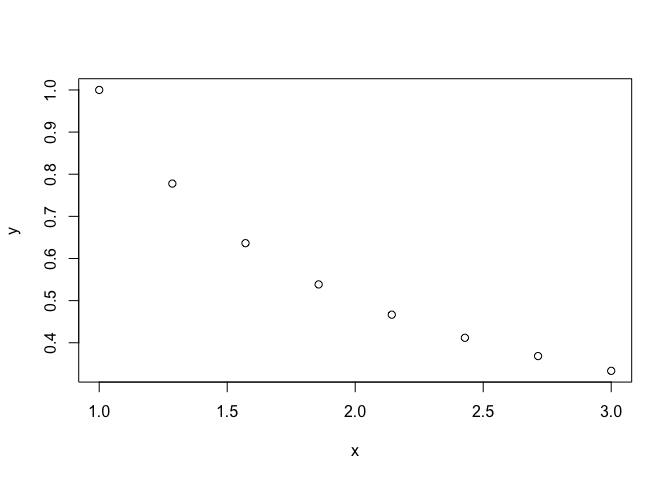

We might try to use polynomials to describe the data, and then glean
information from the polynomial. Polynomials are convenient for several
reasons.

First, for any function that is defined and continuous on a closed,
bounded interval, there exists a polynomial that is as “close” to the
given function as desired. Stated more precisely, this is the
**Weierstrass Approximation Theorem**. Suppose *f* is defined and
continuous on \[*a*,*b*\]. For each *ϵ* &gt; 0, there exists a
polynomial *P*(*x*) with the property that |*f*(*x*)−*P*(*x*)| &lt; *ϵ*
for all *x* ∈ \[*a*,*b*\].

Second, polynomials are easy to handle computationally. It is fast to
evaluate them using Horner’s method and it is straightforward to
integrate and differentiate them.

Though polynomials are convenient, we won’t use Taylor polynomials.
Taylor polynomials can do a great job accurately describing a function
near a single point, but we are now instead interested in getting a good
approximation over an interval.

In contrast, a polynomial that passes through every data point is called
the interpolating polynomial.

Even though I haven’t yet told you how to find an interpolating
polynomial, let’s compare the Taylor and interpolating approaches.
Consider *f*(*x*) = 1/*x* on the interval \[1,3\]. The second degree
Taylor polynomal through *x* = 1 (as an example) is
*T*(*x*) = 3 − 3*x* + *x*2. The interpolating polynomial
using three points from sampled equally across the interval, namely
(1,1), (2,1/2), (3,1/3), is 11/6 − *x* + (1/6)*x*2.

    f <- function(x){1/x}
    tee <- function(x){3-3*x+x^2}
    p <- function(x){11/6 - x + 1/6*x^2}
    xdata <- seq(from=1,to=3,length=3)
    x <- seq(from=1,to=3,length=200)
    plot(x,f(x),type="l",lwd=2)
    lines(x,tee(x),col="red",lwd=2)
    points(xdata,f(xdata),cex=2)
    lines(x,p(x),col="green",lwd=2)

A few important points to know about the interpolating polynomial
through *n* points with distinct *x* coordinates include:

-   It exists
-   It is unique
-   It has degree at most *n* − 1

Let’s examine some different ways to compute the interpolating
polynomial.

## Vandermonde matrix

I also call this method of interpolation “brute force.” Let’s start with
an example. Suppose we have three data points
(*x*1,*y*1), (*x*2,*y*2),
(*x*3,*y*3). The interpolating polynomial is
*P*(*x*) = *c*0 + *c*1*x* + *c*2*x*2,
where we need to determine the coefficients. Let’s determine them simply
by plugging in. We have the equations

$$
\begin{align\*}
c\_0 + c\_1 x\_1 + c\_2 x\_1^2 &= y\_1 \\\\
c\_0 + c\_1 x\_2 + c\_2 x\_2^2 &= y\_2 \\\\
c\_0 + c\_1 x\_3 + c\_2 x\_3^2 &= y\_3
\end{align\*}
$$

We can write this in matrix form as

$$
\begin{pmatrix}
1 & x\_1 & x\_1^2 \\\\
1 & x\_2 & x\_2^2 \\\\
1 & x\_3 & x\_3^2
\end{pmatrix}
\begin{pmatrix}
c\_0 \\\\ c\_1 \\\\ c\_2
\end{pmatrix}
=
\begin{pmatrix}
y\_1 \\\\ y\_2 \\\\ y\_3
\end{pmatrix}
$$

and solve the linear system to find the coefficients *c**i*.
More generally, for *n* data points, the problem is

$$
\begin{pmatrix}
1 & x\_1 & x\_1^2 &  & x\_1^{n-1} \\\\ 
1 & x\_2 & x\_2^2 & \cdots & x\_2^{n-1} \\\\ 
1 & x\_3 & x\_3^2 &  & x\_3^{n-1} \\\\ 
&  \vdots &  &  & \vdots \\\\ 
1 & x\_n & x\_n^2 & \cdots & x\_n^{n-1} \\\\ 
\end{pmatrix}
\begin{pmatrix} c\_0 \\\\ c\_1 \\\\ c\_2 \\\\ \vdots \\\\ c\_{n-1} \end{pmatrix}
= 
\begin{pmatrix} y\_1 \\\\ y\_2 \\\\ y\_3 \\\\ \vdots \\\\ y\_n \end{pmatrix}.
$$

It can be proven that if the *x**i* are distinct, the matrix
has nonzero determinant, and hence the system is solvable with a unique
solution.

In solving problems using the Vandermonde matrix, we are using a basis
for the interpolating polynomial that is {1, *x*, *x*2, …}.
This seems very natural since this is how we usually think of
polynomials! The problems is that to find the coefficients in this
basis, we have to solve a linear problem whose matrix is very
ill-conditioned. Let’s see what happens if we sample more and more
points from our function and construct the interpolating polynomial.
We’ll look at *κ* for the Vandermonde matrix.

    Vandermonde <- function(x){
      n <- length(x)
      V <- outer(x, 0:(n-1), "^")
      return(V)
    }
    nvals <- 2^(1:8)
    kappavals <- NULL
    for (n in nvals){
      x <- seq(from=1,to=3,length=n)
      kappavals <- c(kappavals,kappa(Vandermonde(x)))
    }
    kable(cbind(nvals,kappavals))

<table>
<thead>
<tr>
<th style="text-align:right;">
nvals
</th>
<th style="text-align:right;">
kappavals
</th>
</tr>
</thead>
<tbody>
<tr>
<td style="text-align:right;">
2
</td>
<td style="text-align:right;">
7.50000000000e+00
</td>
</tr>
<tr>
<td style="text-align:right;">
4
</td>
<td style="text-align:right;">
2.49186893872e+03
</td>
</tr>
<tr>
<td style="text-align:right;">
8
</td>
<td style="text-align:right;">
5.75363020789e+08
</td>
</tr>
<tr>
<td style="text-align:right;">
16
</td>
<td style="text-align:right;">
4.55564575643e+19
</td>
</tr>
<tr>
<td style="text-align:right;">
32
</td>
<td style="text-align:right;">
4.91326454030e+28
</td>
</tr>
<tr>
<td style="text-align:right;">
64
</td>
<td style="text-align:right;">
5.17340173411e+44
</td>
</tr>
<tr>
<td style="text-align:right;">
128
</td>
<td style="text-align:right;">
3.07806605038e+76
</td>
</tr>
<tr>
<td style="text-align:right;">
256
</td>
<td style="text-align:right;">
5.91626505144e+136
</td>
</tr>
</tbody>
</table>

## Lagrange interpolating polynomial

Let’s seek an alternative method that gets around these issues. There’s
actually a way to simply write down the interpolating polynomial without
doing any calculation of coefficients at all. Let’s do an example.

For points (1,10), (2,6), (3,4), (4,10), consider the polynomial

$$
\begin{align\*}
p(x) &= 10 \frac{(x-2)(x-3)(x-4)}{(1-2)(1-3)(1-4)}
+ 6 \frac{(x-1)(x-3)(x-4)}{(2-1)(2-3)(2-4)} \\\\
&+ 4 \frac{(x-1)(x-2)(x-4)}{(3-1)(3-2)(3-4)} + 10 \frac{(x-1)(x-2)(x-3)}{(4-1)(4-2)(4-3)}
\end{align\*}
$$

First, notice the pattern of how each term is constructed: there’s a
coefficient times a polynomial. The coefficient is the *y*-value of an
interpolation point. The polynomial is one that is equal to 1 at that
the *x*-coordinate of that point, and 0 at the *x*-coordinate of every
other point. So now we ask…

-   Is the expression a polynomial?
-   Is it degree at most *n* − 1?
-   Does it pass through each data point?

Since the answer to all these questions is yes, it is the interpolating
polynomial.

If we expand out our Lagrange polynomial we find
*p*(*x*) = *x*3 − 5*x*2 + 4*x* + 10. We can use
`R` to verify this result by solving the Vandermonde problem.

    x <- c(1,2,3,4)
    y <- c(10,6,4,10)
    c <- solve(Vandermonde(x),y)
    c

    ## [1] 10  4 -5  1

Following the pattern we established above, the Langrange polynomial for
points
(*x*1,*y*1), …, (*x**n*,*y**n*)
is

$$
p(x) = \sum\_{i = 1}^n y\_i \prod\_{j \not = i} \frac{(x - x\_j)}{(x\_i - x\_j)}.
$$

The advantage of this method is that it doesn’t require any numerical
solution… just evaluation. Let’s try a comparison: Vandermonde
vs. Lagrange. Here, I’ll use R’s `baryalg` function. This function has
some strengths and some weaknesses.

    set.seed(123)
    n <- 10
    x <- 1:n
    y <- runif(n)
    x0 <- 1.5
    c <- solve(vander(x),y)
    horner(c, x0)

    ## $y
    ## [1] -0.157060132098
    ## 
    ## $dy
    ## [1] 2.41438899384

    barylag(x,y,x0)

    ## [1] -0.157060132133

We can also do a speed comparison test.

    set.seed(123)
    numTrials <- 1000
    n <- 10
    x <- 1:n
    t1 <- system.time(
      for (i in 1:numTrials){
        y <- runif(n)
        c <- echelon(vander(x),y)[, n+1]
        horner(c,x0)
      }
    )[3]
    t2 <- system.time(
      for (i in 1:numTrials){
        y <- runif(n)
        barylag(x,y,x0)
      }
    )[3]
    as.numeric(t1/t2)

    ## [1] 24.1125

## Data compression

One of the powerful things interpolation can do is compress data. Let’s
do an example. Suppose that we need to know values for the function
sin *x*. A computer doesn’t magically know this function, so it has to
have some way to compute/evaluate it. One option would be to store a
giant look-up table. There are an infinite number of numbers to store,
though, even for the interval \[0, 2*π*). Another option is to fit a
polynomial based on a finite number of points, store the coefficients,
and evaluate the polynomial as needed. Let’s do this using 5 points to
begin with. We’ll write a function that takes a specified number of
points, samples them from the function, constructs the interpolating
polynomial, plots the function and the polynomial, and calculates the
maximum error. The inputs are your *x* data, your *y* data, and the *x*
values at which you’d like interpolated values.

    interperror <- function(n,plotflag=FALSE){
      x <- seq(from=0,to=2*pi,length=n)
      y <- sin(x)
      xexact <- seq(from=0,to=2*pi,length=1000)
      yexact <- sin(xexact)
      yinterp <- barylag(x,y,xexact)
      if (plotflag==TRUE){
        plot(xexact,yexact,type="l")
        points(x,y)
        lines(xexact,yinterp,col="blue")
      }
      error <- max(abs(yexact-yinterp))
      return(error)
    }
    interperror(5,plotflag=TRUE)

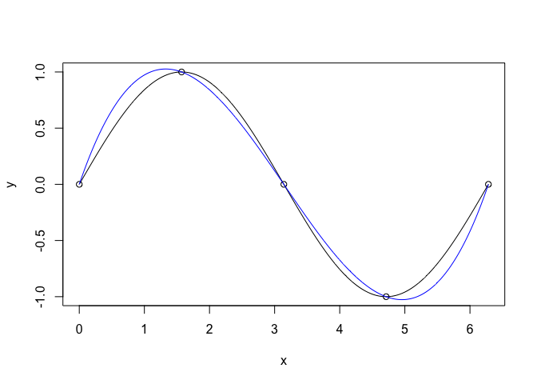

    ## [1] 0.180757796555

Not bad for just 5 points. Let’s examine how the error changes as a
function of *n*.

    nvec <- 2:20
    errorvec <- NULL
    for (n in nvec){
      errorvec <- c(errorvec,interperror(n))
    }
    orderofmag <- round(log10(errorvec))
    plot(nvec,orderofmag)

This means that we can represent the sine function with 10−13
error using only 20 pieces of information, instead of storing a huge
lookup table.

# Interpolation error and Chebyshev interpolation

## Big picture

We have been thinking about data and talking about polynomial
interpolation as a way of estimating it, compressing it, and
representing it conveniently to do other mathematical operations on it.
So far, we have only examined error numerically. Now it is time to look
at the error in more detail, including finding out when it is
potentially large and thinking about how we can reduce it.

## Goals

-   Describe and recognize Runge’s phenomenon
-   State the error term for polynomial interpolation and bound it
-   Explain the advantages of Chebyshev integration and implement the
    technique
-   Compare approaches to interpolation

## Runge’s phenomenon

Before doing polynomial interpolation, let’s start out with an example
that is about Taylor polynomials. We’ll construct Taylor polynomials of
increasing degree to estimate the function $f(x) = \\\cos(x)$ around the
point *x*0 = 0 on $\[0,2\\\pi\]$. The *n*th degree taylor
polynomial is
$$
\\\sum\\\_{i=1}^n (-1)^{i/2} \\\frac{x^i}{i!}.
$$

    mytaylor1 <- function(x,n){
      ans <- 0
      for (i in seq(from=0,to=n,by=2)){
        ans <- ans + (-1)^(i/2)*x^i/factorial(i)
      }
      return(ans)
    }
    x <- seq(from=0,to=2*pi,length=1000)
    plot(x,cos(x),type="l",col="red",lwd=5,xlim=c(0,2*pi),ylim=c(-1.5,1.5),xlab="x",ylab="y")
    for (n in seq(from=0,to=14,by=2)){
      lines(x,mytaylor1(x,n))
    }

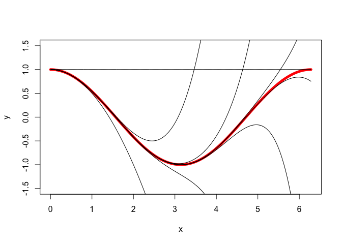

So more terms are better, right? Let’s try again with the function
*f*(*x*) = 1/*x* around the point *x*0 = 1. The *n*th degree
Taylor polynomial is
$$
\\\sum\\\_{i=1}^n (-1)^i (x-1)^i.
$$

    mytaylor2 <- function(x,n){
      ans <- 0
      for (i in seq(from=0,to=n,by=1)){
        ans <- ans + (-1)^(i)*(x-1)^(i)
      }
      return(ans)
    }
    x <- seq(from=1,to=2.5,length=1000)
    plot(x,1/x,type="l",col="red",lwd=5,xlim=c(1,2.5),ylim=c(0,1.5),xlab="x",ylab="y")
    for (n in seq(from=0,to=40,by=4)){
      lines(x,mytaylor2(x,n))
    }

Oh! I guess that more isn’t always better.

Now let’s think now about interpolating polynomials. Let’s consider
$\\\cos(x)$ with *n* equally sampled points across $\[0,2\\\pi\]$ for
different values of *n*.

    x <- seq(from=0,to=2*pi,length=1000)
    y <- cos(x)
    plot(x,y,type="l",col="red",lwd=5,xlim=c(0,2*pi),ylim=c(-1.1,1.1))
    nvec <- 2:20
    error <- NULL
    for (n in nvec){
      xdata <- seq(from=0,to=2*pi,length=n)
      ydata <- cos(xdata)
      yinterp <- barylag(xdata,ydata,x)
      lines(x,yinterp)
      error <- c(error,max(abs(y-yinterp)))
    }

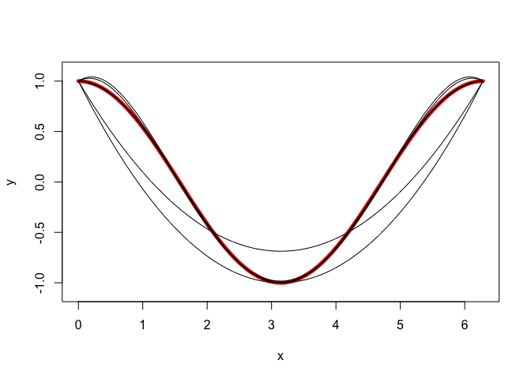

    plot(nvec,log10(error),xlab="n",ylab="log10 of error")

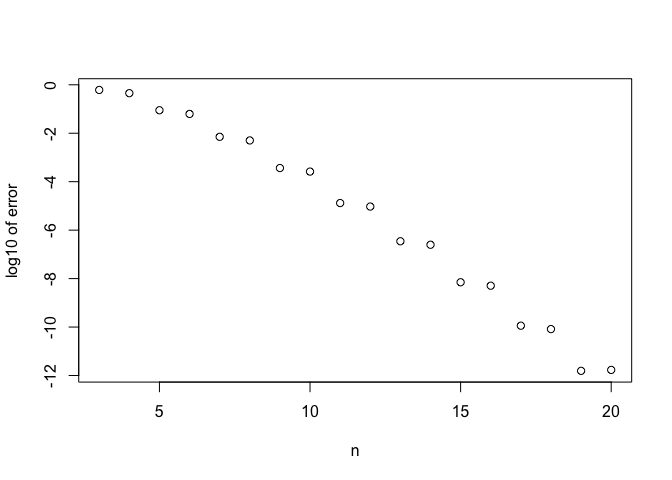

Looks good! Let’s try again with a different function,
*f*(*x*) = (1+*x*2)−1 on \[−1,1\].

    x <- seq(from=-5,to=5,length=1000)
    y <- 1/(1+x^2)
    plot(x,y,type="l",col="red",lwd=5,xlim=c(-5,5),ylim=c(-3,3))
    nvec <- seq(from=2,to=32,by=6)
    error <- NULL
    for (n in nvec){
      xdata <- seq(from=-5,to=5,length=n)
      ydata <- 1/(1+xdata^2)
      yinterp <- barylag(xdata,ydata,x)
      lines(x,yinterp)
      error <- c(error,max(abs(y-yinterp)))
    }

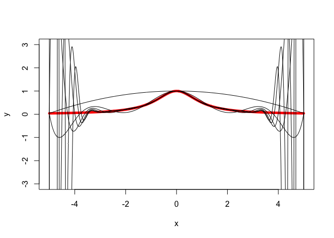

    plot(nvec,log10(error),xlab="n",ylab="log10 of error")

Not good! The error goes up as we take more and more points.
Equally-spaced nodes are very natural in many applications (scientific
measurements, audio/video signals, etc.). But sadly, it turns out that
in some circumstances, inteprolating with polynomials through
equally-spaced nodes leads to very undesirable oscillations like those
above, called \*\*Runge’s phenomenon\*\*.

## Interpolation error

You might remember that for an *n* − 1st degree Taylor series (that is,
*n* coefficients) of *f*(*x*) centered around *x* = *x*0, the
magnitude of the error term is
$$
\\\left\\|\\\frac{f^{(n)}(c)}{n!}(x-x\_0)^{n}\\\right\\|
$$
where *c* is a number between *x* and *x*0. For an
interpolating polynomial constructed from *n* points on an interval
\[*x*1,*x**n*\], the interpolation error is
$$
\\\left\\|\\\frac{f^{(n)}(c)}{n!}(x-x\_1)(x-x\_2)\\\cdots (x-x\_n)\\\right\\|
$$
for some $c \\\in \[x\_1,x\_n\]$. If you are interested in the proof, it
appears in your textbook and/or I am happy to go over it with you in
office hours. Honestly, though, I find the proof to be totally
nonintuitive and unenlightening.

Let’s use the error term to do an example, where we again ask the
question HOW DO WE EVEN KNOW ANYTHING? For instance, suppose you want to
calculate the value of an exponential function. [This turns out to be
hard](https://math.stackexchange.com/questions/1239352/how-do-pocket-calculators-calculate-exponents)!
Let’s restrict the problem a bit. Suppose we want to calculate
$\\\mathrm{e}^{x}$ on \[0,1\] with 5 digits of accuracy. One way to do
this would be to choose equally-spaced points on \[0,1\] and make a
table of $\\\mathrm{e}^{x}$ for those values using some very accurate
method. Then, we let the user choose a value of *x*. We find the two
values that surround it in our table, construct the linear interpolating
polynomial between them, and use it to estimate our answer. For
instance, if we chose *x* values of $0.1, 0.2, \\\ldots, 1$ and the user
input *x* = 0.3268, we would construct the inteprolating polynomial
through $(0.3,\\\mathrm{e}^{0.3})$ and $(0.4,\\\mathrm{e}^{0.4})$ and
then plug in our *x*. Let’s ask the question: to achieve 5-digit
accuracy with this method, how many points must we take on \[0,1\]?
(Note: crucially, this is not at all the same as creating a single
interpolating polynomial that goes through all the points.) We have
$$
\\\begin{align\\\*}
\\|f(x) - P\_1(x)\\| &= \\\left\\|\\\frac{f^{(n)}(c)}{n!}(x-x\_1)(x-x\_2)\\\cdots (x-x\_n)\\\right\\|\\
&= \\\left\\|\\\frac{\\\left(\\\mathrm{e}^{x}\\\right)^{''}\\|\\\_c}{2!}(x-x\_1)(x-x\_2)\\\right\\| \\
& = \\\left\\|\\\frac{\\\mathrm{e}^{c}}{2} (x-x\_1)(x-x\_1-h)\\\right\\|
\\\end{align\\\*} $$
Here, I’ve called the spacing between the two points *h*, that is
*x*2 = *x*1 + *h*. Now, we can ask what is the
worst (biggest) that the term
|(*x*−*x*1)(*x*−*x*1−*h*)| can be, and via
calculus, we can show it is *h*2/4. Also, on our interval of
interest, we know that e*c* ≤ e1. Therefore, we
can write
$$ \\|f(x) - P\_1(x)\\| \leq \\\frac{\\\mathrm{e}h^2}{8}. $$
For our desired level of accuracy, we need
$$ \frac{\mathrm{e}h^2}{8} \leq 0.5 \times 10^{-5}. $$
Solving for *h*, we find *h* ⪅ 3.8 × 10−3. That is the space
between points, so on \[0,1\] this corresponds to just over 260 points.

## Chebyshev nodes

Look at the error expression again. There are three parts of it.
Factorial is the same for every function. If the derivative gets smaller
with more *n* then we’re good. If it gets bigger, the error term could
potentially grow overall with *n*. Since there’s nothing we can do about
the derivative (we can’t choose it!) we should try to do what we can to
minimize what we can control, namely the remaining part of the error
term.

Let’s compare two approaches in Mathematica. Without loss of generality,
we’ll live on the interval \[−1,1\]. Please see the demos in [this
notebook](https://drive.google.com/file/d/0B3Www1z6Tm8xNFlXOVhZZDFITlU/view?usp=sharing).

Now let’s summarize the comparison of equally-spaced nodes vs. Chebyshev
nodes.

    nvec <- 1:30
    x <- seq(from=-1,to=1,length=5000)
    equallyspaced <- NULL
    for (n in nvec){
      nodes <- seq(from=-1,to=1,length=n)
      prod <- 1
      for (i in 1:n){
        prod <- prod*(x-nodes[i])
      }
      equallyspaced <- c(equallyspaced,unique(max(abs(prod))))
    }
    chebyshev <- 1/2^(nvec-1)
    plot(nvec,log10(chebyshev),col="green",pch=16,ylim=c(-10,0),xlab="points",ylab="bound on portion of error")
    points(nvec,log10(equallyspaced),col="red",pch=16)

Chebyshev is much better! We won’t prove the result, but I hope my
numerical experiment convinced you that for *n* points on \[0,1\], we
should choose nodes

$$
x\_i = \cos \frac{(2i-1)\pi}{2n}, \quad i = 1,\ldots,n
$$

and the maximum magnitude of the relevant portion of the error term is

$$
\max\_{-1\leq x\leq 1}\left|\prod\_{i=1}^n (x-x\_i)\right| = \frac{1}{2^{n-1}}.
$$

If we generalize these results to the interval \[*a*,*b*\], we find

$$
x\_i = \frac{b+a}{2} + \frac{b-a}{2}\cos \frac{(2i-1)\pi}{2n}, \quad i = 1,\ldots,n
$$

with

$$
\max\_{a\leq x\leq b}\left|\prod\_{i=1}^n (x-x\_i)\right| = \frac{\left(\frac{b-a}{2}\right)^n}{2^{n-1}}.
$$

The proof is not direct, which is why I have eliminated it here.

## Comparing interpolation methods

Let’s do an example comparing interpolation approaches. Consider
$f(x)=(1/\sqrt{2\pi})\mathrm{e}^{-x^2/2}$. This is the standard normal
distribution which plays a key role in probability and statistics.

One thing to know is that the derivatives of this function grow with
*n*.

    n <- 0:10
    maxderiv <- c(0.398942,0.241971,0.178032, 0.550588,1.19683,2.30711,4.24061,14.178,41.8889,115.091,302.425) # Computed in Mathematica
    plot(n,log(maxderiv))

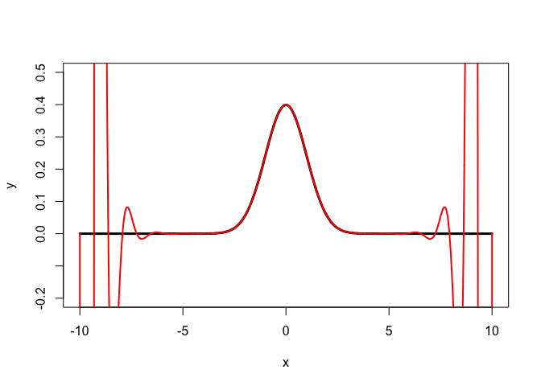

Given this, using equally-spaced nodes seems reckless, but we can try it
anyway, say, on \[−10,10\] with 30 data points to start with.

    a <- -10
    b <- 10
    xexact <- seq(from=a,to=b,length=10000)
    f <- function(x){exp(-x^2/2)/sqrt(2*pi)}
    yexact <- f(xexact)
    plot(xexact,yexact,type="l",lwd=3,xlim=c(a,b),ylim=c(-0.2,0.5))
    n <- 30
    xequal <- seq(from=a,to=b,length=n)
    yequal <- lagrange(xequal,f(xequal),xexact)
    lines(xexact,yequal,col="red",lwd=2)

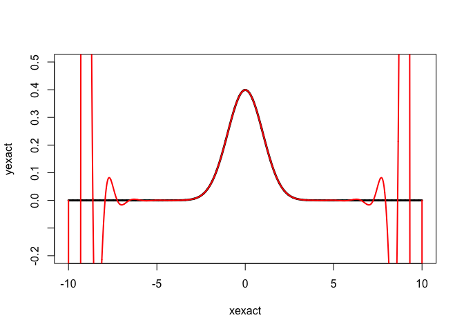

Ok, that approach is not going to work! Let’s try the approach of a
lookup table with linear interpolation. Let’s suppose we wish to achieve
4 digit accuracy.

    n <- 1
    error <- Inf
    while (error > 0.5e-4){
      n <- n+1
      xlookup <- seq(from=a,to=b,length=n)
      ylookup <- f(xlookup)
      ytable <- approx(xlookup,ylookup,xexact)$y
      error <- max(abs(yexact-ytable))
    }
    nlookup <- n
    print(nlookup)

    ## [1] 632

Now we can go back to polynomial interpolation with Chebyshev nodes.

    n <- 30
    error <- Inf
    while (error > 0.5e-4){
      n <- n+1
      odds <- seq(from=1,to=2*n-1,by=2)
      xcheb <- sort((b+a)/2 + (b-a)/2*cos(odds*pi/2/n))
      ycheb <- lagrange(xcheb, f(xcheb), xexact)
      error <- max(abs(yexact-ycheb))
    }
    ncheb <- n
    print(ncheb)

    ## [1] 41

This is an improvement in compression by a factor of 632/41 =
15.4146341.

# Splines

## Big picture

I’ve tried to convince you that it can be problematic to construct
interpolating polynomials of high degree. When dealing with a lot of
data, an alternative approach can be to construct low degree
interpolating polynomials through successive sets of points. Typically
we use cubics, and these are called cubic splines.

## Goals

-   Explain advantages of interpolating data with cubic splines
-   Implement cubic spline interpolation

## Why cubic splines?

Before progressing to real data later on, let’s do an illustrative
example with a small amount of fake data. We make some data points and
connect them with linear splines. We can do this using the built-in
`approxfun` command which returns a function representing the linear
spline.

    x <- c(-2,-1.5,-1,0.25,1,2,3.75,4,5)
    y <- c(4,4.2,3,5,0,-2,2,1,1)
    xplot <- seq(from=-2,to=5,length=200)
    linearspline <- approxfun(x,y)
    plot(x,y,ylim=c(-2.5,5.5))
    lines(xplot,linearspline(xplot),col="red",lwd=2)

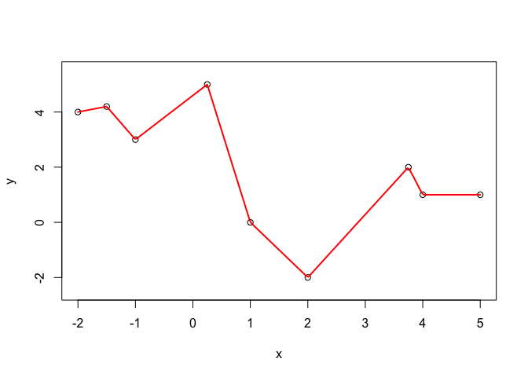

Your eyeball might be telling you that this is a very jagged graph. Most
things in nature and society are not this jagged, so it might feel
desirable to represent the data with smoother functions. Let me show you
what this looks like.

    cubicspline <- splinefun(x,y)
    plot(x,y,ylim=c(-2.5,5.5))
    lines(xplot,linearspline(xplot),col="red",lwd=2)
    lines(xplot,cubicspline(xplot),col="green",lwd=2)

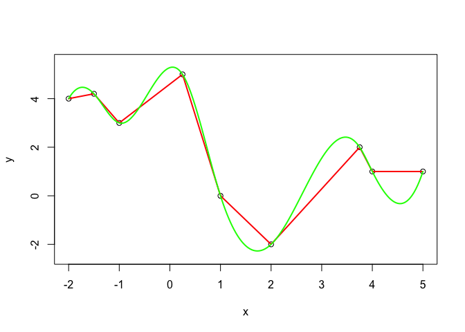

This is smoother. What smoothness means here is continuity of
derivatives from one spline to the next. Using cubic rather than linear
splines gives us more coefficients, and using these coefficients we can
make the derivatives of successive splines match up. How exactly does
this work though?

## Mathematical conditions for cubic splines

Suppose we have data points
(*x*1,*y*1), …, (*x**n*,*y**n*).
We will connect successive points with cubic curves. With *n* points,
there are *n* − 1 curves. Each curve is cubic, having the form

*S**i*(*x*) = *a**i* + *b**i*(*x*−*x**i*) + *c**i*(*x*−*x**i*)2 + *d**i*(*x*−*x**i*)3.

With *n* − 1 curves each having four coefficients, there are 4(*n*−1)
coefficients.

First, we force each spline to pass through its two endpoints (which
also makes the overall spline curve continuous). By inspection, this
forces *a**i* = *y**i*, and it also enforces a
condition on the relationship between
*b**i*, *c**i*, *d**i*. So doing the
bookkeeping, that is 2(*n*−1) conditions to enforce, which leaves
2*n* − 2 coefficients undetermined.

Next, we force continuity of the first derivatives of successive
splines. Note that at *x*1 there’s no condition to enforce,
since there’s no spline to the left of it. And at *x**n*
there’s no condition to enforce, since there’s no spline to the right of
it. Therefore, we enforce conditions at the *n* − 2 points
*x*2, …, *x**n* − 1. Specifically, the condition
is
*S**i*′(*x**i*) = *S**i* − 1′(*x**i*).
Subtracting these *n* − 2 conditions from our previous count of
2*n* − 2, there are *n* conditions left.

Finally, we enforce continuity of the second derivatives of successive
splines. This is very similar to enforcing the previous condition. The
condition is
*S**i*″(*x**i*) = *S**i* − 1″(*x**i*)
at the points *x*2, …, *x**n* − 1. Substracting
these *n* − 2 conditions from our previous total of *n* conditions,
there are two conditions left.

In short, thus far, the procedure for finding spline coefficients is
underetermined because there are 4*n* − 4 unknowns but only 4*n* − 2
equations. To make the system solvable, we have to make a choice about
what conditions to enforce at the leftmost and rightmost points. Some of
the most common choices are:

-   **Natural spline**. The concavity at the left and right endpoints is
    zero, that is
    *S*1″(*x*1) = *S**n* − 1″(*x**n*) = 0.
-   **Clamped sline**. The concavity at the left and right endpoints is
    set to a user specified value, that is,
    *S*1″(*x*1) = *m*1 and
    *S**n* − 1″(*x**n*) = *m**n*.
-   **FMM (not-a-knot)**. *S*1 = *S*2 is a single
    cubic equation that is run through the first 3 points, and
    *S**n* − 2 = *S**n* − 1 is, similarly, a
    single cubic run through the last 3 points.

Crucially, since we find the coefficients by solving an square linear
system of dimension 4*n* − 4, these boundary conditions don’t merely
affect the first and last splines, but influence ALL of the splines.

You don’t need to memorize the details of these different types of
splines. My main goals for you are to understand what they mean and to
be able to implement them in R.

## Splines and linear algebra

As we have been discussing, to find spline coefficients, we have to
solve a linear system. I won’t write down the whole system here because
we are going to use built-in tools to solve it. However, it’s good
mathematical literacy to know that by writing down the system of
equations, you can see that it is tridiagonal and strictly diagonally
dominant, which are nice numerical properties.

## Implementing cubic spline interpolation

Just to emphasize how splines avoid the problem of high-degree
polynomial interpolation, let’s do a cooked example.

    set.seed(123)
    n <- 30
    x <- sort(runif(n))
    y <- cumsum(abs(rnorm(n)))
    plot(x,y,pch=19,ylim=c(-2,35),cex=1.5)
    xx = seq(from=min(x),to=max(x),length=1000)
    yy = barylag(x,y,xx)
    lines(xx,yy,col="red",lwd=3)
    cubicspline <- splinefun(x,y,method='natural')
    lines(xx,cubicspline(xx),col="blue",lwd=3)

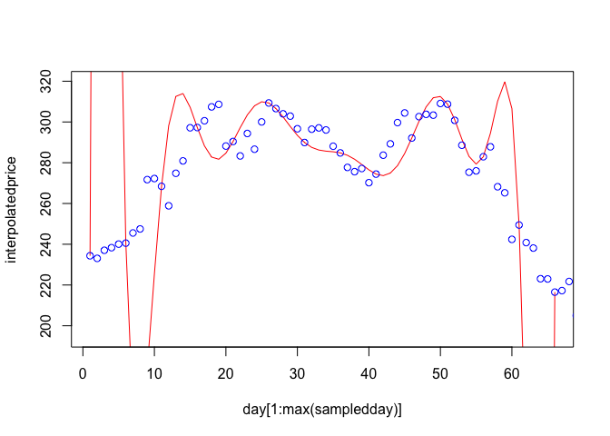

Now let’s work with some real data, let’s say, Tesla stock price for the
last 100 days (we won’t actually get 100 days because of days when the
markets were closed, including weekends).

    # Set dates and stock symbol
    first.date <- Sys.Date()-100
    last.date <- Sys.Date()
    tickers <- c('TSLA')
    # Acquire data
    l.out <- BatchGetSymbols(tickers = tickers, first.date = first.date, last.date = last.date)

    ## Warning: `BatchGetSymbols()` was deprecated in BatchGetSymbols 2.6.4.
    ## Please use `yfR::yf_get()` instead.
    ## 2022-05-01: Package BatchGetSymbols will soon be replaced by yfR. 
    ## More details about the change is available at github <<www.github.com/msperlin/yfR>
    ## You can install yfR by executing:
    ## 
    ## remotes::install_github('msperlin/yfR')

    ## 
    ## Running BatchGetSymbols for:
    ##    tickers =TSLA
    ##    Downloading data for benchmark ticker
    ## ^GSPC | yahoo (1|1) | Not Cached | Saving cache
    ## TSLA | yahoo (1|1) | Not Cached | Saving cache - Got 100% of valid prices | Youre doing good!

    price <- l.out[[2]]$price.close
    day <- 1:length(price)
    # Sample every 5th day
    sampledday <- day[seq(from=1,to=length(price),by=5)]
    sampledprice <- price[seq(from=1,to=length(price),by=5)]
    # Fit interpolating polynomial
    interpolatedprice <- barylag(sampledday,sampledprice,day[1:max(sampledday)])
    plot(day[1:max(sampledday)],interpolatedprice,col="red",type="l",ylim=c(800,1200))
    points(day,price,col="blue")

    # Fit splines
    TSLAspline <- splinefun(sampledday,sampledprice,method='natural')
    plot(day,TSLAspline(day),col="blue",type="l",ylim=c(800,1200))
    points(day,price,col="blue")

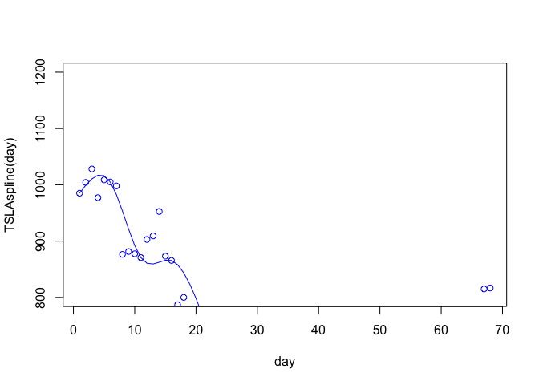

# Least squares

## Big picture

All of our study of interpolation has been based on the idea that the
model (a polynomial or polynomnial spline) should precisely pass through
every data point. But what if we loosen this restriction? What if the
data is thought to have error or noise that we don’t want to represent
in our model? Or what if we just don’t care about precise interpolation,
and decide approximation even at the data points themselves is good
enough?

## Goals

-   Explain how least squares arises as a model fitting problem
-   Explain how the solution of least squares involves vector projection
-   Set up and solve least squares problems
-   Define, identify, and calculate crucial quantities such as basis,
    target, normal equations, least squares solution, residual,
    pseudoinverse, projection, projection operator
-   Recognize when a least squares approach is appropriate
-   Explain how least squares allows data compression

## Model fitting

By way of motivation, let’s examine a pedagogical data set. Suppose *a*
represents the amount of money (in $1,000’s) a company spent on
advertising during different quarters, and *s* represents money the
company earned on sales that quarter. We can plot the data to explore
it.

    a <- c(3,4,5,6)
    s <- c(105,117,141,152)
    plot(a,s,xlab="advertising",ylab="sales")

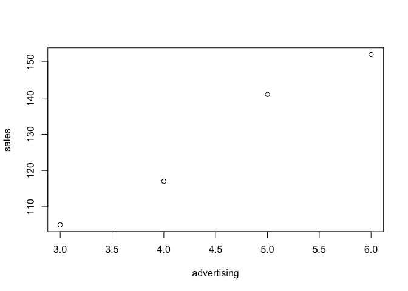

The company would like to model this data so they can predict sales for
other levels of advertising. The data looks roughly linear, and we have
no reason to expect a complicated relationship, so let’s try modeling
the data with a line, *s* = *x*0 + *x*1*a* where
*x*0, 1 are unknown coefficients. Plugging in to the model,
we find
$$
\begin{align}
x\_0 + 3x\_1 &= 105\\\\
x\_0 + 4x\_1 &= 117\\\\
x\_0 + 5x\_1 &= 141\\\\
x\_0 + 6x\_1 &= 152
\end{align}
$$
which we can write in vector form as
$$
x\_0 \begin{pmatrix} 1 \\\\ 1 \\\\ 1 \\\\ 1 \end{pmatrix} + x\_1 \begin{pmatrix} 3 \\\\ 4 \\\\ 5 \\\\ 6 \end{pmatrix} = \begin{pmatrix} 105 \\\\ 117 \\\\ 141 \\\\ 152 \end{pmatrix}.
$$
By writing it this way, we can remember one interpretation of linear
systems. In this case we should imagine a four-dimensional space in
which we are trying to reach a particular target (the right hand side
vector) by taking linear combinations of the two vecors on the left.
Unfortunately, those two vectors only span a two dimensional subspace,
so the chance that we can make it to our target vector are pretty slim.
Stated differently: the sysem is overdetermined. But we would still like
to find a good model, so what should we do?

## Projection onto a vector

To examine the details, let’s start with an even more fundamental
example: a single vector in the plane. Suppose I hand you the vector
$\mat{A} = (2,1)^T$ and tell you to use it to reach the target vector
**b** = (6,8)*T*. Well, you can’t do it exactly because there
is no scalar *x* such that $x\mat{A} = \mathbf{b}$. So let us do the
next best thing: let’s find the value of *x* such that $x\mat{A}$ is as
close as possible to **b**. We can draw a picture to solve this problem.

Where should we stop on the dotted line? When we are perpendicular to
the end of **b**. This results in the following picture.

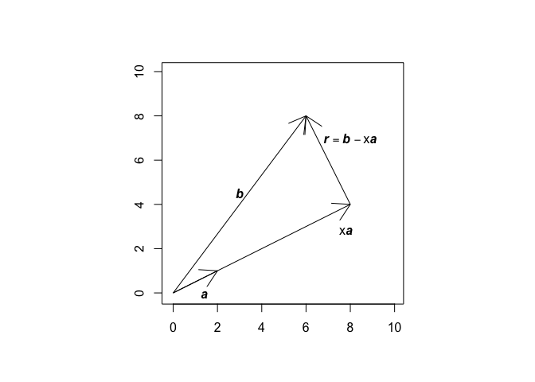

From this picture, two relationships arise:

$$
\begin{align}
x\mat{A} + \mathbf{r}&=\mathbf{b}\\\\
\mat{A} \cdot \mathbf{r} &=0.
\end{align}
$$

Let us dot the first equation with the vector $\mat{A}$. Then we have

$$
\mat{A} \cdot \mat{A}x + \mat{A} \cdot \mathbf{r} = \mat{A} \cdot \mathbf{b}.
$$

From the second equation above, we can eliminate the second term on the
left hand side to write

$$
\mat{A}^T \mat{A} x = \mat{A}^T \mathbf{b}
$$

where we have used the fact that
**y** ⋅ **z** = **y***T***z**. We can solve for **x** by
writing $x = \left(\mat{A}^T \mat{A}\right)^{-1}\mat{A}^T \mathbf{b}$.
We can also calculate the vector that was as close as possible to **b**.
We will call it $\widehat{\mathbf{b}}$ and it is

$$
\begin{align}
\widehat{\mathbf{b}} &= \mat{A}x \\\\
&=\mat{A}\left(\mat{A}^T \mat{A}\right)^{-1}\mat{A}^T \mathbf{b}\\\\
& = \mathbf{P} \mathbf{b}.
\end{align}
$$

where thre last equation defines a new quantity that we call **P**.

Let us know revisit what we have done and emphasize/introduce some
vocabulary. We started with a vector $\mat{A}$ that we used as a
**basis** to try to reach the **target** **b**. We couldn’t do it
exactly, so we calcualted the closest we could come to **b**, which
turned out to be $\widehat{\mathbf{b}}$. This is called the
**projection** of **b** into the subspace spanned by $\mat{A}$. We found
$\widehat{\mathbf{b}} = \mat{A}x$, where *x* is called the **least
squares solution**, which solved the **normal equations**
$\mat{A}^T \mat{A} x = \mat{A}^T \mathbf{b}$. We can summarize the
calculation of *x* by remembering
$x = \left(\mat{A}^T \mat{A}\right)^{-1}\mat{A}^T \mathbf{b}$ where
$\left(\mat{A}^T \mat{A}\right)^{-1}\mat{A}^T$ is called the
**pseudoinverse** of $\mat{A}$. Also, we can summarize the calculation
of $\widehat{\mathbf{b}}$ as
$\widehat{\mathbf{b}} = \mathbf{P} \mathbf{b}$ where
$\mathbf{P} = \mat{A} (\mat{A}^T\mat{A})^{-1} \mat{A}^T$ is what we call
a **projection operator** or a **projection matrix**. Since we didn’t
succeed in reaching **b**, there is some error, and we call this the
**residual**, $\mathbf{r} = \mathbf{b}-\widehat{\mathbf{b}}$.

What are the words/ideas you should make sure you understand in the
narrative above?

-   basis
-   target
-   normal equations
-   least squares solution
-   pseudoinverse
-   projection
-   projection operator
-   residual

Let’s calculate this concretely in `R`.

    a <- c(2,1)
    b <- c(6,8)
    pseudoinv <- solve(t(a) %*% a) %*% t(a)
    x <- pseudoinv %*% b
    bhat <- a %*% x
    r <- b - bhat
    print(x)

    ##      [,1]
    ## [1,]    4

    print(bhat)

    ##      [,1]
    ## [1,]    8
    ## [2,]    4

    dot <- function(v1,v2){sum(v1*v2)}
    dot(a,r)

    ## [1] 0

## Projection onto a plane

Let’s apply these same conceps to our original problem of predicting
sales from advertising. We had

$$
x\_0 \begin{pmatrix} 1 \\\\ 1 \\\\ 1 \\\\ 1 \end{pmatrix} + x\_1 \begin{pmatrix} 3 \\\\ 4 \\\\ 5 \\\\ 6 \end{pmatrix} = \begin{pmatrix} 105 \\\\ 117 \\\\ 141 \\\\ 152 \end{pmatrix}
$$

which we’ll write symbolically as

$$
x\_0 \mat{A}\_0 + x\_1 \mat{A}\_1 = \mathbf{b}.
$$

We’d like to reach **b** using the basis vectors $\mat{A}\_{0,1}$, but
we can’t, so let’s consider getting as close as possible. The picture
looks something like this.

This picture gives rise to the equation

$$
\begin{align}
x\_0 \mat{A}\_0 + x\_1 \mathbf{a\_1} + \mathbf{r} &= \mathbf{b} \\\\
a\_0 \cdot \mathbf{r} &= 0 \\\\
a\_1 \cdot \mathbf{r} &= 0.
\end{align}
$$

Let’s take the dot product of the first equaton with each basis vector.
We find

$$
\begin{align}
x\_0 \mat{A}\_0\cdot\mat{A}\_0 + x\_1 \mat{A}\_0\cdot\mat{A}\_1 &= \mat{A}\_0 \cdot \mathbf{b}\\\\
x\_0 \mat{A}\_1\cdot\mat{A}\_0 + x\_1 \mat{A}\_1\cdot\mat{A}\_1 &= \mat{A}\_1 \cdot \mathbf{b}
\end{align}
$$

where we have elminated terms that turn out to be zero thanks to the
second and third equations previously. Note that there is a matrix way
to write this. we can write

$$
\begin{pmatrix} \mat{A}\_0^T \\\\ \mat{A}\_1^T \end{pmatrix} \begin{pmatrix} \mat{A}\_0 & \mat{A}\_1 \end{pmatrix} \begin{pmatrix} x\_0 \\\\ x\_1 \end{pmatrix} = \begin{pmatrix} \mat{A}\_0^T \\\\ \mat{A}\_1^T \end{pmatrix} \mathbf{b}.
$$

If we let $\mat{A}$ represent the matrix with columns $\mat{A}\_{0,1}$
and if we let **x** = (*x*0,*x*1)*T*
then we can write the last equation as

$$
\mat{A}^T \mat{A} \mathbf{x} = \mat{A}^T \mathbf{b}.
$$

These are the normal equations. For us, concretely, it looks like

$$
\begin{align}
\begin{pmatrix} 1 & 1 & 1 & 1\\\\ 3 & 4 & 5 & 6\end{pmatrix} \begin{pmatrix} 1 & 3\\\1 & 4\\\\ 1 & 5\\\\ 1& 6\end{pmatrix}\begin{pmatrix}x\_1 \\\\ x\_2 \end{pmatrix} &= \begin{pmatrix} 1 & 1 & 1 & 1\\\\ 3 & 4 & 5 & 6\end{pmatrix} \begin{pmatrix} 105 \\\\ 117 \\\\ 141 \\\\ 152\end{pmatrix}\\\\
\begin{pmatrix} 4 & 18 \\\\ 18 & 86 \end{pmatrix} \begin{pmatrix} x\_1 \\\\ x\_2 \end{pmatrix} &= \begin{pmatrix} 515 \\\\ 2400 \end{pmatrix}
\end{align}
$$

which has solution

$$
\begin{pmatrix} x\_1 \\\\ x\_2  \end{pmatrix} = \begin{pmatrix}  54.5 \\\\ 16.5 \end{pmatrix}.
$$

Let’s calculuate this in `R`.

    a0 <- c(1,1,1,1)
    a1 <- c(3,4,5,6)
    A <- cbind(a0,a1)
    b <- c(105,117,141,152)
    pseudoinv <- solve(t(A) %*% A) %*% t(A)
    x <- pseudoinv %*% b
    bhat <- A %*% x
    r <- b - bhat
    print(x)

    ##    [,1]
    ## a0 54.5
    ## a1 16.5

    print(bhat)

    ##       [,1]
    ## [1,] 104.0
    ## [2,] 120.5
    ## [3,] 137.0
    ## [4,] 153.5

    dot(r,a0)

    ## [1] 1.84741111298e-13

    dot(r,a1)

    ## [1] 8.81072992343e-13

    plot(a1,b,xlab="advertising",ylab="sales")
    xx <- seq(from=0,to=6,length=200)
    lines(xx,horner(as.numeric(x),xx)$y)

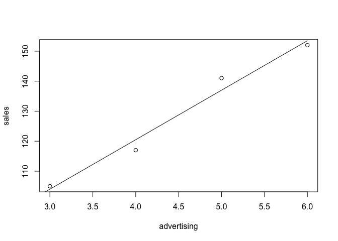

Symbolically, we calculated the least squares solution
$\mathbf{x} = \left(\mat{A}^T \mat{A}\right)^{-1}\mat{A}^T \mathbf{b}$
where $\left(\mat{A}^T \mat{A}\right)^{-1}\mat{A}^T$ is the
pseudoinverse. The projection is
$\widehat{\mathbf{b}} = \mat{A} \mathbf{x} = \mat{A} \left(\mat{A}^T \mat{A}\right)^{-1}\mat{A}^T \mathbf{b}$
where $\mat{A} \left(\mat{A}^T \mat{A}\right)^{-1}\mat{A}^T$ is the
projection matrix.

Though our example here has used merely two basis vectors, the ideas
extend to any number.

## Model fitting

The technique we have developed here of solving a least squares problem
by vector projection works in a model fitting context whenever the
unknowns **x** appear linearly. It doesn’t require that other quantities
appear linearly.

For instance, suppose that we wanted to fit a parabola to the data
(0,6), (1,5), (2,2), and (3,2). We choose the model
*y* = *c*0 + *c*1*x* + *c*2*x*2
where our unknown is the vector
**c** = (*c*0,*c*1,*c*2)*T*.
Though *x* appears nonlinearly, the coefficients *c*0, 1, 2
don’t, so we are fine! Let’s solve this problem using linear algebra. We
want to solve
$$
\begin{align}
c\_0 + c\_1 \cdot 0 + c\_2 \cdot 0^2 &= 6 \\\\
c\_0 + c\_1 \cdot 1 + c\_2 \cdot 1^2 &= 5 \\\\
c\_0 + c\_1 \cdot 2 + c\_2 \cdot 2^2 &= 2 \\\\
c\_0 + c\_1 \cdot 3 + c\_2 \cdot 3^2 &= 2
\end{align}
$$
So, we calculuate in `R`:

    x <- c(0,1,2,3)
    A <- matrix(cbind(x^0,x^1,x^2),nrow=4)
    b <- c(6,5,2,12)
    pseudoinv <- solve(t(A) %*% A) %*% t(A)
    c <- pseudoinv %*% b
    bhat <- A %*% c
    r <- b - bhat
    print(c)

    ##       [,1]
    ## [1,]  6.75
    ## [2,] -6.75
    ## [3,]  2.75

    plot(x,b)
    xx <- seq(from=0,to=3,length=200)
    lines(xx,horner(c,xx)$y)

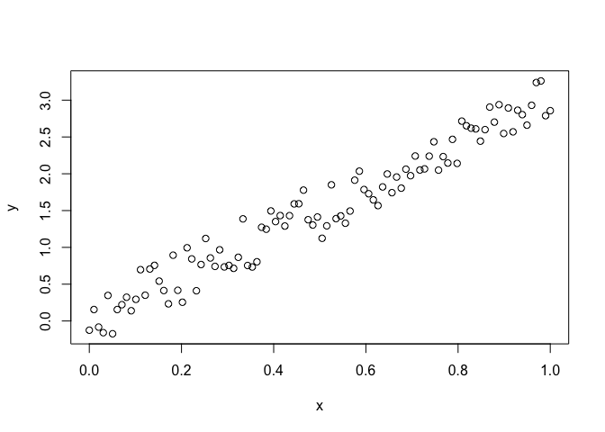

    print(r)

    ##       [,1]
    ## [1,] -0.75
    ## [2,]  2.25
    ## [3,] -2.25
    ## [4,]  0.75

If model parameters don’t appear in a linear fashion, sometimes you can
transform the equation so that they do. For example, if you wanted to
fit data to *y* = *C*e*k**x*, you could take the log of both
sides to obtain ln *y* = ln *C* + *k**x*. By considering the data
(*x*,ln*y*) you could take a least squares approach to find ln *C* and
*k*.

Overall, here’s the process one would follow for model fitting in cases
where the model parameters appear in a lienar fashion.

1.  Look at data.
2.  Propose a model.
3.  Force the model, resulting in $\mat{A}\mathbf{x}=\mathbf{b}$.
4.  Solve the normal equations
    $\mat{A}^T\mat{A}\mathbf{x}=\mat{A}^T \mathbf{b}$.
5.  Assess the fit of the model visually and/or using the residual
    vector.

A statistics class would provide much more sophisticated ways of
analyzing the error.

## Least squares and data compression

Adopting a least squares approach allows, potentially, massive
compression of data. Suppose we had 100 points that looked like this

    x <- seq(from=0,to=1,length=100)
    y <- 3*x + 0.4*(2*runif(100)-1)
    plot(x,y)

If we decided to represent this data with a line, we’d go down from
having 100 pieces of information (the original data points) to merely 2
(a slope and an intercept).

## An optimization viewpoint on least squares

So far, we’ve taken a geometric approach to solving least-squares
problems, but there’s another way to get the same result: optimization.
We can start directly with the square of the norm of the residual vector
(a factor of 1/2 is included for algebraic convenience, but it doesn’t
change the result)
$$
\frac{1}{2}||\mathbf{r}||^2 = \frac{1}{2}||\mat{A}\mathbf{x}-\mathbf{b}||^2.
$$
More formally, we can define the scalar **objective function**
$$f(\mathbf{x}) = \frac{1}{2} ||\mat{A}\mathbf{x}-\mathbf{b}||^2$$
and define our least squares solution **x***L**S*as the value
of **x** that minimizes this objective function, that is,
**x***L**S* = arg min**x***f*(**x**).
Now you know where the terminology least squares comes from! We can
apply calculus to minimize this expression and the normal equations will
result. This is a problem on your in-class exercise and your homework,
and it is critical that you work through the details.

# QR Factorization

## Big picture

We’ve talked about how to fit a model to data using least squares, and
we’ve examined the theoretical aspect of this process, but thus far
we’ve ignored computational issues. It turns out that solving the normal
equations can be difficult on a computer, and a technique called QR
factorization provides a potentially better way to solve a least squares
problem.

## Goals

-   Define orthonormal matrices
-   Perform Graham-Schmidt Orthogonalization
-   Solve least squares problems with **QR** decomposition

## Orthogonality is nice

The eventual goal of this lesson is to show you how to solve the least
squares problem
$$\mathbf{x}\_{LS} = \mathop{\mathrm{arg\\,min}}\_x \frac{1}{2}||\mat{A}\mathbf{x}-\mathbf{b}||^2$$

by writing the matrix $\mat{A}$ in a convenient way. But to build up to
that, we need to introduce a number of ideas. First off: orthogonality.

You might remember that two vectors **v** and **w** are **orthogonal**
if **v** ⋅ **w** = **v***T***w** = 0. We say that two vectors
are **orthonormal** if they are orthogonal and each have norm of one,
that is **v** ⋅ **v** = **w** ⋅ **w** = 1.

A matrix is called **orthogonal** or **orthonormal** (they are used
interchangeably for matrices, sometimes) if its columns are orthonormal
vectors. A cool property arises from this. Suppose these orthonormal
columns are **v**1, …, **v***n*. Then we can
consider the quantity $\mat{A}^T \mat{A}$:
$$
\begin{align}
\mat{A}^T \mat{A} &= \begin{pmatrix} \mathbf{v}\_1^T\\\\ \mathbf{v}\_2^T \\\\ \vdots \\\\ \mathbf{v}\_n^T \end{pmatrix} \begin{pmatrix} \mathbf{v}\_1 & \mathbf{v}\_2 & \cdots & \mathbf{v}\_n \end{pmatrix} \\\\
&= \begin{pmatrix} \mathbf{v}\_1^T \mathbf{v}\_1 & \mathbf{v}\_1^T \mathbf{v}\_2 & \cdots & \mathbf{v}\_1^T \mathbf{v}\_n \\\\ \mathbf{v}\_2^T \mathbf{v}\_1 & \mathbf{v}\_2^T \mathbf{v}\_2 & \cdots &  \mathbf{v}\_2^T \mathbf{v}\_n \\\\
\vdots & \vdots & \cdots & \vdots \\\\
\mathbf{v}\_n^T \mathbf{v}\_1 & \mathbf{v}\_n^T \mathbf{v}\_2 & \cdots & \mathbf{v}\_n^T \mathbf{v}\_n
\end{pmatrix}\\\\
&= \begin{pmatrix} 1 & 0 & \cdots & 0 \\\\ 0 & 1 & \cdots & 0\\\\ \vdots & \vdots & \cdots & \vdots \\\\ 0 & 0 & \cdots & 1\end{pmatrix}\\\\
&= \mathbf{I}\_n.
\end{align}
$$
If $\mat{A}$ is square and orthonormal, since
$\mat{A}^T\mat{A} = \mathbf{I}$, then by definition of inverse,
$\mat{A}^T = \mat{A}^{-1}$. This is a pretty great way to calculate an
inverse! Remember, though, that in our least squares context ,$\mat{A}$
is generally *not* a square matrix.

Another helpful property of orthogonal matrices is that they preserve
length, meaning that have norm of one. That is, suppose **Q** is
orthogonal. Then
$$
\begin{align}
||\mathbf{Q} \mathbf{v}||^2 &= \mathbf{Q} \mathbf{v} \cdot \mathbf{Q} \mathbf{v} \\\\
& = (\mathbf{Q}\mathbf{v})^T (\mathbf{Q}\mathbf{v})\\\\
& = \mathbf{v}^T \mathbf{Q}^T \mathbf{Q} \mathbf{v}\\\\
& = \mathbf{v}^T \mathbf{Q}^{-1} \mathbf{Q} \mathbf{v}\\\\
& = \mathbf{v}^T \mathbf{v}\\\\
& = ||\mathbf{v}||^2.
\end{align}
$$
Since ||**Q****v**||2 = ||**v**||2, we know
||**Q****v**|| = ||**v**|| and therefore ||**Q**|| = 1. A similar
calculuation shows that ||**Q**−1|| = 1. And then, by
definition of condition number, *κ*(**Q**) = 1. This means that
orthogonal matrices are incredibly well-conditioned.

Finally, let’s consider projecting a vector into a subspace spanned by
orthonormal vectors **q***i*, *i* = 1, …, *n*. Define
$\mat{A}$ as
$$
\mat{A} = \begin{pmatrix} | & | &  & | \\\\ \mathbf{q}\_1 & \mathbf{q}\_2 & \cdots & \\  \mathbf{q}\_n \\\\| & | &  & | \\\\ \end{pmatrix}.
$$
Let’s project a vector **w** onto the subspace spanned by the columns of
$\mat{A}$. By definition of the projection operator, and using the fact
that $\mat{A}$ is orthogonal,
$$
\begin{align}
\mathbf{P}\mathbf{w} &= \mat{A} (\mat{A}^T \mat{A})^{-1} \mat{A}^T \mathbf{w}\\\\
&= \mat{A} \mat{A}^{-1} \mat{A} \mat{A}^T \mathbf{w} \\\\
&= \mat{A} \mat{A}^T \mathbf{w} \\\\
&= \mathbf{q}\_1 \mathbf{q}\_1^T \mathbf{w} + \mathbf{q}\_2 \mathbf{q}\_2^T \mathbf{w} + \cdots + \mathbf{q}\_n \mathbf{q}\_n^T \mathbf{w}.
\end{align}
$$
So, when projecting onto the space spanned by orthonormal vectors, you
can just project onto each vector separately and add up the results. In
the calculation above, remember that
**q***i***q***i**T* is a matrix.

As an example, take
$$
\mathbf{q}\_1 = \left(\frac{1}{3},\frac{2}{3},\frac{2}{3}\right)^T, \quad \mathbf{q}\_2 = \left(\frac{2}{15},\frac{2}{3},-\frac{11}{15}\right)^T
$$
so that
$$
\mat{A} = \begin{pmatrix} \frac{1}{3} & \frac{2}{15} \\\\ \frac{2}{3} & \frac{2}{3} \\\\ \frac{2}{3} & -\frac{11}{15} \end{pmatrix}.
$$
Then
$$
\begin{align}
\mat{A} \mat{A}^T &= \begin{pmatrix} \frac{1}{3} & \frac{2}{15} \\\\ \frac{2}{3} & \frac{2}{3} \\\\ \frac{2}{3} & -\frac{11}{15} \end{pmatrix}
\begin{pmatrix} \frac{1}{3} &  \frac{2}{3} & \frac{2}{3} \\\\ \frac{2}{15} & \frac{2}{3} & -\frac{11}{15} \end{pmatrix} \\\\
&= \frac{1}{225}
\begin{pmatrix}
29 & 70 & 28 \\\\
70 & 200 & -10 \\\\
28 & -10 & 221
\end{pmatrix}\\\\
& = \underbrace{
\begin{pmatrix}
\frac{1}{9} & \frac{2}{9} & \frac{2}{9} \\\\
\frac{2}{9} & \frac{4}{9} & \frac{4}{9} \\\\
\frac{2}{9} & \frac{4}{9} & \frac{4}{9}
\end{pmatrix}}\_{\mathbf{q}\_1 \mathbf{q}\_1^T}  +  \underbrace{
\begin{pmatrix}
\frac{4}{225} & \frac{4}{45} & -\frac{22}{225} \\\\
\frac{4}{45} & \frac{4}{9} & -\frac{22}{45} \\\\
-\frac{22}{225} & -\frac{22}{45} & \frac{121}{225}
\end{pmatrix}}\_{\mathbf{q}\_2 \mathbf{q}\_2^T}.
\end{align}
$$

## Gram-Schmidt orthogonalization

Now that I’ve convinced you that it’s nice to have an orthonormal basis,
let’s talk about how to get one. Gram-Schmidt orthogonalization is an
iterative way of creating an orthonormal basis from a set of vectors.

Let’s see how it works via an example. Suppose we have
**v**1 = (3,4,0)*T* and
**v**2 = (1,1,0)*T*.

    v1 <- c(1,2,2)
    v2 <- c(2,1,-2)
    v3 <- c(1,1,0)

1.  Take the first vector and turn it into a unit vector.

<!-- -->

    y1 <- v1
    r11 <- Norm(y1,2)
    q1 <- y1/r11

1.  Think of **v**2 as made up of stuff in the subspace
    spanned by **q**1 and stuff orthogonal to it. Through
    away stuff in the span of **q**1 since we have it covered
    already. Take what’s left of **v**2 and turn it unto a
    unit vector.

<!-- -->

    y2 <- v2 - q1%*%t(q1)%*%v2
    r22 <- Norm(y2,2)
    q2 <- y2/r22

1.  Think of **v**3 as made up of stuff in the subspace
    spanned by **q**1, 2 and stuff orthogonal to it. Through
    away stuff in the span of **q**1, 2 since we have it
    covered already. Take what’s left of **v**3 and turn it
    unto a unit vector.

<!-- -->

    y3 <- v3 - q1%*%t(q1)%*%v3 - q2%*%t(q2)%*%v3
    r33 <- Norm(y3,2)

Let’s check the result and see if the procedure worked.

    q1

    ## [1] 0.333333333333 0.666666666667 0.666666666667

    q2

    ##                 [,1]
    ## [1,]  0.666666666667
    ## [2,]  0.333333333333
    ## [3,] -0.666666666667

    Norm(q1,2)

    ## [1] 1

    Norm(q2,2)

    ## [1] 1

    dot(q1,q2)

    ## [1] 0

## QR decomposition

Just like LU decomposition is a way of using matrices to encode the
process of Gaussian elimination, QR decomposition is a way of using
matrices to encode the process of Gram-Schmidt orthogonalization. Let’s
take the equations we implemented above:
$$
\begin{align}
\mathbf{y}\_1 &= \mathbf{v}\_1\\\\
\mathbf{q}\_1 &= \frac{1}{||\mathbf{y}\_1||} \mathbf{y}\_1 \\\\
\mathbf{y}\_2 &= \mathbf{v}\_2 - \mathbf{q}\_1 \mathbf{q}\_1^T \mathbf{v}\_2 \\\\
\mathbf{q}\_2 &= \frac{1}{||\mathbf{y}\_2||} \mathbf{y}\_2\\\\
\mathbf{y}\_3 &= \mathbf{v}\_3 - ( \mathbf{q}\_1 \mathbf{q}\_1^T \mathbf{v}\_3 + \mathbf{q}\_2 \mathbf{q}\_2^T \mathbf{v}\_3)\\\\
\mathbf{q}\_3 &= \frac{1}{||\mathbf{y}\_3||} \mathbf{y}\_3.
\end{align}
$$
Let’s rewrite these equations, solving for the **v***i*:
$$
\begin{align}
\mathbf{v}\_1 &= ||\mathbf{y}\_1|| \mathbf{q}\_1 \\\\
\mathbf{v}\_2 &= (\mathbf{q}\_1\cdot \mathbf{v}\_2) \mathbf{q}\_1 + ||\mathbf{y}\_2|| \mathbf{q}\_2 \\\\
\mathbf{v}\_3 &= (\mathbf{q}\_1\cdot \mathbf{v}\_3) \mathbf{q}\_1 + (\mathbf{q}\_2\cdot \mathbf{v}\_3) \mathbf{q}\_2  + ||\mathbf{y}\_3|| \mathbf{q}\_3 
\end{align}
$$
or, as matrices,
$$
\begin{pmatrix} | & | &   | \\\\ \mathbf{v}\_1 & \mathbf{v}\_2  & \mathbf{v}\_3 \\\\| & | &   | \\\\ \end{pmatrix} = 
\underbrace{ \begin{pmatrix} | & | &   | \\\\ \mathbf{q}\_1 & \mathbf{q}\_2  & \mathbf{q}\_3 \\\\| & | &   | \\\\ \end{pmatrix}}\_Q   \underbrace{\begin{pmatrix} r\_{1,1} & r\_{1,2} &   r\_{1,3} \\\\ 0 &r\_{2,2}  & r\_{2,3} \\\0 & 0 &   r\_{3,3} \\\\ \end{pmatrix} }\_R
$$
with
*r**i*, *i* = ||**y***i*||,   *r**i*, *j* = **q***i* ⋅ **v***j*.

The QR decomposition is a matrix decomposition that writes a *m* × *n*
matrix $\mat{A}$ as a product $\mat{A} = \mathbf{Q} \mathbf{R}$ where:

-   **Q** is an *m* × *r* matrix with orthonormal columns, where *r* is
    the number of linearly independent columns of $\mat{A}$.
-   **R** is an *r* × *n* matrix which is upper triangular if *r* = *n*,
    or the top portion of an upper triangular matrix if *r* &lt; *n*.
-   The columns of **Q** span the same space as the columns of
    $\mat{A}$.
-   The matrix **R** gives the change of basis between the vectors in
    **Q** and the vectors in $\mat{A}$.
-   The decompisition is unique up to some sign changes, so if we
    require *R**i**i* ≥ 0, it is unique.
-   If the columns of $\mat{A}$ are independent, then
    *R**i**i* ≠ 0.
-   On the other hand, if column *j* of $\mat{A}$ can be written as a
    linear combination of columns to the left, then
    *R**j**j* = 0.

The QR decomposition we’ve done so far is actually called the partial QR
decomposition We distinguish this from the **full** or **complete** QR
decomposition. In the latter, we include vectors than span parts of the
space not spanned by $\mat{A}$ itself. Of course, these contribute
nothing to the matrix **Q**, so it results in a bunch of 0’s in **R**.
Below is the key picture to understand. Here, **Q** and **R** are the
(partial) QR decomposition and $\overline{Q}$ and $\overline{R}$ are the
full version.

Let’s make this clear with numerous examples!

First example. Let’s start with a 3 × 3 matrix and perform Gram-Schmidt
orthogonalization to obtain the QR decomposition.

    # Define matrix
    v1 <- c(2,3,6)
    v2 <- c(10,8,9)
    v3 <- c(19,-3,-13)
    A <- cbind(v1,v2,v3)

    # Step 1
    y1 <- v1
    r11 <- Norm(y1,2)
    q1 <- y1/r11

    # Step2
    y2 <- v2 - (q1%*%t(q1))%*%v2
    r22 <- Norm(y2, 2)
    q2 <- y2/r22
    r12 <- dot(q1,v2)

    # Step 3
    y3 <- v3 - (q1%*%t(q1))%*%v3 - (q2%*%t(q2))%*%v3
    r33 <- Norm(y3,2)
    q3 <- y3/r33
    r13 <- dot(q1,v3)
    r23 <- dot(q2,v3)

    # Assemble into Qbar and Rbar
    Qbar <- cbind(q1,q2,q3)
    Rbar <- rbind(c(r11,r12,r13),c(0,r22,r23),c(0,0,r33))
    Qbar

    ##                  q1                                
    ## [1,] 0.285714285714  0.857142857143  0.428571428571
    ## [2,] 0.428571428571  0.285714285714 -0.857142857143
    ## [3,] 0.857142857143 -0.428571428571  0.285714285714

    Rbar

    ##      [,1] [,2] [,3]
    ## [1,]    7   14   -7
    ## [2,]    0    7   21
    ## [3,]    0    0    7

In this example, notice that $\overline{\mathbf{Q}}$ has three columns.
This reflects the fact that the columns of $\mat{A}$ are linearly
independent. Hence, it spans all of ℝ3 and the QR and full QR
decompositions are the same.

Let’s check our answer by hand and also check it against `R`’s built-in
capabilities.

    Qbar%*%Rbar - A

    ##      v1 v2 v3
    ## [1,]  0  0  0
    ## [2,]  0  0  0
    ## [3,]  0  0  0

    QRbarcheck <- qr(A)
    Qbarcheck <- qr.Q(QRbarcheck, complete=TRUE)
    Rbarcheck <- qr.R(QRbarcheck, complete=TRUE)
    Qbar

    ##                  q1                                
    ## [1,] 0.285714285714  0.857142857143  0.428571428571
    ## [2,] 0.428571428571  0.285714285714 -0.857142857143
    ## [3,] 0.857142857143 -0.428571428571  0.285714285714

    Qbarcheck

    ##                 [,1]            [,2]            [,3]
    ## [1,] -0.285714285714 -0.857142857143 -0.428571428571
    ## [2,] -0.428571428571 -0.285714285714  0.857142857143
    ## [3,] -0.857142857143  0.428571428571 -0.285714285714

    S <- diag(c(-1,-1,-1))
    Qbarcheck <- Qbarcheck%*%S
    Rbarcheck <- S%*%Rbarcheck
    Qbarcheck - Qbar

    ##                      q1                                     
    ## [1,] -1.11022302463e-16  0.00000000000e+00 1.66533453694e-16
    ## [2,]  0.00000000000e+00 -1.11022302463e-16 3.33066907388e-16
    ## [3,]  0.00000000000e+00 -1.11022302463e-16 6.10622663544e-16

    Rbarcheck - Rbar

    ##      v1               v2                v3
    ## [1,]  0 1.7763568394e-15  0.0000000000e+00
    ## [2,]  0 8.8817841970e-16  0.0000000000e+00
    ## [3,]  0 0.0000000000e+00 -1.7763568394e-15

Let’s try an example we looked at earlier.

    # Define matrix
    v1 <- c(1,2,2)
    v2 <- c(2,1,-2)
    v3 <- c(1,1,0)
    A <- cbind(v1,v2,v3)

    # Step 1
    y1 <- v1
    r11 <- Norm(y1,2)
    q1 <- y1/r11

    # Step2
    y2 <- v2 - (q1%*%t(q1))%*%v2
    r22 <- Norm(y2,2)
    q2 <- y2/r22
    r12 <- dot(q1,v2)

    # Step 3
    y3 <- v3 - (q1%*%t(q1))%*%v3 - (q2%*%t(q2))%*%v3
    y3

    ##                   [,1]
    ## [1,] 1.11022302463e-16
    ## [2,] 5.55111512313e-17
    ## [3,] 0.00000000000e+00

Oh! it turns out there’s nothing left. If we want to compute the full QR
decomposition, we need to find something orthogonal to the span of
*q*1, 2. An easy way to do that is to pick a vector outside
of their span and continue the orthogonalization procedure. You can
algorithmically use your linear algebra skills to do this, but for
little cases like ours, you can eyeball it.

    V3 <- c(1,1,1)
    y3 <- V3 - (q1%*%t(q1))%*%V3 - (q2%*%t(q2))%*%V3
    q3 <- y3/Norm(y3,2)
    r13 <- dot(q1,v3)
    r23 <- dot(q2,v3)
    r33 <- 0

    # Assemble into Qbar and Rbar
    Qbar <- cbind(q1,q2,q3)
    Rbar <- rbind(c(r11,r12,r13),c(0,r22,r23),c(0,0,r33))
    Qbar

    ##                  q1                                
    ## [1,] 0.333333333333  0.666666666667  0.666666666667
    ## [2,] 0.666666666667  0.333333333333 -0.666666666667
    ## [3,] 0.666666666667 -0.666666666667  0.333333333333

    Rbar

    ##      [,1] [,2] [,3]
    ## [1,]    3    0    1
    ## [2,]    0    3    1
    ## [3,]    0    0    0

To reiterate, we ended up with a row of zeros at the bottom of
$\overline{\mathbf{R}}$. That’s because the columns of $\mat{A}$ are
linearly dependent and don’t span ℝ3. At any rate, let’s go
ahead and check our result.

    Qbar%*%Rbar - A

    ##      v1 v2 v3
    ## [1,]  0  0  0
    ## [2,]  0  0  0
    ## [3,]  0  0  0

In this case, the full and reduced QR are not the same. Let’s see how
this works.

    Q <- Qbar[1:3,1:2]
    R <- Rbar[1:2,1:3]
    Q

    ##                  q1                
    ## [1,] 0.333333333333  0.666666666667
    ## [2,] 0.666666666667  0.333333333333
    ## [3,] 0.666666666667 -0.666666666667

    R

    ##      [,1] [,2] [,3]
    ## [1,]    3    0    1
    ## [2,]    0    3    1

    Q%*%R - A

    ##      v1 v2 v3
    ## [1,]  0  0  0
    ## [2,]  0  0  0
    ## [3,]  0  0  0

Ok, and let’s do one last example.

    # Define matrix
    v1 <- c(1,1,1,1)
    v2 <- c(0,1,1,1)
    v3 <- c(0,0,1,1)
    A <- cbind(v1,v2,v3)
    A

    ##      v1 v2 v3
    ## [1,]  1  0  0
    ## [2,]  1  1  0
    ## [3,]  1  1  1
    ## [4,]  1  1  1

    # Step 1
    y1 <- v1
    r11 <- Norm(y1,2)
    q1 <- y1/r11

    # Step 2
    y2 <- v2 - (q1%*%t(q1))%*%v2
    r22 <- Norm(y2,2)
    q2 <- y2/r22
    r12 <- dot(q1,v2)

    # Step 3
    y3 <- v3 - (q1%*%t(q1))%*%v3 - (q2%*%t(q2))%*%v3
    r33 <- Norm(y3,2)
    q3 <- y3/(r33)
    r13 <- dot(q1,v3)
    r23 <- dot(q2,v3)

But wait! We are living in ℝ4 and we only have three vectors
to far, **q**1, 2, 3. If we want the full decomposition, we
have to find a basis for the orthogonal complement of $\mat{A}$.

    # Choose a vector not in the span of q1, q2, q3
    v4 <- c(1,2,3,4)
    y4 <- v4 - (q1%*%t(q1))%*%v4 - (q2%*%t(q2))%*%v4  - (q3%*%t(q3))%*%v4
    r44 <- Norm(y4,2) 
    q4 <- y4/(r44)
    r14 <- dot(q1,v4)
    r24 <- dot(q2,v4)
    r34 <- dot(q3,v4)

    # Assemble into Qbar and Rbar, check answer
    Qbar <- cbind(q1,q2,q3,q4)
    Rbar <- rbind(c(r11,r12,r13),c(0,r22,r23),c(0,0,r33),c(0,0,0))
    Qbar

    ##       q1                                                      
    ## [1,] 0.5 -0.866025403784  1.35973995551e-16  3.92523114671e-16
    ## [2,] 0.5  0.288675134595 -8.16496580928e-01 -3.14018491737e-16
    ## [3,] 0.5  0.288675134595  4.08248290464e-01 -7.07106781187e-01
    ## [4,] 0.5  0.288675134595  4.08248290464e-01  7.07106781187e-01

    Rbar

    ##      [,1]           [,2]           [,3]
    ## [1,]    2 1.500000000000 1.000000000000
    ## [2,]    0 0.866025403784 0.577350269190
    ## [3,]    0 0.000000000000 0.816496580928
    ## [4,]    0 0.000000000000 0.000000000000

    Qbar%*%Rbar - A

    ##      v1 v2                 v3
    ## [1,]  0  0 -1.23259516441e-32
    ## [2,]  0  0  0.00000000000e+00
    ## [3,]  0  0  0.00000000000e+00
    ## [4,]  0  0  0.00000000000e+00

    # Make reduced QR and check
    Q <- Qbar[1:4,1:3]
    R <- Rbar[1:3,1:3]
    Q%*%R - A

    ##      v1 v2                 v3
    ## [1,]  0  0 -1.23259516441e-32
    ## [2,]  0  0  0.00000000000e+00
    ## [3,]  0  0  0.00000000000e+00
    ## [4,]  0  0  0.00000000000e+00

## Computational considerations

So far, we have calculated the QR decomposition using a methodology that
is based on Gram-Schmidt orthogonalization. This is because Gram-Schmidt
is the most conceptually straightforward method. For an *m* × *n*
matrix, it turns out that the computational cost of factorization is
𝒪)(2*m**n*2) multiplications and additions. An alternative
choice for factorization uses objects called Householder reflections. I
won’t go in to these here, but the method requires fewer operations and
is the one actually implemented in many software packages.

## What is the point of QR factorization

Finally, we ask: why have we bothered to do all of this? It is really,
really convenient for least squares, and turns out to have very nice
numerical properties because of small condition numbers. You’ll work
with the numerical issue on your activities and/or homework, but for
now, here’s how least squares works when you use QR decomposition on
$\mat{A}\mathbf{x}=\mathbf{b}$. Note
$$
\begin{align}
||\mat{A}\mathbf{x}-\mathbf{b}||^2 &= ||\bar{\mathbf{Q}}\bar{\mathbf{R}} \mathbf{x} - \mathbf{b}||^2 \\\\
&= ||\bar{\mathbf{Q}}^T(\bar{\mathbf{Q}}\bar{\mathbf{R}} \mathbf{x} - \mathbf{b})||^2 \\\\
&= ||\bar{\mathbf{Q}}^T \bar{\mathbf{Q}}\bar{\mathbf{R}} \mathbf{x} - \bar{\mathbf{Q}}^T \mathbf{b}||^2 \\\\
&= ||\bar{\mathbf{R}} \mathbf{x} - \bar{\mathbf{Q}}^T \mathbf{b}||^2 \\\\
& = ||\mathbf{R} \mathbf{x}-\mathbf{Q}^T \mathbf{b}||^2+ ||\widehat{\mathbf{Q}}^T \mathbf{b}||^2. 
\end{align}
$$
Proceeding from the second to last line to the very last line is not
obvious, and takes you a little bit of writing out expressions more
explicitly. This is a good exercise for you to try.

In any case, to minimize this, note that the second term doesn’t even
include **x** so there’s nothing we can do about it (in fact, it is the
norm of the residual). To minimize the quantity, we can then just force
the first term to be zero. This is fine because it is a square system!
There’s a command that does this all automatically for you called
`qr.solve`.

# Eigenvalues

## Big picture

Along with solving the linear system $\mat{A}\mathbf{x}=\mathbf{b}$,
finding the eigenvalues and eigenvectors of a matrix $\mat{A}$ is one of
the most important problems in linear algebra. Knowing the eigenpairs
can help simplify a problem and reveal important information about
systems modeled with linear algebra.

## Goals

-   Define eigenvalues and eigenvectors, and calculate them by hand for
    small matrices
-   Diagonalize matrices and state the algebraic and geometric
    multiplicity of eigenvalues
-   Apply the power iteration technique to find an eigenvalue

## Eigenvalue fundamentals

For an *n* × *n* matrix $\mat{A}$, a scalar *λ* ∈ ℂ, and vector
**v** ∈ ℝ*n*, **v** ≠ **0**, then we say *λ* is an
**eigenvalue** of $\mat{A}$ and **v** is an **eigenvector** of $\mat{A}$
if $\mat{A}\mathbf{v}=\lambda \mathbf{v}$.

Stated in words: an eigenvector and eigenvalue are the magical vector
**v** and scalar *λ* such that if you hit **v** with $\mat{A}$, you get
back the same vector **v** but multiplied by a constant *λ*.

How do we calculate them? Let’s take the definition
$\mat{A} \mathbf{v} = \lambda \mathbf{v}$ and rearrange it to write
$(\mat{A} - \mathbf{I} \lambda) \mathbf{v} = \mathbf{0}$. There are only
two ways this can happen. One choice is **v** = 0, but that’s trivial
because it works for any $\mat{A}$. The other choice, by the Invertible
Matrix Theorem, is that the matrix on the left is singular. Also from
the Invertible Matrix Theorem, if it is singular, then it has
determinant zero, that is $\det (\mat{A}- \mathbf{I} \lambda) = 0$. This
equation is a polynomial in *λ* and is called the **characteristic
polynomial**. When calculating by hand, we find the characteristic
polynomial first and then solve it to find the eigenvalues. To find
eigenvectors, we remember that
$\mat{A}\mathbf{v} = \lambda \mathbf{v} \rightarrow (\mat{A}-\mathbf{I}\lambda)\mathbf{v}=\mathbf{0}$
and solve for **v**.

To recap:

1.  Solve the characteristic equation
    $\det (\mat{A}- \mathbf{I} \lambda) = 0$ to find the
    *λ**i*.
2.  Solve $(\mat{A}-\mathbf{I}\lambda\_i)\mathbf{v\_i}=\mathbf{0}$ to
    find the **v***i*.

For example, let’s find the eigenvalues and eigenvectors of
$$
\mat{A} = \begin{pmatrix} -3 & 2 \\\\ 2 & -3 \end{pmatrix}.
$$
Using the result above, we can write the characteristic polynomial:
$$
\begin{align}
\det (\mat{A} - \mathbf{I} \lambda) &= 0\\\\
\det \begin{pmatrix} -3 - \lambda & 2 \\\\ 2 & -3 - \lambda \end{pmatrix} &= 0\\\\
(\lambda+3)^2-4 &= 0\\\\
\lambda^2 + 6\lambda + 5 &= 0\\\\
(\lambda+5)(\lambda+1) &= 0
\end{align}
$$
and therefore *λ*1, 2 =  − 1,  − 5. To find
**v**1, we solve:
$$
\begin{align}
(\mat{A}-\mathbf{I}\lambda\_1)\mathbf{v}\_1&=\mathbf{0}\\\\
\begin{pmatrix} -2 & 2 \\\\ 2 & -2 \end{pmatrix}\mathbf{v}\_1 &= \mathbf{0} \\\\
\mathbf{v}\_1 &= \begin{pmatrix} 1 \\\\ 1 \end{pmatrix}
\end{align}
$$
or any scalar multiple of this vector. Similarly, we find
$$
\mathbf{v}\_2 = \begin{pmatrix} 1 \\\\ -1 \end{pmatrix}.
$$

## Algebraic multiplicity, geometric multiplicity, and diagonalization

Many applications of eigenvalues are intimiately tied up with the idea
of **diagonalization** of matrices. Suppose $\mat{A}$ has eigenpairs
*λ**i*, **v***i*, *i* = 1, …, *n*. Then we can
write down the definition of eigenpair for all pairs simultaneously:
$\mat{A} \mathbf{v}\_i = \lambda\_i \mathbf{v}\_i$ implies
$$
\begin{align}
\mat{A} \underbrace{\begin{pmatrix}
\vert & \vert & \cdots & \vert \\\\
\mathbf{v}\_1 & \mathbf{v}\_2 & \cdots & \mathbf{v}\_n \\\\
\vert & \vert & \cdots & \vert 
\end{pmatrix}}\_\mathbf{S} &= 
{\begin{pmatrix} \vert & \vert & \cdots & \vert \\\\
\lambda\_1 \mathbf{v}\_1 & \lambda\_2 \mathbf{v}\_2 & \cdots & \lambda\_n \mathbf{v}\_n \\\\
\vert & \vert & \cdots & \vert 
\end{pmatrix}} \\\\
&=\underbrace{\begin{pmatrix} \vert & \vert & \cdots & \vert \\\\
\mathbf{v}\_1 & \mathbf{v}\_2 & \cdots & \mathbf{v}\_n \\\\
\vert & \vert & \cdots & \vert 
\end{pmatrix}}\_\mathbf{S}
\underbrace{\begin{pmatrix} \lambda\_1 &&& \\\\ & \lambda\_2 & & \\\\ && \ddots & \\\\ &&& \lambda\_n   \end{pmatrix}}\_\mathbf{\Lambda}.
\end{align}
$$
Since $\mat{A}\mathbf{S} = \mathbf{S} \mathbf{\Lambda}$, we can write
$\mat{A} = \mathbf{S} \mathbf{\Lambda} \mathbf{S}^{-1}$. If we think of
**S** as describing a change of basis, this equation says that the
action of $\mat{A}$ is like going into another basis, multiplying by a
diagonal matrix, and then changing back to the original basis.

Let’s show that we can do this with our example matrix $\mat{A}$ from
before,

$$
\mat{A} = \begin{pmatrix} -3 & 2 \\\\ 2 & -3 \end{pmatrix}.
$$

    A <- matrix(c(-3,2,2,-3),byrow=TRUE,nrow=2)
    e <- eigen(A)
    e

    ## eigen() decomposition
    ## $values
    ## [1] -1 -5
    ## 
    ## $vectors
    ##                [,1]            [,2]
    ## [1,] 0.707106781187  0.707106781187
    ## [2,] 0.707106781187 -0.707106781187

    Lambda <- diag(e$values)
    S <- e$vectors
    S%*%Lambda%*%solve(S)

    ##      [,1] [,2]
    ## [1,]   -3    2
    ## [2,]    2   -3

Why would you ever need/want to diagonalize a matrix? There are many
reasons related to data analysis, differential equations, graph theory,
and more. During the next class you will see some of these applications
of eigenvalues and eigenvectors.

We’ll do one classic example: the Fibonacci sequence. First though,
let’s do a quick warm-up problem. Suppose we have a sequence defined as
*A*0 = 2,  *A**n* = 5*A**n* − 1.
What is a formula for *A**n*? Well, notice that
$$
\begin{align}
A\_1 &= 2 \cdot 5\\\\
A\_2 &= 2 \cdot 5 \cdot 5\\\\
&\vdots\\\\
A\_n &= 2 \cdot 5^n.
\end{align}
$$
We’ll need this result! Now recall the Fibonacci sequence,
*F*0 = 1,  *F*1 = 1,  *F**n* = *F**n* − 1 + *F**n* − 2,  *n* ≥ 2.
If I asked you for *F*1000, then using the recursive
definition above, you’d need to compute the 999 terms that come before
it. But is there a way to avoid doing this? That is, is there a way to
come up with an explicit (non-recursive) formula for *F**n*?

So that we can use tools of linear algebra, let’s transform this to a
problem involving a matrix. Define
*G**n* = *F**n* − 1. Then substituting into the
definition of *F**n*, we can write
*F**n* = *F**n* − 1 + *G**n* − 1.
Putting it all together,
$$
\begin{align}
F\_n &= F\_{n-1} + G\_{n-1} \\\\
G\_n &= F\_{n-1} \\\\
\begin{pmatrix} F\_n \\\\ G\_n \end{pmatrix} &= \begin{pmatrix} 1 & 1 \\\\ 1 & 0 \end{pmatrix} \begin{pmatrix} F\_{n-1} \\\\ G\_{n-1} \end{pmatrix} \\\\
\mathbf{F}\_n &= \mat{A} \mathbf{F}\_{n-1}.
\end{align}
$$
Let’s diagonalize $\mat{A}$, and momentarily, you’ll see why.

    A <- matrix(c(1,1,1,0),byrow=TRUE,nrow=2)
    lambdap <- (1+sqrt(5))/2
    lambdap

    ## [1] 1.61803398875

    lambdam <- (1-sqrt(5))/2
    lambdam

    ## [1] -0.61803398875

    e <- eigen(A)
    e$values

    ## [1]  1.61803398875 -0.61803398875

    Lambda <- diag(e$values)
    Lambda

    ##               [,1]           [,2]
    ## [1,] 1.61803398875  0.00000000000
    ## [2,] 0.00000000000 -0.61803398875

    S <- e$vectors
    v1 <- S[,1]/S[2,1]
    v2 <- S[,2]/S[2,2]
    S <- cbind(v1,v2)
    S

    ##                 v1             v2
    ## [1,] 1.61803398875 -0.61803398875
    ## [2,] 1.00000000000  1.00000000000

    S%*%Lambda%*%solve(S)

    ##      [,1]               [,2]
    ## [1,]    1  1.00000000000e+00
    ## [2,]    1 -1.11022302463e-16

So to recap, we have
$$
\mathbf{\Lambda} = \begin{pmatrix} \lambda\_+ & 0 \\\\ 0 & \lambda\_- \end{pmatrix}, \quad \mathbf{S} = \begin{pmatrix} \lambda\_+ & \lambda\_- \\\\ 1 & 1 \end{pmatrix}.
$$
Why would we do this? Let’s use the diagonalization to re-write our
problem:
$$
\begin{align}
\mathbf{F}\_n &= \mat{A} \mathbf{F}\_{n-1}\\\\
\mathbf{F}\_n &= \mathbf{S} \mathbf{\Lambda} \mathbf{S}^{-1} \mathbf{F}\_{n-1}\\\\
\mathbf{S}^{-1} \mathbf{F} &= \mathbf{\Lambda} \mathbf{S}^{-1} \mathbf{F}\_{n-1}.
\end{align}
$$
Now define
$$
\mathbf{S}^{-1} \mathbf{F} = \mathbf{S}^{-1} \begin{pmatrix} F\_n \\\\ G\_n \end{pmatrix} \equiv  \begin{pmatrix} A\_n \\\\ B\_n \end{pmatrix}.
$$
Then our problem becomes
$$
\begin{align}
\begin{pmatrix} A\_n \\\\ B\_n \end{pmatrix} &= \mathbf{\Lambda} \begin{pmatrix} A\_{n-1} \\\\ B\_{n-1} \end{pmatrix} \\\\
\begin{pmatrix} A\_n \\\\ B\_n \end{pmatrix} &= \begin{pmatrix} \lambda\_+ &  0 \\\\ 0 & \lambda\_- \end{pmatrix} \begin{pmatrix} A\_{n-1} \\\\ B\_{n-1}. \end{pmatrix}
\end{align}
$$
Because this problem is diagonal, the top and bottom equations are
uncoupled, which makes them much easier to solve. In fact, they are
geometrtic, just like the warm-up problem we did. We can write
$$
\begin{pmatrix} A\_n \\\\ B\_n \end{pmatrix} = \begin{pmatrix}  A\_0 \lambda\_+^n \\\\ B\_0 \lambda\_-^n \end{pmatrix}.
$$
But we didn’t want to know *A**n* and *B**n*. We
wanted to know *F**n* and *G**n*. So we have to
undo the transformation we did before. We have
$$
\begin{align}
\mathbf{S}^{-1} \mathbf{F} &= \begin{pmatrix} A\_n \\\\ B\_n \end{pmatrix} \\\\
\mathbf{S}^{-1} \mathbf{F} &= \begin{pmatrix}  A\_0 \lambda\_1^n \\\\ B\_0 \lambda\_2^n \end{pmatrix} \\\\
\mathbf{F} &= \mathbf{S} \begin{pmatrix}  A\_0 \lambda\_1^n \\\\ B\_0 \lambda\_2^n \end{pmatrix} \\\\
\mathbf{F} &= \begin{pmatrix} \lambda\_1 & \lambda\_2 \\\\ 1 & 1 \end{pmatrix} \begin{pmatrix}  A\_0 \lambda\_1^n \\\\ B\_0 \lambda\_2^n \end{pmatrix} \\\\
\mathbf{F} &= \begin{pmatrix} \lambda\_1 A\_0 \lambda\_1^n + \lambda\_2 B\_0 \lambda^2n \\\\ \mathrm{doesn't\\ matter}\end{pmatrix}.
\end{align}
$$
Therefore,
*F**n* = *A*0*λ*+*n* + 1 + *B*0*λ*−*n* + 1.
To find the unknown constants, we plug in the initial conditions.
$$
\begin{align}
F\_0 &= A\_0 \lambda\_+ + B\_0 \lambda\_- = 1\\\\
F\_1 &= A\_0 \lambda\_+^2 + B\_0 \lambda\_-^2 = 1.
\end{align}
$$
Solving, we find $A\_0 = 1/\sqrt{5}$, $B\_0 = -1/\sqrt{5}$. The final
answer, then, is
$$
F\_n = \frac{1}{\sqrt{5}}\lambda\_+^{n+1} - \frac{1}{\sqrt{5}}\lambda\_-^{n+1},\quad \lambda\_\pm = \frac{1 \pm \sqrt{5}}{2}.
$$
Let’s test this out.

    fib <- function(n){
      lambdap <- (1+sqrt(5))/2
      lambdam <- (1-sqrt(5))/2
      Fn <- 1/sqrt(5)*lambdap^(n+1) - 1/sqrt(5)*lambdam^(n+1)
      return(Fn)
    }
    fib(1:10)

    ##  [1]  1  2  3  5  8 13 21 34 55 89

    fib(1000)

    ## [1] 7.03303677114e+208

One cool thing about this is that it lets us understand the behavior of
*F**n* for large *n* in a simpler way. Since
|*λ*−| &lt; 1, after many repeated iterations, the term
involving *λ*− will die out and we can write, for large *n*,
$$
F\_n \approx \frac{1}{\sqrt{5}}\lambda\_+^{n+1}.
$$
Let’s test this out!

    fibapprox <- function(n){
      lambdap <- (1+sqrt(5))/2
      Fn <- 1/sqrt(5)*lambdap^(n+1)
      return(Fn)
    }
    n <- 1:10
    fib(n)

    ##  [1]  1  2  3  5  8 13 21 34 55 89

    fibapprox(n)

    ##  [1]  1.17082039325  1.89442719100  3.06524758425  4.95967477525  8.02492235950
    ##  [6] 12.98459713475 21.00951949425 33.99411662900 55.00363612325 88.99775275225

    n <- 1:20
    error <- abs(fib(n)-fibapprox(n))
    plot(n,log10(error))

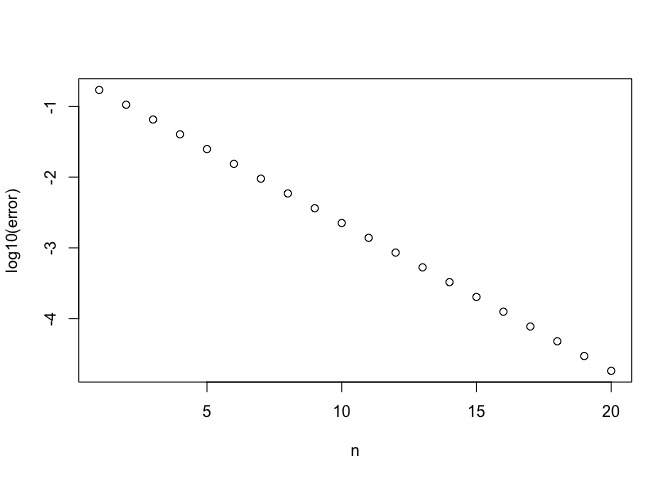

It’s important to remember from linear algebra that not every matrix can
be diagonalized. For a matrix to be diagonalizable, you need for the
multiplicity of each eigenvalue to be the same as the dimension of the
eigenspace. Here are a couple of examples.

    A <- matrix(c(5,-4,4,12,-11,12,4,-4,5),byrow=TRUE,nrow=3)
    e <- eigen(A)
    e$values

    ## [1] -3  1  1

    e$vectors

    ##                 [,1]           [,2]            [,3]
    ## [1,] -0.301511344578 0.534522483825 -0.588533689677
    ## [2,] -0.904534033733 0.801783725737 -0.784390372213
    ## [3,] -0.301511344578 0.267261241912 -0.195856682537

Here, the **algebraic multiplicity** of  − 3 is 1 because it is only an
eigenvalue once, and the **geometric multiplicity** is 1 because it only
has one eigenvector. The algebraic multiplicity of 1 is 2 because it is
an eigenvalue twice. Since it has two independent eigenvectors, the
geometric multiplicity is also 2. Therefore, this matrix is
diagonalizable. Stated differently: we need enough independent
eigenvectors to form the **S** matrix.

By way of counterexample, consider this problem.

    A <- matrix(c(1,-1,0,1),byrow=TRUE,nrow=2)
    A

    ##      [,1] [,2]
    ## [1,]    1   -1
    ## [2,]    0    1

    e <- eigen(A)
    e$values

    ## [1] 1 1

    e$vectors

    ##      [,1]              [,2]
    ## [1,]    1 1.00000000000e+00
    ## [2,]    0 2.22044604925e-16

The eigenvalue 1 has algebraic multiplicity 2, but there is only one
eigenvector (the trivial eigenvector doesn’t count) so it has geometric
multiplicity 1. We don’t have enough eigenvectors to make **S**, so the
matrix is not diagonalizable.

## Power iteration

Please find the eigenvalues of this matrix:

    set.seed(123)
    A <- matrix(sample(-100:100,64),nrow=8)
    print(A)

    ##      [,1] [,2] [,3] [,4] [,5] [,6] [,7] [,8]
    ## [1,]   58   98   36  -23    8   62   -4   15
    ## [2,]   78   97   -2  -20   80   77   87   -7
    ## [3,]  -87   52  -29   93   99  -67  -63  -95
    ## [4,]   94  -11  -75    2  -27  -32  -80  -15
    ## [5,]   69  -10  -94   16  -78   82  -60   41
    ## [6,]  -51   88   96  -25   54   71   89  -62
    ## [7,]   17   84   86   42  -48  -38  -41   91
    ## [8,]  -58   -9   63  -69   34   40  -85   95

Haha, you (probably) can’t! That’s because writing down the
characteristic polynomial is messy, and also, because for any polynomial
of degree greater than 4, we don’t have a formula for the solution, so
you’d have to resort to numerical methods to find the roots.

Instead, we will develop numerical methods that can find an eigenvalue
more directly. Let’s do a numerical experiment.

    A <- matrix(c(-13,170,240,19,-224,-320,-14,166,237),byrow=TRUE,nrow=3)
    A

    ##      [,1] [,2] [,3]
    ## [1,]  -13  170  240
    ## [2,]   19 -224 -320
    ## [3,]  -14  166  237

    v <- c(1,1,1)
    v <- A%*%v
    v

    ##      [,1]
    ## [1,]  397
    ## [2,] -525
    ## [3,]  389

    v <- v/Norm(v,2)
    v

    ##                 [,1]
    ## [1,]  0.519251568355
    ## [2,] -0.686667691150
    ## [3,]  0.508788060681

    v <- A%*%v
    v

    ##                 [,1]
    ## [1,] -1.374643320759
    ## [2,]  0.867163198538
    ## [3,] -0.673588306557

    v <- v/Norm(v,2)
    for (i in 1:100){
      v <- A%*%v
      v <- v/Norm(v,2)
    }
    (A%*%v)/v

    ##      [,1]
    ## [1,]   -3
    ## [2,]   -3
    ## [3,]   -3

    e <- eigen(A)
    e$values

    ## [1] -3  2  1

Interesting. Using this iteration, we found the eigenvalue  − 3. Any
guesses why?

Let’s try another example.

    A <- matrix(c(2,-520,8,-90,468,-360,40,-698,160),byrow=TRUE,nrow=3)
    v <- c(1,1,1)
    for (i in 1:100){
      v <- A%*%v
      v <- v/Norm(v,2)
    }
    (A%*%v)/v

    ##      [,1]
    ## [1,]  882
    ## [2,]  882
    ## [3,]  882

    e <- eigen(A)
    e$values

    ## [1]  8.82000000000e+02 -2.52000000000e+02 -4.63379334903e-14

This method if called **power iteration**. How and why, exactly, does it
work though? This is the subject of your activity for today.

You might not realize it, but you use power iteration nearly every day.
Google searches are based on an algorithm called PageRank, which is
applies power iteration to a matrix that encodes links between web
pages. We may investigate this in class at some point. But as you can
imagine, the matrix in question is gigantic, which is why numerical
methods are necessary.
