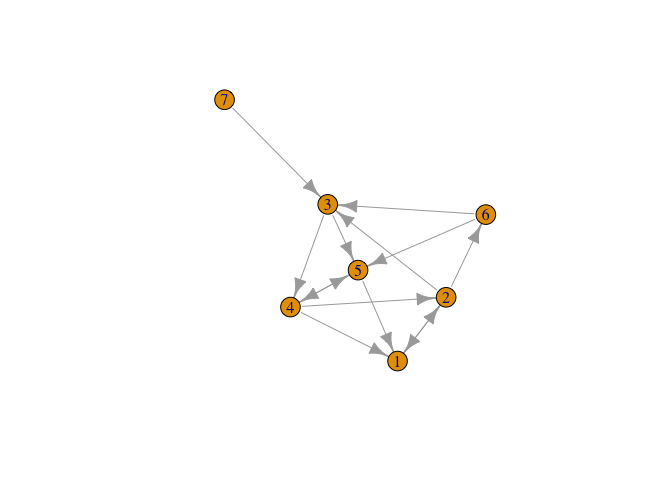

Pset - Eigenvalues I
================

------------------------------------------------------------------------

When you begin work during class, work with your assigned partner.
Please have only one electronic device open and work on it jointly. When
writing up this assignment, please remember that showing all of your
work and giving your reasoning are critical parts of achieving mastery.
If the course staff cannot tell how you solved a problem or finds leaps
in explanation or logic, the problem is not mastered. Finally, as a
matter of academic integrity, please make sure that you are positioned
to honestly answer yes to these questions:

- Have I disclosed everyone with whom I collaborated on this work? (Even
  if it is only my assigned partner.)

- Have I made a substantive intellectual contribution to the solution of
  every problem?

- Am I making sure not to pass off as my own work any work that belongs
  to someone else?

Whether intentional or unintentional, any potential violations of
academic integrity will be referred to the Honor Committee.

------------------------------------------------------------------------

Load necessary packages:

``` r
library(pracma)
library(igraph)
```

### Problem 1

In this problem, you’ll work with the famous Google PageRank algorithm.
PageRank is sometimes known as the world’s largest power iteration.

Let’s generate a (random) network of 7 websites. The adjacency matrix is
stored in $\textbf{A}$ and I have also visualized the network for you.

``` r
set.seed(123)
n <- 7
B <- matrix(rbinom(n^2, size = 1, prob = 0.3), nrow = n)
A <- B - diag(diag(B))
G <- graph_from_adjacency_matrix(A)
plot(G)
```

<!-- -->

The purpose of this exercise is to understand how PageRank works, and
what it has to do with power iteration. Imagine that you initially
assign each node an equal PageRank score (such that the scores sum to
one). We store these guesses in a vector $\mathbf{x}$. Then, as
described by Jon Kleinberg: “Each node divides its current PageRank
equally across its out-going links, and passes these equal shares to the
nodes it points to. Each node updates its new PageRank to be the sum of
the shares it receives.”

One then repeats this process over and over until the PageRank scores
converge, and those converged values are the final importance ratings of
the nodes.

a\. Construct the matrix $\mathbf{M}$ which, when applied to
$\mathbf{x}$, represents one iteration of PageRank. Hint: the matrix
$\mathbf{M}$ we’re after is not the matrix $\mathbf{A}$, though it
certainly depends on $\mathbf{A}$. Another hint: the way to figure this
out is to grab a pencil and paper and start doing the PageRank iteration
by hand so you can see exactly what is involved in terms of matrix
computation.

b\. Now you have the matrix $\mathbf{M}$ that does one iteration of
PageRank when applied to $\mathbf{x}$. Since you want to do many
iterations (until convergence), you are repeatedly multiplying
$\mathbf{x}$ by $\mathbf{M}$. This is the definition of power iteration,
and if it converges, it will converge to the dominant eigenvector of
$\mathbf{M}$.

Use power iteration to find the PageRank values for each website. Stop
your iteration when the 2-norm of successive approximations is less that
$5 \times 10^{-10}$. After each step of power iteration, make sure to
normalize $\mathbf{x}$ so that its entries sum to one. When you are done
iterating, report which web site has the highest PageRank. Give the
number of the node (1 through 7) and also state its actual PageRank
score.

### Problem 1 Solution

a\. Your solution goes here.

b\. Your solution goes here.
