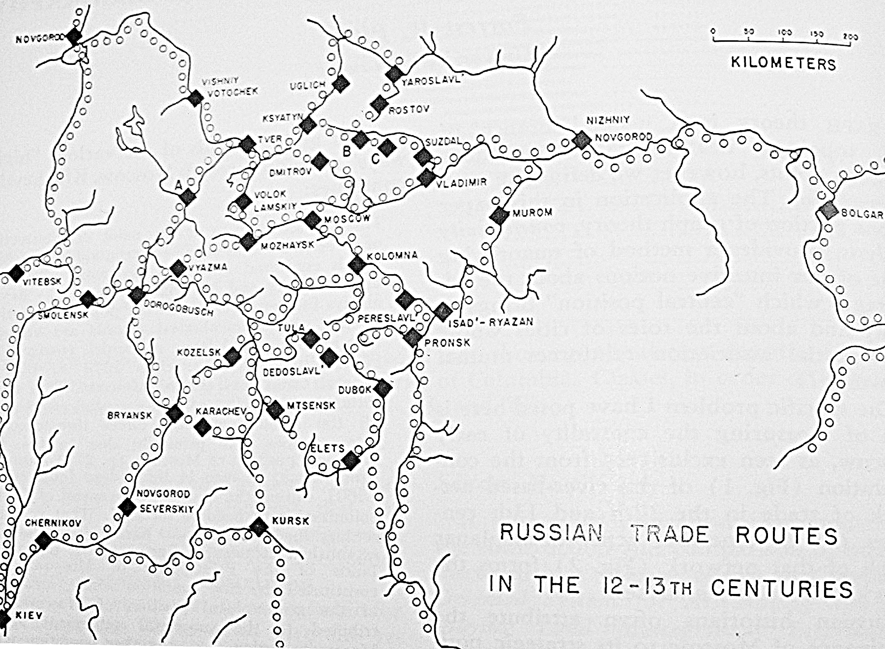

Load necessary packages:

```{r, message = FALSE}
library(expm)
library(pracma)
library(igraph)
```

### Problem 1

In this problem, you'll analyze a Markov chain model that has states where you can get stuck, known as absorbing states.

You are headed to Las Vegas. Your plan is to bring \$100 of gambling money, gamble \$1 at a time, and stop gambling when you hit \$0 or when you hit \$200. Let's assume at first that the probability of winning each game is 50% (a naive assumption).

a\. Let's model your earnings with a Markov chain. What are the states? You don't need to include it in your response, but draw a state diagram and label the edges with probabilities. Then form the transition matrix $\mathbf{P}$. To help me check your answer, run these commands on $\mathbf{P}$:

```{r eval = FALSE}
colSums(P)
image(P)
```

b\. Compute the probability that you have \$105 after placing 10 different \$1 bets.

c\. Use `eigen` to find the eigenvalues and eigenvectors of $\mathbf{P}$. What do you notice? Can you explain why the eigenvectors associated with the eigenvalue 1 are steady-state distributions?

d\. Once you reach \$0 or \$200, you cannot reach any other state. We say that those two states are **absorbing** states. We are interested in the absorption probabilities; i.e., what is the probability that you reach \$0 before \$200, and vice versa? To answer this, we can first reorder the state labels so that the absorption states \$0 and \$200 are the first two listed, and then everything else. That is, we can rearrange the transition matrix $\mathbf{P}$ into the following form:

$$
\mathbf{P}=\begin{bmatrix} \mathbf{I} & \mathbf{S} \\ \mathbf{0}  & \mathbf{R}\end{bmatrix},
$$

where 

- $\mathbf{I}$ is a 2x2 identity matrix

- $\mathbf{0}$ is a $2 \times (N-2)$ matrix of zeros

- $\mathbf{S}$ is a $(N-2) \times 2$ matrix giving the transition probabilities from the non-absorbing states (called the **transient** states) to the absorbing states, and

- $\mathbf{R}$ is the matrix of transition probabilities from the transient states to other transient states.

To find the absorption probabilities, once you have $\mathbf{S}$, $\mathbf{R}$, and $\mathbf{I}$, compute the **fundamental matrix** $\mathbf{F} = \mathbf{S}(\mathbf{I}_{n-2} -\mathbf{R})^{-1}$. The probability of absorbing into state $i$ (say \$0 in this case) starting from transient state $j$ (say \$100 in this case) is $(\mathbf{F})_{i,j}$. If you start with \$100, what is the probability of reaching \$200 before going broke? How does it change if you start with \$120 and only aim to make \$80 profit?

e\. Does your probability of reaching \$200 before going broke change if you bet \$10 at a time or \$100 at a time?

f\. The actual odds of winning a game in Vegas are not equal to 50%! Let's say you are betting on red at the roulette wheel. Assuming it is a wheel with a double zero, your chances of winning each game are $18/38 \approx 47.4$%. Now does your  probability of reaching \$200 before going broke change if you bet \$10 at a time or \$100 at a time? What is the best strategy?

### Problem 1 Solution

a\. Your solution goes here.

b\. Your solution goes here.

c\. Your solution goes here.

d\. Your solution goes here.

e\. Your solution goes here.

f\. Your solution goes here.

### Problem 2

Russian historians often attribute the dominance and rise to power of Moscow to its strategic position on medieval trade routes (see below).  Others argue that sociological and political factors aided Moscow's rise to power, and thus Moscow did not rise to power strictly because of its strategic location on the trade routes. You are to use eigenvectors to analyze this question.



Here is the list of cities and their index numbers for an adjacency matrix I will give you.

Index | City
:--:|:--
1     | Novogrod
2     | Vitebsk
3     | Smolensk
4     | Kiev
5     | Chernikov
6     | Novogrod Severskiy
7     | Kursk
8     | Bryansk
9     | Karachev
10    | Kozelsk
11    | Dorogobusch
12    | Vyazma
13    | "A"
14    | Tver
15    | Vishny Totochek
16    | Ksyatyn
17    | Uglich
18    | Yaroslavl'
19    | Rostov
20    | "B"
21    | "C"
22    | Suzdal
23    | Vladimir
24    | Nizhny Novogrod
25    | Bolgar
26    | Isad'-Ryazan
27    | Pronsk
28    | Dubok
29    | Elets
30    | Mtsenk
31    | Tula
32    | Dedoslavl'
33    | Perselavl'
34    | Kolomna
35    | Moscow
36    | Mozhaysk
37    | Dmitrov
38    | Volok Lamskiy
39    | Murom

The following code block loads the adjacency matrix into the matrix $\mathbf{A}$ and plots the graph. The adjaceny matrix has an entry $A_{i,j}=1$ if the cities indexed $i$ and $j$ are connected in the network, and $0$ otherwise. I'm suppressing the appearance of the codeblock in the markdown output because it includes a lot of lines of ones and zeros.
```{r echo = FALSE, cache = TRUE}
A <- rbind(
  c(0,1,0,0,0,0,0,0,0,0 ,0 ,0 ,0 ,0 ,1 ,0 ,0 ,0 ,0 ,0 ,0 ,0 ,0 ,0 ,0 ,0 ,0 ,0 ,0 ,0 ,0 ,0 ,0 ,0 ,0 ,0 ,0 ,0 ,0 ),
  c(1,0,1,0,0,0,0,0,0,0 ,0 ,0 ,0 ,0 ,0 ,0 ,0 ,0 ,0 ,0 ,0 ,0 ,0 ,0 ,0 ,0 ,0 ,0 ,0 ,0 ,0 ,0 ,0 ,0 ,0 ,0 ,0 ,0 ,0 ),
  c(0,1,0,1,0,0,0,0,0,0 ,1 ,0 ,0 ,0 ,0 ,0 ,0 ,0 ,0 ,0 ,0 ,0 ,0 ,0 ,0 ,0 ,0 ,0 ,0 ,0 ,0 ,0 ,0 ,0 ,0 ,0 ,0 ,0 ,0 ),
  c(0,0,1,0,1,0,0,0,0,0 ,0 ,0 ,0 ,0 ,0 ,0 ,0 ,0 ,0 ,0 ,0 ,0 ,0 ,0 ,0 ,0 ,0 ,0 ,0 ,0 ,0 ,0 ,0 ,0 ,0 ,0 ,0 ,0 ,0 ),
  c(0,0,0,1,0,1,1,0,0,0 ,0 ,0 ,0 ,0 ,0 ,0 ,0 ,0 ,0 ,0 ,0 ,0 ,0 ,0 ,0 ,0 ,0 ,0 ,0 ,0 ,0 ,0 ,0 ,0 ,0 ,0 ,0 ,0 ,0 ),
  c(0,0,0,0,1,0,0,1,0,0 ,0 ,0 ,0 ,0 ,0 ,0 ,0 ,0 ,0 ,0 ,0 ,0 ,0 ,0 ,0 ,0 ,0 ,0 ,0 ,0 ,0 ,0 ,0 ,0 ,0 ,0 ,0 ,0 ,0 ),
  c(0,0,0,0,1,0,0,0,1,0 ,0 ,0 ,0 ,0 ,0 ,0 ,0 ,0 ,0 ,0 ,0 ,0 ,0 ,0 ,0 ,0 ,0 ,0 ,0 ,1 ,0 ,0 ,0 ,0 ,0 ,0 ,0 ,0 ,0 ),
  c(0,0,0,0,0,1,0,0,1,1 ,1 ,0 ,0 ,0 ,0 ,0 ,0 ,0 ,0 ,0 ,0 ,0 ,0 ,0 ,0 ,0 ,0 ,0 ,0 ,0 ,0 ,0 ,0 ,0 ,0 ,0 ,0 ,0 ,0 ),
  c(0,0,0,0,0,0,1,1,0,0 ,0 ,0 ,0 ,0 ,0 ,0 ,0 ,0 ,0 ,0 ,0 ,0 ,0 ,0 ,0 ,0 ,0 ,0 ,0 ,1 ,0 ,0 ,0 ,0 ,0 ,0 ,0 ,0 ,0 ),
  c(0,0,0,0,0,0,0,1,0,0 ,0 ,1 ,0 ,0 ,0 ,0 ,0 ,0 ,0 ,0 ,0 ,0 ,0 ,0 ,0 ,0 ,0 ,0 ,0 ,1 ,1 ,0 ,0 ,1 ,0 ,0 ,0 ,0 ,0 ),
  c(0,0,1,0,0,0,0,1,0,0 ,0 ,1 ,1 ,0 ,0 ,0 ,0 ,0 ,0 ,0 ,0 ,0 ,0 ,0 ,0 ,0 ,0 ,0 ,0 ,0 ,0 ,0 ,0 ,0 ,0 ,0 ,0 ,0 ,0 ),
  c(0,0,0,0,0,0,0,0,0,1 ,1 ,0 ,0 ,0 ,0 ,0 ,0 ,0 ,0 ,0 ,0 ,0 ,0 ,0 ,0 ,0 ,0 ,0 ,0 ,0 ,0 ,0 ,0 ,1 ,0 ,1 ,0 ,0 ,0 ),
  c(0,0,0,0,0,0,0,0,0,0 ,1 ,0 ,0 ,1 ,0 ,0 ,0 ,0 ,0 ,0 ,0 ,0 ,0 ,0 ,0 ,0 ,0 ,0 ,0 ,0 ,0 ,0 ,0 ,0 ,0 ,0 ,0 ,0 ,0 ),
  c(0,0,0,0,0,0,0,0,0,0 ,0 ,0 ,1 ,0 ,1 ,1 ,0 ,0 ,0 ,0 ,0 ,0 ,0 ,0 ,0 ,0 ,0 ,0 ,0 ,0 ,0 ,0 ,0 ,0 ,0 ,0 ,0 ,1 ,0 ),
  c(1,0,0,0,0,0,0,0,0,0 ,0 ,0 ,0 ,1 ,0 ,0 ,0 ,0 ,0 ,0 ,0 ,0 ,0 ,0 ,0 ,0 ,0 ,0 ,0 ,0 ,0 ,0 ,0 ,0 ,0 ,0 ,0 ,0 ,0 ),
  c(0,0,0,0,0,0,0,0,0,0 ,0 ,0 ,0 ,1 ,0 ,0 ,1 ,0 ,0 ,1 ,0 ,0 ,0 ,0 ,0 ,0 ,0 ,0 ,0 ,0 ,0 ,0 ,0 ,0 ,1 ,0 ,1 ,0 ,0 ),
  c(0,0,0,0,0,0,0,0,0,0 ,0 ,0 ,0 ,0 ,0 ,1 ,0 ,1 ,0 ,0 ,0 ,0 ,0 ,0 ,0 ,0 ,0 ,0 ,0 ,0 ,0 ,0 ,0 ,0 ,0 ,0 ,0 ,0 ,0 ),
  c(0,0,0,0,0,0,0,0,0,0 ,0 ,0 ,0 ,0 ,0 ,0 ,1 ,0 ,1 ,0 ,0 ,0 ,0 ,0 ,0 ,0 ,0 ,0 ,0 ,0 ,0 ,0 ,0 ,0 ,0 ,0 ,0 ,0 ,0 ),
  c(0,0,0,0,0,0,0,0,0,0 ,0 ,0 ,0 ,0 ,0 ,0 ,0 ,1 ,0 ,1 ,0 ,0 ,0 ,0 ,0 ,0 ,0 ,0 ,0 ,0 ,0 ,0 ,0 ,0 ,0 ,0 ,0 ,0 ,0 ),
  c(0,0,0,0,0,0,0,0,0,0 ,0 ,0 ,0 ,0 ,0 ,1 ,0 ,0 ,1 ,0 ,1 ,0 ,0 ,0 ,0 ,0 ,0 ,0 ,0 ,0 ,0 ,0 ,0 ,0 ,0 ,0 ,0 ,0 ,0 ),
  c(0,0,0,0,0,0,0,0,0,0 ,0 ,0 ,0 ,0 ,0 ,0 ,0 ,0 ,0 ,1 ,0 ,1 ,0 ,0 ,0 ,0 ,0 ,0 ,0 ,0 ,0 ,0 ,0 ,0 ,0 ,0 ,0 ,0 ,0 ),
  c(0,0,0,0,0,0,0,0,0,0 ,0 ,0 ,0 ,0 ,0 ,0 ,0 ,0 ,0 ,0 ,1 ,0 ,1 ,0 ,0 ,0 ,0 ,0 ,0 ,0 ,0 ,0 ,0 ,0 ,0 ,0 ,0 ,0 ,0 ),
  c(0,0,0,0,0,0,0,0,0,0 ,0 ,0 ,0 ,0 ,0 ,0 ,0 ,0 ,0 ,0 ,0 ,1 ,0 ,1 ,0 ,0 ,0 ,0 ,0 ,0 ,0 ,0 ,0 ,0 ,1 ,0 ,0 ,0 ,0 ),
  c(0,0,0,0,0,0,0,0,0,0 ,0 ,0 ,0 ,0 ,0 ,0 ,0 ,0 ,0 ,0 ,0 ,0 ,1 ,0 ,1 ,0 ,0 ,0 ,0 ,0 ,0 ,0 ,0 ,0 ,0 ,0 ,0 ,0 ,1 ),
  c(0,0,0,0,0,0,0,0,0,0 ,0 ,0 ,0 ,0 ,0 ,0 ,0 ,0 ,0 ,0 ,0 ,0 ,0 ,1 ,0 ,0 ,0 ,0 ,0 ,0 ,0 ,0 ,0 ,0 ,0 ,0 ,0 ,0 ,0 ),
  c(0,0,0,0,0,0,0,0,0,0 ,0 ,0 ,0 ,0 ,0 ,0 ,0 ,0 ,0 ,0 ,0 ,0 ,0 ,0 ,0 ,0 ,1 ,0 ,0 ,0 ,0 ,0 ,1 ,0 ,0 ,0 ,0 ,0 ,1 ),
  c(0,0,0,0,0,0,0,0,0,0 ,0 ,0 ,0 ,0 ,0 ,0 ,0 ,0 ,0 ,0 ,0 ,0 ,0 ,0 ,0 ,1 ,0 ,0 ,0 ,0 ,0 ,1 ,0 ,0 ,0 ,0 ,0 ,0 ,0 ),
  c(0,0,0,0,0,0,0,0,0,0 ,0 ,0 ,0 ,0 ,0 ,0 ,0 ,0 ,0 ,0 ,0 ,0 ,0 ,0 ,0 ,0 ,0 ,0 ,1 ,0 ,0 ,1 ,0 ,0 ,0 ,0 ,0 ,0 ,0 ),
  c(0,0,0,0,0,0,0,0,0,0 ,0 ,0 ,0 ,0 ,0 ,0 ,0 ,0 ,0 ,0 ,0 ,0 ,0 ,0 ,0 ,0 ,0 ,1 ,0 ,1 ,0 ,0 ,0 ,0 ,0 ,0 ,0 ,0 ,0 ),
  c(0,0,0,0,0,0,1,0,1,1 ,0 ,0 ,0 ,0 ,0 ,0 ,0 ,0 ,0 ,0 ,0 ,0 ,0 ,0 ,0 ,0 ,0 ,0 ,1 ,0 ,0 ,0 ,0 ,0 ,0 ,0 ,0 ,0 ,0 ),
  c(0,0,0,0,0,0,0,0,0,1 ,0 ,0 ,0 ,0 ,0 ,0 ,0 ,0 ,0 ,0 ,0 ,0 ,0 ,0 ,0 ,0 ,0 ,0 ,0 ,0 ,0 ,1 ,0 ,0 ,0 ,0 ,0 ,0 ,0 ),
  c(0,0,0,0,0,0,0,0,0,0 ,0 ,0 ,0 ,0 ,0 ,0 ,0 ,0 ,0 ,0 ,0 ,0 ,0 ,0 ,0 ,0 ,1 ,1 ,0 ,0 ,1 ,0 ,0 ,1 ,0 ,0 ,0 ,0 ,0 ),
  c(0,0,0,0,0,0,0,0,0,0 ,0 ,0 ,0 ,0 ,0 ,0 ,0 ,0 ,0 ,0 ,0 ,0 ,0 ,0 ,0 ,1 ,0 ,0 ,0 ,0 ,0 ,0 ,0 ,1 ,0 ,0 ,0 ,0 ,0 ),
  c(0,0,0,0,0,0,0,0,0,1 ,0 ,1 ,0 ,0 ,0 ,0 ,0 ,0 ,0 ,0 ,0 ,0 ,0 ,0 ,0 ,0 ,0 ,0 ,0 ,0 ,0 ,1 ,1 ,0 ,1 ,0 ,0 ,0 ,0 ),
  c(0,0,0,0,0,0,0,0,0,0 ,0 ,0 ,0 ,0 ,0 ,1 ,0 ,0 ,0 ,0 ,0 ,0 ,1 ,0 ,0 ,0 ,0 ,0 ,0 ,0 ,0 ,0 ,0 ,1 ,0 ,1 ,0 ,0 ,0 ),
  c(0,0,0,0,0,0,0,0,0,0 ,0 ,1 ,0 ,0 ,0 ,0 ,0 ,0 ,0 ,0 ,0 ,0 ,0 ,0 ,0 ,0 ,0 ,0 ,0 ,0 ,0 ,0 ,0 ,0 ,1 ,0 ,0 ,1 ,0 ),
  c(0,0,0,0,0,0,0,0,0,0 ,0 ,0 ,0 ,0 ,0 ,1 ,0 ,0 ,0 ,0 ,0 ,0 ,0 ,0 ,0 ,0 ,0 ,0 ,0 ,0 ,0 ,0 ,0 ,0 ,0 ,0 ,0 ,1 ,0 ),
  c(0,0,0,0,0,0,0,0,0,0 ,0 ,0 ,0 ,1 ,0 ,0 ,0 ,0 ,0 ,0 ,0 ,0 ,0 ,0 ,0 ,0 ,0 ,0 ,0 ,0 ,0 ,0 ,0 ,0 ,0 ,1 ,1 ,0 ,0 ),
  c(0,0,0,0,0,0,0,0,0,0 ,0 ,0 ,0 ,0 ,0 ,0 ,0 ,0 ,0 ,0 ,0 ,0 ,0 ,1 ,0 ,1 ,0 ,0 ,0 ,0 ,0 ,0 ,0 ,0 ,0 ,0 ,0 ,0 ,0 ))
G <- graph.adjacency(A,mode="undirected")
V(G)[c(1:34,36:length(V(G)))] $color <- "lightgoldenrod"
V(G)[35]$color <- "powderblue"
plot(G)
```

Let $\mathbf{B}=\mathbf{A}+\mathbf{I}$ be the **augmented adjacency matrix** and let $\mathbf{x}=(1,1,\ldots,1)^{\top}$. Think about computing $\mathbf{B}\mathbf{x}$, $\mathbf{B}^2\mathbf{x}$, $\mathbf{B}^3\mathbf{x}$. The entries are nonnegative integers, and they can be interpreted as counting something. The ij-th entry of the matrix $\mathbf{B}^k$ represents the number of paths of length $k$ or less from vertex $i$ to vertex $j$. As $k$ grows, the normalized version of $\mathbf{B}^k x$ converges to the dominant eigenvector of the augmented adjacency matrix, and is therefore a good measure of accessibility, because it represents the total number of paths of length $k$ or less from each vertex to all of the other vertices. This idea is developed at length in the article ["Linear Algebra in Geography: Eigenvectors of Networks,"](http://www.jstor.org/stable/2689388?seq=1#page_scan_tab_contents) by Philip D. Straffin, Jr. in Mathematics Magazine, November 1980.

The matrix $\mathbf{B}$ turns out to be primitive, so the Perron-Frobenius theorem applies and there is a dominant eigenvector. **Gould's index of accessibility** is just the dominant eigenvector of $\mathbf{B}$, normalized so that the entries sum to one. That is to say, if $\mathbf{v}$ is the dominant eigenvector, then Gould's index is

```
v/sum(v)
```

Compute Gould's index for this problem and answer the historians' question.

### Problem 2 Solution

Your solution goes here.