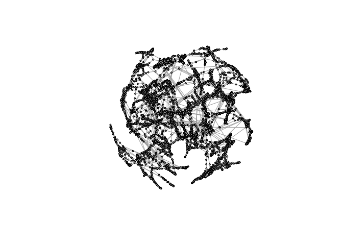

Pset - How Computers Store Numbers
================

Load necessary packages:

``` r
library("Matrix")
library("igraph")
library("pracma")
```

### Problem 1

A real

matrix

is *orthonormal* if


Note: sometimes you will see these matrices just called *orthogonal
matrices*.

Show that
,
and therefore the 2-norm condition number of any orthonormal matrix

is
=||\mathbf{Q}||_2 ||\mathbf{Q}^{-1}||_2=1").

### Problem 1 Solution

Your solution goes here.

### Problem 2

Consider the

square matrix


1.  Write a function that takes a value of
    
    as input and outputs the matrix A above. Challenge yourself to be
    efficient in your coding when you create the matrix. Looking at
    patterns and Googling how to create them helps. I managed to create
    the matrix with no loops, in two lines of code.

2.  Use your function and the R command `kappa` to calculate the
    approximate condition number
    ")
    for
    .
    Plot
    ![\\log\_{10}\[\\kappa(\\mathbf{A})\]](https://latex.codecogs.com/png.image?%5Cdpi%7B110%7D&space;%5Cbg_white&space;%5Clog_%7B10%7D%5B%5Ckappa%28%5Cmathbf%7BA%7D%29%5D "\log_{10}[\kappa(\mathbf{A})]")
    as a function of
    
    and use the commands `lm` and `abline` to plot a best fit line. How
    would you describe the conditioning of the matrix as
    
    increases?

3.  Now choose
    .
    Generate the matrix
    
    and let
    
    be an
    
    vector of random numbers chosen uniformly from 0 to 1. Solve
    
    using any appropriate method that you want (including R’s built-in
    capabilities). Now let
    ^T"),
    that is, you leave the first 29 elements the same as in
    
    but add 0.001 to the last element. Solve
    .
    Use the command `Norm` to find the (approximate)2-norm of
    
    and discuss vis-a-vis your result from part b. Also, to help build
    your intuition, find the magnitude of the difference between the
    first coordinate of
    
    and that of
    .

### Problem 2 Solution

Your solution goes here.

### Problem 3

Note: This problem is taken from Linear Algebra and its Applications, by
Lay et al.


An important concern in the study of heat transfer is to determine the
steady-state temperature distribution of a thin plate when the
temperature around the boundary is known. Assume the plate shown in the
figure above represents a cross section of a metal beam, with negligible
heat flow in the direction perpendicular to the plate. Let the variables

denote the temperatures at nodes 1 through 8 in the picture. In steady
state, the temperature at a node is approximately equal to the average
of the four nearest nodes (to the left, above, right, below).

1.  The solution to the approximate steady-state heat flow problem for
    this plate can be written as a system of linear equations
    ,
    where
    ![x=\[x\_1, x\_2, \\ldots, x\_8\]](https://latex.codecogs.com/png.image?%5Cdpi%7B110%7D&space;%5Cbg_white&space;x%3D%5Bx_1%2C%20x_2%2C%20%5Cldots%2C%20x_8%5D "x=[x_1, x_2, \ldots, x_8]")
    is the vector of temperatures at nodes 1 through 8. Find the
    
    matrix
    
    and the vector
    .

2.  Solve the system any way you want (using R) to find the unknown
    temperatures.

### Problem 3 Solution

Your solution goes here.

### Problem 4

The following command loads a matrix

describing the western power network of the United States. Each element
is zero or one. A one in row

and column

means that component

of the network is connected to component
.
This type of matrix is called a network’s *adjacency matrix*.

``` r
M <- as.matrix(readMM(gzcon(url("https://math.nist.gov/pub/MatrixMarket2/Harwell-Boeing/bcspwr/bcspwr10.mtx.gz")))+0)
```

These commands visualize the network for you using a package called
`igraph`. It may take a little bit of time (several minutes) to run
because the graph is really large!

``` r
knitr::knit_hooks$set(crop = knitr::hook_pdfcrop)
g <- graph_from_adjacency_matrix(M, mode="undirected")
V(g)$color <- "grey"
V(g)$size <- 2
myLayout <- layout_nicely(g)
plot(simplify(g), layout=myLayout, vertex.color=V(g)$color, vertex.size=V(g)$size, vertex.label="")
```



1.  In the analysis of networks, one is often concerned with finding the
    most important (most central, in some sense) component. One measure
    of importance is called Katz centrality. The Katz centrality of the
    nodes,
    ,
    satisfies

    (\mathbf{x} + \mathbf{1}) = \mathbf{I}
    ")

    where
    
    is the identity matrix,
    
    is a small number, and
    
    is a vector of all ones. Take
    
    and solve for
    
    using any method you want. Print out the largest element of
    
    so that I can verify your answer.

2.  Re-plot the network using your same graph layout as before, color
    the most important node red and plot it with size 5. This way, the
    most important node (at least, according to the Katz measure) will
    stand out on your plot.

### Problem 4 Solution

Your solution goes here.
