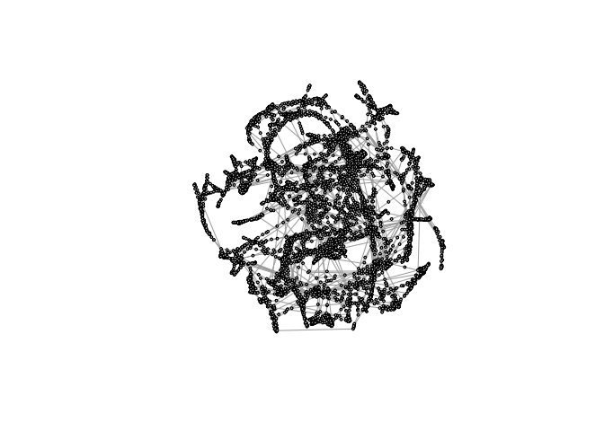

Load necessary packages:

    library("Matrix")
    library("igraph")
    library("pracma")

### Problem 1

A real *n* × *n* matrix **Q** is *orthonormal* if

**Q***T* **Q** = **Q** **Q***T* = **I**; *i*.*e*., **Q**−1 = **Q***T*.

Note: sometimes you will see these matrices just called *orthogonal
matrices*.

Show that
||**Q**||2 = ||**Q**−1||2 = 1, and
therefore the 2-norm condition number of any orthonormal matrix **Q** is
*κ*2(**Q**) = ||**Q**||2||**Q**−1||2 = 1.

### Problem 1 Solution

Your solution goes here.

### Problem 2

Consider the *n* × *n* square matrix

$$
A=\begin{pmatrix} 1 & -1 & -1 & -1 & \ldots & -1 \\\\ 0 & 1 & -1 & -1 & \ldots & -1 \\\\ 0 & 0 & 1 & -1 & \ldots & -1 \\\\ \vdots & \vdots & \vdots & \vdots & \vdots & \vdots \\\\ 0 & 0 & 0 & 0 & 0 & 1 \end{pmatrix}.
$$

a\. Write a function that takes a value of *n* as input and outputs the
matrix A above. Challenge yourself to be efficient in your coding when
you create the matrix. Looking at patterns and Googling how to create
them helps. I managed to create the matrix with no loops, in two lines
of code.

b\. Use your function and the R command `kappa` to calculate the
approximate condition number *κ*(**A**) for *n* = 1, …, 30. Plot
log10\[*κ*(**A**)\] as a function of *n* and use the commands
`lm` and `abline` to plot a best fit line. How would you describe the
conditioning of the matrix as *n* increases?

c\. Now choose *n* = 30. Generate the matrix **A** and let
**b****1** be an *n* × 1 vector of random numbers chosen
uniformly from 0 to 1. Solve **A** **x**1 = **b**1
using any appropriate method that you want (including R’s built-in
capabilities). Now let
**b**2 = **b**1 + (0,…,0,0.001)*T*,
that is, you leave the first 29 elements the same as in
**b**1 but add 0.001 to the last element. Solve
**A** **x**2 = **b**2. Use the command `Norm` to
find the (approximate) 2-norm of
**x****1** − **x****2** and discuss vis-a-vis your
result from part b. Also, to help build your intuition, find the
magnitude of the difference between the first coordinate of
**x**1 and that of **x**2.

### Problem 2 Solution

Your solution goes here.

### Problem 3

Note: This problem is taken from Linear Algebra and its Applications, by
Lay et al.

An important concern in the study of heat transfer is to determine the
steady-state temperature distribution of a thin plate when the
temperature around the boundary is known. Assume the plate shown in the
figure above represents a cross section of a metal beam, with negligible
heat flow in the direction perpendicular to the plate. Let the variables
*x*1, *x*2, …, *x*8 denote the
temperatures at nodes 1 through 8 in the picture. In steady state, the
temperature at a node is approximately equal to the average of the four
nearest nodes (to the left, above, right, below).

a\. The solution to the approximate steady-state heat flow problem for
this plate can be written as a system of linear equations
**A** **x** = **b**, where
*x* = \[*x*1,*x*2,…,*x*8\] is the
vector of temperatures at nodes 1 through 8. Find the 8 × 8 matrix *A*
and the vector *b*.

b\. Solve the system any way you want (using R) to find the unknown
temperatures.

### Problem 3 Solution

Your solution goes here.

### Problem 4

The following command loads a matrix **M** describing the western power
network of the United States. Each element is zero or one. A one in row
*i* and column *j* means that component *i* of the network is connected
to component *j*. This type of matrix is called a network’s *adjacency
matrix*.

    M <- as.matrix(readMM(gzcon(url("https://math.nist.gov/pub/MatrixMarket2/Harwell-Boeing/bcspwr/bcspwr10.mtx.gz")))+0)

These commands visualize the network for you using a package called
`igraph`. It may take a little bit of time (several minutes) to run
because the graph is really large!

    g <- graph_from_adjacency_matrix(M, mode="undirected")
    V(g)$color <- "grey"
    V(g)$size <- 2
    myLayout <- layout_nicely(g)
    plot(simplify(g), layout=myLayout, vertex.color=V(g)$color, vertex.size=V(g)$size, vertex.label="")

a\. In the analysis of networks, one is often concerned with finding the
most important (most central, in some sense) component. One measure of
importance is called Katz centrality. The Katz centrality of the nodes,
**x**, satisfies

(**I** − *α* **M***T*)(**x**+**1**) = **1**

where **I** is the identity matrix, *α* is a small number, and **1** is
a vector of all ones. Take *α* = 0.05 and solve for **x** using any
method you want. Print out the largest element of **x** so that I can
verify your answer.

b\. Re-plot the network using your same graph layout as before, color
the most important node red and plot it with size 5. This way, the most
important node (at least, according to the Katz measure) will stand out
on your plot.

### Problem 4 Solution

a\. Your solution goes here.

b\. Your solution goes here.
