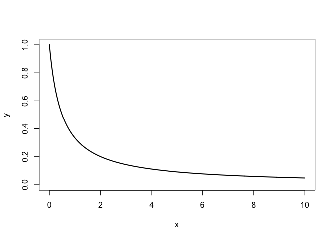
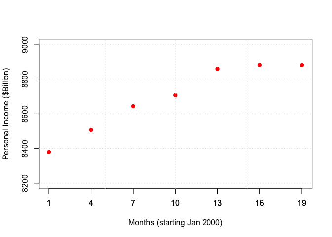
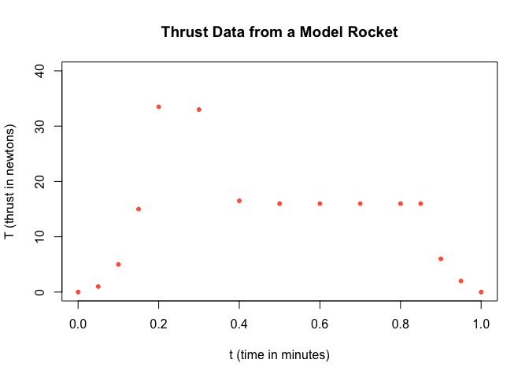

Pset - Interpolation
================

------------------------------------------------------------------------

When you begin work during class, work with your assigned partner.
Please have only one electronic device open and work on it jointly. When
writing up this assignment, please remember that showing all of your
work and giving your reasoning are critical parts of achieving mastery.
If the course staff cannot tell how you solved a problem or finds leaps
in explanation or logic, the problem is not mastered. Finally, as a
matter of academic integrity, please make sure that you are positioned
to honestly answer yes to these questions:

- Have I disclosed everyone with whom I collaborated on this work? (Even
  if it is only my assigned partner.)

- Have I made a substantive intellectual contribution to the solution of
  every problem?

- Am I making sure not to pass off as my own work any work that belongs
  to someone else?

Whether intentional or unintentional, any potential violations of
academic integrity will be referred to the Honor Committee.

------------------------------------------------------------------------

Load necessary packages:

``` r
library(pracma)
```

### Problem 1

Here is the function $f(x) = \frac{1}{1+2x}$ on the interval $[0,10]$:

``` r
f <- function(x){1/(1 + 2*x)}
a <- 0
b <- 10
xx <- seq(a, b, length = 1000)
yf <- f(xx)
plot(xx, yf, type = 'l', xlab = "x", ylab = "y", xlim = c(a,b), ylim = c(0,1), col = 'black', lwd = 2)
```

<!-- -->

a\. Use 5 evenly spaced nodes on the interval \[0,10\] to generate a
polynomial interpolant $p_{e5}(x)$ of $f(x)$ on this interval. Make a
plot with the graph of the function $f(x)$ in black, the graph of the
interpolating polynomial in blue, and the 5 interpolating points in red.

b\. Repeat part (a) with 10 evenly spaced nodes on the interval
\[0,10\].

c\. Repeat part (a) using 5 Chebyshev nodes.

d\. Repeat part (a) using 10 Chebyshev nodes.

e\. Compare the maximum errors $||f-p||_{\infty}$ for each of these four
approximating polynomials on the interval $[0,10]$. You can approximate
these errors by taking a grid of 1000 equally spaced points at which you
evaluate the functions $f$ and $p$ in order to find the norm.

f\. Show the pointwise errors from parts (b) and (d) on a single plot.
Describe and interpret what you see.

g\. On a single plot, show the pointwise errors from parts (b) and (d)
divided by the function values `yf` (this is called the relative error).
Describe and interpret what you see.

### Problem 1 Solution

a\. Your solution goes here.

b\. Your solution goes here.

c\. Your solution goes here.

d\. Your solution goes here.

e\. Your solution goes here.

f\. Your solution goes here.

g\. Your solution goes here.

### Problem 2

Suppose you are designing a natural log (`ln`) key for a calculator that
displays 5 digits to the right of the decimal point. Find the least
degree $d$ for which Chebyshev interpolation on the interval $[1,e]$
will always approximate the natural log function to 5 digits of accuracy
(i.e., the interpolation error will always be less than $0.5*10^{-5}$)?

### Problem 2 Solution

Your solution goes here.

### Problem 3

This [article](http://columbiaeconomics.com/?s=spline) discusses how
economists commonly use splines to convert quarterly data into monthly
data. One example the authors cite is the quarterly data on Personal
Income in the US from [National Income and Product Accounts
(NIPAs)](http://bea.gov/iTable/iTable.cfm?ReqID=9&step=1#reqid=9&step=1&isuri=1).
The idea is that you have quarterly economic data and you want to use
cubic splines to make reasonable estimates of the monthly economic
values. In the image below, the quarterly data are known and are given
in red, along with a linear spline fitting the data points.

``` r
# Source: U.S. Bureau of Economic Analysis, NIPA Table 2.1.
# Data is given quarterly: use splines to estimate monthly
#http://chamberlaineconomics.com/2010/01/20/how-economists-convert-quarterly-data-into-monthly-cubic-spline-interpolation/
# Personal Income  ($Billions)
PI <- c(8379.6,8506.6 ,8644.2 ,8707.3 ,8859.0 ,8881.2 ,8880.6)
Quarters <- seq(1, 3*length(PI), by = 3)
plot(Quarters, PI, ylim = c(8200,9000), pch = 19, col = "red", ylab = "Personal Income ($Billion)", xlab = "Months (starting Jan 2000)", xaxp = c(1,19,6))
axis(1, at = seq(1, 3*length(PI), by = 3))
grid()
```

<!-- -->

Using a natural cubic spline, generate a plot that shows the
interpolated values at every month. Color the original, quarterly data
red and the interpolated values blue.

### Problem 3 Solution

Your solution goes here.

### Problem 4

Here is some toy data on the thrust of a model rocket sampled every 3
seconds. Thrust is a reaction force measured here in newtons (or
$kg\cdot m/s^2$). The integral of thrust over the interval is the total
impulse of the rocket. For those interested,
[here](http://exploration.grc.nasa.gov/education/rocket/rktenglab.html)
is some more information.

``` r
# Thrust T vs. time t of a model rocket
t <- c(0., 0.05, 0.1, 0.15, 0.2, 0.3, 0.4, 0.5, 0.6, 0.7, 0.8, 0.85, 0.9,0.95, 1.);
T <- c(0., 1., 5., 15., 33.5, 33., 16.5, 16., 16., 16., 16., 16., 6., 2.,0.)
plot(t, T, pch = 20, col= "tomato", xlab = "t (time in minutes)", ylab="T (thrust in newtons)", main = "Thrust Data from a Model Rocket", ylim=c(0,40))
```

<!-- -->

a\. Use `splinefun` to fit a not-a-knot cubic spline to the data and
then plot the data with both the points shown above and the fitted cubic
spline.

b\. Use your spline function to output the interpolated thrust values at
15, 29, and 37 seconds.

c\. Use the command

    integrate(yourSplineFunction, lower = 0, upper = 1)

to estimate the total impulse of the rocket.

### Problem 4 Solution

a\. Your solution goes here.

b\. Your solution goes here.

c\. Your solution goes here.
