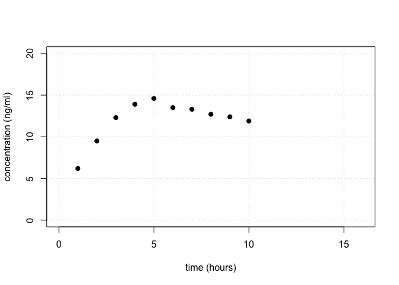
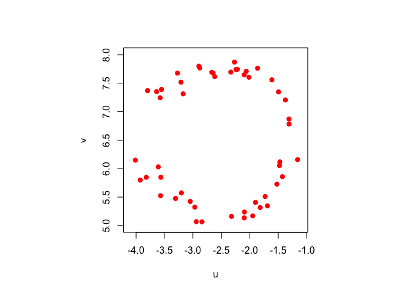

Load necessary packages:

    library(pracma)

### Problem 1

Here is some data for the concentration of a particular drug in a
patient’s bloodstream.

    hour <- 1:10
    concentration <- c(6.2,9.5,12.3,13.9,14.6,13.5,13.3,12.7,12.4,11.9)
    plot(hour, concentration, pch = 19, col = "black",
         xlim = c(0,16), ylim = c(0,20), ylab = "concentration (ng/ml)", xlab = "time (hours)")
    grid()

Using a least squares approach, fit a “surge” model of the form

*y*(*t*) = *c* *t* *e**k* *t*

State your estimated values of *c* and *k* and plot your final function
on top of the data to assess the fit visually.

### Problem 1 Solution

Your solution goes here.

### Problem 2

The vectors **u** and **v** defined below (in a hidden code block) are
the coordinates of 50 points (*u**i*,*v**i*) in
the plane.

    par(pty = "s") # for the plot to be square
    plot(u, v, pch = 19, col = "red", xlim = c(-4.1,-1.1), ylim = c(5,8), xlab = "u", ylab = "v")

We want to fit a circle to these points. Denote the center of the circle
by (*u**c*,*v**c*) and the radius by *R*. A point
(*u*,*v*) is on the circle if
(*u*−*u**c*)2 + (*v*−*v**c*)2 = *R*.
We can therefore formulate the fitting problem as choosing the
*u**c*, *v**c*, and *R* that minimize

$$
\left\\{\sum\_{i=1}^{50} \left\[(u\_i-u\_c)^2+(v\_i-v\_c)^2-R^2\right\]^2  \right\\}.
$$

If we do a change of variable
*w* = *u**c*2 + *v**c*2 − *R*2,
then the problem becomes finding the **x** that minimizes

||**A****x** − **b**||2,

where

$$
\mathbf{x}=\begin{pmatrix} u\_c \\\\ v\_c \\\\ w \end{pmatrix}.
$$

a\. Define **A** and **b** in this least squares formulation. What are
their dimensions?

b\. Solve the least squares problem to find *u**c*,
*v**c*, and *R*.

c\. To double check your work, plot the data and the fitted circle.

### Problem 2 Solution

a\. Your solution goes here.

b\. Your solution goes here.

c\. Your solution goes here.
