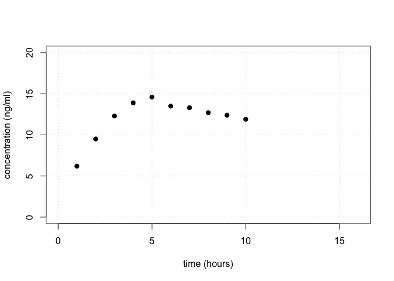
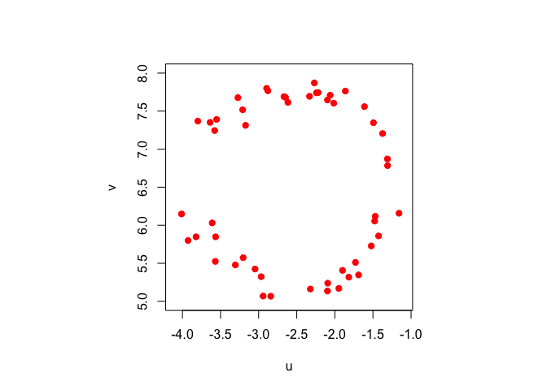

Pset - Least Squares I
================

------------------------------------------------------------------------

When you begin work during class, work with your assigned partner.
Please have only one electronic device open and work on it jointly. When
writing up this assignment, please remember that showing all of your
work and giving your reasoning are critical parts of achieving mastery.
If the course staff cannot tell how you solved a problem or finds leaps
in explanation or logic, the problem is not mastered. Finally, as a
matter of academic integrity, please make sure that you are positioned
to honestly answer yes to these questions:

- Have I disclosed everyone with whom I collaborated on this work? (Even
  if it is only my assigned partner.)

- Have I made a substantive intellectual contribution to the solution of
  every problem?

- Am I making sure not to pass off as my own work any work that belongs
  to someone else?

Whether intentional or unintentional, any potential violations of
academic integrity will be referred to the Honor Committee.

------------------------------------------------------------------------

Load necessary packages:

``` r
library(pracma)
```

### Problem 1

Here is some data for the concentration of a particular drug in a
patient’s bloodstream.

``` r
hour <- 1:10
concentration <- c(6.2,9.5,12.3,13.9,14.6,13.5,13.3,12.7,12.4,11.9)
plot(hour, concentration, pch = 19, col = "black",
     xlim = c(0,16), ylim = c(0,20), ylab = "concentration (ng/ml)", xlab = "time (hours)")
grid()
```

<!-- -->

Using a least squares approach, fit a “surge” model of the form

$$
y(t) = cte^{k\,t}
$$

State your estimated values of $c$ and $k$ and plot your final function
on top of the data to assess the fit visually.

### Problem 1 Solution

Your solution goes here.

### Problem 2

The vectors $\mathbf{u}$ and $\mathbf{v}$ defined below (in a hidden
code block) are the coordinates of 50 points $(u_i,v_i)$ in the plane.

``` r
par(pty = "s") # for the plot to be square
plot(u, v, pch = 19, col = "red", xlim = c(-4.1,-1.1), ylim = c(5,8), xlab = "u", ylab = "v")
```

<!-- -->

We want to fit a circle to these points. Denote the center of the circle
by $(u_c,v_c)$ and the radius by $R$. A point $(u,v)$ is on the circle
if $(u-u_c)^2+(v-v_c)^2=R$. We can therefore formulate the fitting
problem as choosing the $u_c$, $v_c$, and $R$ that minimize

$$
\sum_{i=1}^{50} \left[(u_i-u_c)^2+(v_i-v_c)^2-R^2\right]^2.
$$

If we do a change of variable $w=u_c^2+v_c^2-R^2$, then the problem
becomes finding the $\mathbf{x}$ that minimizes

$$
||\mathbf{A} \mathbf{x}-\mathbf{b}||^2,
$$

where

$$
\mathbf{x}=\begin{pmatrix}
u_c \\
v_c \\
w
\end{pmatrix}.
$$

a\. Define $\mathbf{A}$ and $\mathbf{b}$ in this least squares
formulation. What are their dimensions?

b\. Solve the least squares problem to find $u_c$, $v_c$, and $R$.

c\. To double check your work, plot the data and the fitted circle.

### Problem 2 Solution

a\. Your solution goes here.

b\. Your solution goes here.

c\. Your solution goes here.
