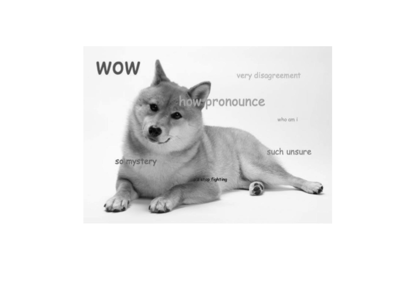

Load necessary packages:

    library(Matrix)
    library(imager)
    library(ggplot2)

### Problem 1

By completing this problem, you’ll learn how PCA can be used to compress
images. Let’s download an image of a famous meme.

    url <- "http://www.slate.com/content/dam/slate/articles/news_and_politics/the_slate_quiz/authorPortraits/pronounce_doge4.jpg.CROP.promo-xlarge2.jpg"
    doge <- load.image(url)

It’s a bit more straightforward to work with black and white images, so
let’s convert this color image to black and white and display it.

    dogebw <- grayscale(doge)
    plot(dogebw, axes=FALSE)

One slightly confusing thing about images in `R` is that for a matrix
that stores an image, the first index counts columns and the second
index counts rows. Why? I have no idea. But for example, the code below
will plot the first 400 columns of the image. To extract those columns,
we’ll need to convert the image to regular matrix, then do the
extraction, then covert back to an image before plotting.

    plot(as.cimg(as.matrix(dogebw)[1:400,]), axes = FALSE)

a\. The image is represented as a matrix of numbers, with each number
representing the greyscale value of the pixel. Therefore, it takes as
many numbers as there are pixels in the image to specify the image. How
many pixels are there in the image?

b\. Perform PCA on the image by treating each column of the image
(meaning each row of the matrix) as an observation. Then, reconstruct
the image obtained by keeping 1, 3, 10, and 30 principal components and
plot each reconstruction.

One technical hint: when we do PCA, we want our data centered around the
origin, and `R` does this by default. After we reconstruct an image from
principal components, we have to un-do that centering. For instance,
suppose we wanted to reconstruct the original image, and suppose we
saved the output of the `prcomp` command in a variable called `pca`.
Then we would run something like

    recon <- pca$x %*% t(pca$rotation)
    recon <- scale(recon, center = -1*pca$center, scale = FALSE)

c\. How many components do you need to capture 99.9% of the variation in
the data? Plot the reconstruction using that many components.

d\. How many numbers do you need to represent this reconstruction. Note:
this is NOT the number of pixels in the image, which hasn’t changed.
Why? Because you made the image from a product of matrices. So you only
need to keep track of however many numbers there are in the first matrix
plus however many numbers there are in the second matrix.

e\. Divide your answer from (d) by your answer from (a) and comment on
the level of image compression achieved.

### Problem 1 Solution

a\. Your solution goes here.

b\. Your solution goes here.

c\. Your solution goes here.

d\. Your solution goes here.

e\. Your solution goes here.
