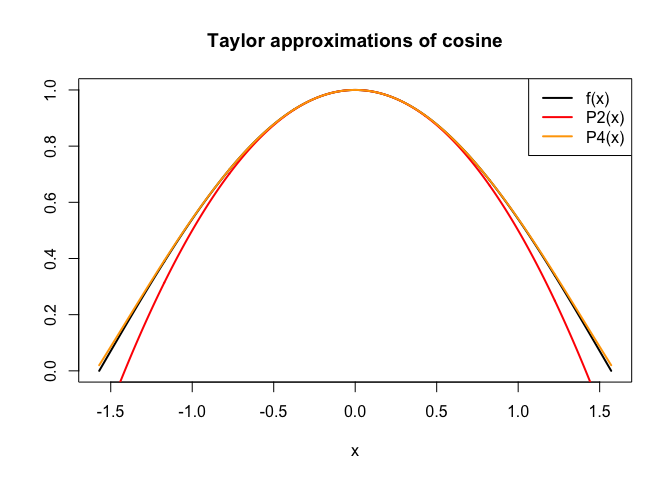

Pset - R Bootcamp Solutions
================

Load necessary packages.

``` r
library(tictoc)
```

### Problem 1

In the 1999 movie Office Space, a character creates a program that takes
fractions of cents that are truncated in a bank’s transactions and
deposits them into his own account. This is not a new idea, and hackers
who have actually attempted it have been arrested. In this exercise you
will explore this scam. The point of this problem is to practice some R
skills.

Assume the following details:

-   You have access to 10,000 bank accounts.

-   Initially, the bank accounts have balances that are uniformly
    distributed between $100 and $100,000.

-   The annual interest rate on the accounts is 5%.

-   Interest is compounded each day and added to the accounts, except
    that fractions of a cent are truncated.

-   The daily interest rate is thus .05/365.

-   The truncated fractions are deposited into an illegal account that
    initially has a balance of $0.

-   The illegal account can hold fractional values and it also accrues
    daily interest.

-   Assume that each day, interest is earned (on the main account and
    the illegal account) first, and then skimming from the main account
    into the illegal account happens.

Your job is to write an R script that simulates this situation and finds
how long it takes for the illegal account to reach a million dollars.

Here is some R help.

The following code generates the initial accounts:

``` r
accounts <- runif(10000,100,100000)
accounts <- floor(accounts*100)/100
```

The first line sets up 10,000 accounts with values uniformly between 100
and 100,000. The second line removes the fractions of cents (look at the
data before and after that line is applied).

For the main part of your code, I strongly recommend a `while` loop,
which would look something like:

``` r
while (illegal < 1000000) { do stuff here }
```

### Problem 1 Solution

``` r
OfficeSpace <- function(goal) {
  
  # Set up the accounts and round to nearest cent
  accounts <- runif(10000,100,100000)
  accounts <- floor(accounts*100)/100
  
  # Initialize illegal accounts and day counter
  illegal <- 0
  days <- 0
  
  # Main loop
  while (illegal < goal) {
    illegal <- illegal*(1+.05/365)
    accounts.plus.interest <- accounts*(1+.05/365)
    accounts <- floor(accounts.plus.interest*100)/100
    skim <- accounts.plus.interest-accounts
    illegal <- illegal + sum(skim) 
    days <- days + 1
  }
  
  return(days)
}

days <- OfficeSpace(1000000)
```

It takes 9627 days, which is approximately 26.4 years.

### Problem 2

The purpose of this problem is to practice some R skills and review a
critical topic in applied mathematics: Taylor series.

1.  Find the degree 5 Taylor polynomial
    ")
    centered at
    
    for
     = \cos x").
    This is a paper-and-pencil calculation, but you should write up the
    solution here in your markdown document.
2.  Find an upper bound for the error in approximating
    ")
    by
    ")
    on the interval
    ![\[-\\pi/4,\\pi/4\]](https://latex.codecogs.com/png.image?%5Cdpi%7B110%7D&space;%5Cbg_white&space;%5B-%5Cpi%2F4%2C%5Cpi%2F4%5D "[-\pi/4,\pi/4]").
    This is also a paper-and-pencil calculation that you should write up
    here.
3.  Make a single plot with 3 different curves:
    ")
    and the 2nd and 4th degree Taylor approximations of
    ")
    around
    .
    Plot these on the interval
    ![\[-\\pi/2,\\pi/2\]](https://latex.codecogs.com/png.image?%5Cdpi%7B110%7D&space;%5Cbg_white&space;%5B-%5Cpi%2F2%2C%5Cpi%2F2%5D "[-\pi/2,\pi/2]").

### Problem 2 Solution

1.  The degree 5 Taylor polynomial centered at
    
    is

    =1-\frac{x^2}{2}+\frac{x^4}{24},")

    since
    =-\sin(0)=0"),
    =\sin(0)=0"),
    and
    =-\sin(0)=0").

2.  The remainder in the Taylor approximation is
    }{720}x^6")
    for some
    
    between 0 and
    .
    So for
    ,

    }{720}x^6 \right| \leq \frac{1}{720}|x^6| \leq \frac{1}{720}\left(\frac{\pi}{4}\right)^6 \approx 0.000326. ")

``` r
x <- seq(-pi/2,pi/2,len=1000)

# Compute function values
f <- cos(x)
P2 <- 1 - x^2/2
P4 <- 1 - x^2/2+x^4/24

# Plot
plot(x,f,type="l",lwd=2, col="black", xlab="x",ylab="", main="Taylor approximations of cosine")
lines(x,P2,col="red",type="l",lwd=2)
lines(x,P4,col="orange",type="l",lwd=2)
legend("topright",legend=c("f(x)","P2(x)","P4(x)"),lty=1,lwd=2,col=c("black","red","orange"))
```

<!-- -->

### Problem 3

Consider the polynomial
 = x^5 + x^4 - 2x^3 + 4x^2 - 8x + 5").
For a vector of 5 million equally spaced values going from x = -100 to x
= 100, evaluate the polynomial four different ways, time each one using
commands from the `tictoc` package, and compare. You should make your
vector of x values using the `seq` command.

-   Regular polynomial evaluation using a loop to iterate over each
    value in the vector.
-   Regular polynomial evaluation using the entire vector at once.
-   Horner’s method using a loop to iterate over each value in the
    vector.
-   Horner’s method using the entire vector at once.

In addition to stating the times for each calculation, identify the
slowest, the fastest, and the ratio of slowest to fastest.

### Problem 3 Solution

``` r
fregular <- function(x){
  x^5 + x^4 - 2*x^3 + 4*x^2 - 8*x + 5
}

fhorner <- function(x){
  5 + x*(-8 + x*(4 + x*(-2 + x*(1 + x))))
}

x <- seq(from = -100, to = 100, length = 5e6)

# Regular evaluation, for loop
tic()
for (thisx in x){
  garbage <- fregular(thisx)
}
tmp <- toc()
t1 <- tmp$toc - tmp$tic

# Regular evaluation, vector
tic()
garbage <- fregular(x)
tmp <- toc()
t2 <- tmp$toc - tmp$tic

# Horner's method, for loop
tic()
for (thisx in x){
  garbage <- fhorner(thisx)
}
tmp <- toc()
t3 <- tmp$toc - tmp$tic

# Horner's method, vector
tic()
garbage <- fhorner(x)
tmp <- toc()
t4 <- tmp$toc - tmp$tic
```

Regular evaluation with a for loop took 2.658 seconds. Regular
evaluation with a vector took 0.441 sectonds. Horner’s method with a
foor loop took 2.151 seconds. Horner’s method with a vector took 0.046
seconds. The slowest method was regular evaluation with a for loop and
the fastest method was Horner’s method with a vector. The ratio of the
times is approximately 58.

### Problem 4

You read three articles on applications of linear algebra:

-   [The Mathematics of Mass Testing for
    COVID-19](https://sinews.siam.org/Details-Page/the-mathematics-of-mass-testing-for-covid-19)
-   [Machine Learning Has Been Used to Automatically Translate Long-Lost
    Languages](https://www.technologyreview.com/2019/07/01/65601/machine-learning-has-been-used-to-automatically-translate-long-lost-languages/)
-   [The Best
    Bits](https://www.americanscientist.org/article/the-best-bits)

Choose one of these articles and write a brief paragraph about it in
which you explain the role that linear algebra plays. Strive to be
specific. For instance, rather than writing “linear algebra is used to
make pooled testing more efficient,” try to explain the actual
mathematical ideas used.

### Problem 4

Your solution goes here.
