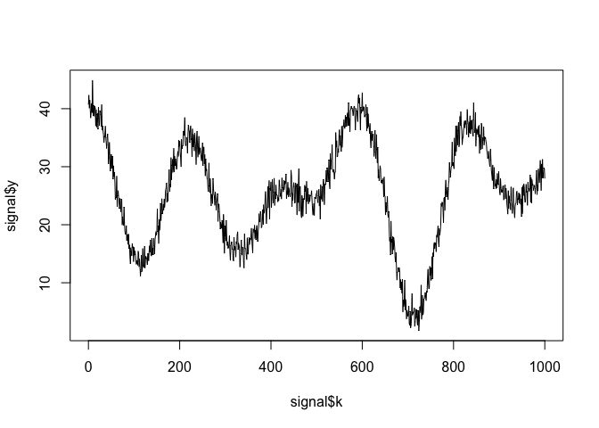

**Important note: For your first submission of this recap exercise, work
on it alone. Do not collaborate with classmates, the TAs, or the
instructor.**

Load necessary packages:

    library(pracma)
    library(expm)
    library(tidyverse)

### Problem 1

Consider the bell curve function, also known as the normal distribution:

$$
f(x) = \frac{1}{\sqrt{2\pi}} \mathrm{e}^{-\frac{1}{2}x^2}
$$

In probability and statistics, it’s crucial to be able to integrate this
function, and yet, the function has no closed-form anti-derivative. Use
polynomial interpolation with 7 equally-spaced nodes to approximate the
function *f*(*x*) on the interval *x* ∈ \[−1.96,1.96\]. Then integrate
the polynomial exactly (not using R’s `integrate` function, which does a
numerical integral similar to a Riemann sum) in order to come up with an
estimate of the definite integral of *f*(*x*) on that interval. (If you
want, you can use R to perform the exact integration by manipulation the
polynomial coefficients.) Calculate the relative error as compared to
the true answer, which to seven decimal places, is 0.9500042.

### Problem 1 Solution

Your solution goes here.

### Problem 2

Let’s investigate how some positioning systems might work. While walking
the woods, I started at the location (0,0) and a short while later, I
got lost. Luckily I have a device that lets me compute the distances
between my location and various communication towers. Suppose that the
distance between my unknown location (*u*,*v*) and the tower located at
position (*p**i*,*q**i*), *i* = 1, …20, is
estimated as *σ**i*. This gives me a system of nonlinear
equations:

$$
\sqrt{(u-p\_i)^2+(v-q\_i)^2} = \sigma\_i.
$$

Since I assume that I am not too far from my original location of (0,0),
I am going to Taylor expand the left hand equations around (0,0),
yielding the linear system

$$
\sqrt{p\_i^2 + q\_i^2} - \frac{p\_i u + q\_i v}{\sqrt{p\_i^2+q\_i^2}} = \sigma\_i.
$$

Due to my linearization and to measurement errors in the distances
*σ**i*, I can’t solve these equations exactly. For the
*p**i*, *q**i*, *σ**i* data defined
below, find the best estimate of my location.

    p <- c(0, -16, 20, -17, -28, 11, 19, 23, 12, 6, 27, -6, -5, -4, -26, 17, -3, -22, -2, 4)
    q <- c(-4, -6, 7, -10, -16, 10, 16, -5, 0, -15, -1, -25, 12, -23, -9, 24, 8, 22, -14, 3)
    sigma <- c(7.82, 9.9, 12.33, 11.79, 14.7, 6.59, 4.68, 6.14, 0.16, 2.76, 12.64, 3.47, 3.59, 1.15, 3.69, 10.98, 12.71, 7.46, 5.82, 3.7)

### Problem 2 Solution

Your solution goes here.

### Problem 3

Let’s use linear algebra to carry out an important task in signal
processing. In the figure below is a plot of discrete-time signal. The
signal **y** is a sequence of 1001 voltage measurements taken at times
*k* = 0, 1, …, 1000. There is a code block below (which, by design,
won’t print when you knit this document) that pre-loads for you a data
frame called `signal` that contains this data. Since the measurements
were taken with an oscilloscope, they include measurement noise. Your
objective in this problem is to remove the noise and smooth out the
signal.

    plot(signal$k,signal$y,type="l")

We can do this as follows. Let **y** ∈ ℝ1001 be the vector of
noisy measurements at times *k* = 0, 1, …, 1000. Then we want to solve
the following optimization problem:

$$
z\_\* = \mathrm{argmin}\_{z \in \mathbb{R}^{1001}} \left\\{\sum\_{k=0}^{1000} (z\_k-y\_k)^2 + \lambda \sum\_{k=1}^{1000} (z\_k-z\_{k-1})^2 \right\\}.
$$

This optimization problem tries to accomplish two different objectives,
simultaneously:

-   The new signal **z** should still be close to the noisy signal
    **y**, as measured by the sum of the squared differences between
    *z**k* and *y**k* (the first term).
-   The new signal **z** should be smooth in the sense that it doesn’t
    change too quickly, as measured by the sum of the squared
    differences between consecutive signal terms *z**k* and
    *z**k* − 1 (the second term).

The parameter *λ* trades off the importance between these two
objectives. If you set *λ* to be very small, then the new signal **z**
should be very close to **y**. If you set *λ* to be very large, then the
new signal **z** should be extremely smooth, but perhaps farther away
from the original signal **y**.

Since this is a minimization problem, it’s (probably) overdetermined.
Look at the equation given above and take each term separately. The
first term is trying to minimize the sum of
(*z**k*−*y**k*)2. Note this is the dot
product of **z** − **y** with itself. It will be minimized when
**z** = **y**. The second term is trying to minimize the sum of
*λ*(*z**k*−*z**k* − 1)2. This is the
dot product of $\sqrt{\lambda}\mathbf{M}\mathbf{z}$ with itself, for an
appropriate matrix **M**. This term will be minimized when
$\sqrt{\lambda}\mathbf{M}\mathbf{z} = 0$.

To recap, we have two problems to solve simultaneously:

**z** = **y**

and

$$
\sqrt{\lambda}\mathbf{M}\mathbf{z} = 0
$$

This is an overdetermined system. Use a least squares approach to solve
the problem for *λ* = 1, *λ* = 100, and *λ* = 1000. Plot your three
de-noised signals and the original signal on one graph and state which
value of *λ* you think is best for balancing smoothness and accuracy
(just from looking at your graph).

### Problem 3 Solution

Your solution goes here.

### Problem 4

Board game time! Let’s model a variant of the Chutes and Ladders game as
a Markov chain. We’ll analyze some of the game dynamics assuming there
is just one player. Here are some more details of the movement rules on
the game board shown above.

In this variant of the game, there is only one player. This player roles
a three-sided die each turn, which yields the possible values of 0, 1,
or 2, each with probability equal to one third. The player starts at
square 1, and moves the number of spaces rolled on the die. The
direction of movement is according to the order indicated in the top
left corner of each square. For example, if the player starts on square
5 and rolls a 2, they end up on square 7. If they roll a 0, they stay on
square 5.

If the player’s roll leads to a space that is the bottom of the ladder,
they are instantaneously transferred to the top of the ladder. For
example, if they start on square 5 and roll a 1, they end the turn on
square 15.

On the other hand, if the player’s roll leads to a space that is the top
of a chute, they instantaneously fall to the bottom of the slide. For
example, if they start on square 7 and roll a 2, they end the turn on
square 3.

Once they reach square 20, they stay there and the game is over. If the
player rolls 2 while starting on square 19, they move to square 20 and
the game is over.

a\. Compute the probability that after 20 turns the player has reached
the end (square 20).

b\. Now let’s change the board slightly and add a chute from square 20
back to square 1, so the game never ends! (If you roll a 2 on 19, you
also go back to square 1.) You play the game for a very long time (e.g.,
while you are contemplating the beauty of linear algebra), and then I
walk into the room. On which square am I most likely to find you, and
what is the probability of being there?

### Problem 4 Solution

a\. Your solution goes here.

b\. Your solution goes here.

### Problem 5

Here is some data about life expectancy in various countries in Africa,
estimated every 5 years from 1952 to 2007:

    lifeexpectancy <- read.csv("https://bit.ly/2vEDq5b") %>%
      select(continent,country,starts_with('lifeExp')) %>%
      filter(continent %in% c("Africa"))

a\. Perform a principal component analysis on this data and plot the
data (with labels as country names). What proportion of the variance in
the data do the first two principal components capture?

b\. Note that Zimbabwe and Senegal have similar values for the first
principal component coordinate and quite different values for the second
principal component coordinate. By looking at the loadings (the rotation
matrix) and remembering that PCA does a change of basis, interpret the
difference between these two countries in terms of life expectancy.

### Problem 5 Solution

a\. Your solution goes here.

b\. Your solution goes here.
